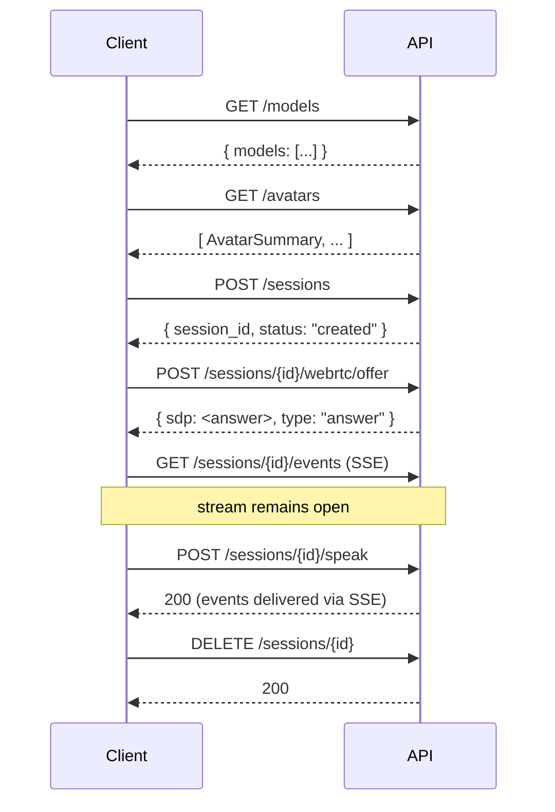

# API Reference

OpenTalking exposes a REST, Server-Sent Events, and WebSocket interface defined in
`apps/api/routes/`. The interface is organized into the following groups:

| Group | Purpose | Documentation |
|-------|---------|--------------|
| Health and Models | Liveness probes, queue introspection, and capability discovery. | [Health and Models](health.md) |
| Avatars | Avatar bundle catalog and custom avatar upload. | [Avatars](avatars.md) |
| Sessions | Session lifecycle, conversational interaction, WebRTC signaling. | [Sessions](sessions.md) |
| TTS and Voices | One-off TTS preview and cloned voice management. | [TTS and Voices](tts-and-voices.md) |
| Events and Streaming | Server-Sent Events stream and audio WebSocket protocol. | [Events and Streaming](events.md) |

## Base URL and authentication

The default base URL is `http://localhost:8000`. Production deployments terminate TLS
and authentication at an upstream reverse proxy. OpenTalking itself does not require
authentication for its routes; deployments that expose the API publicly should
implement authentication at the gateway layer.

The `OPENTALKING_CORS_ORIGINS` environment variable controls which origins may issue
cross-origin requests; see [Configuration §3](../user-guide/configuration.md#3-production-deployment).

## Request and response conventions

Unless otherwise noted, request and response bodies use `application/json`. Multipart
uploads (`multipart/form-data`) are used by avatar and voice-cloning endpoints.

- Successful responses return HTTP `200` with a JSON body.
- Validation errors return HTTP `400` with a `{"detail": "..."}` payload.
- Missing resources return HTTP `404`.
- Authentication and authorization errors raised by upstream services (DashScope, OmniRT) are translated to HTTP `502` with the upstream error text in `detail`.
- Server-side errors return HTTP `500` with a generic message; the actual exception is logged.

Identifier formats:

- `session_id` — UUID4 string assigned at session creation.
- `avatar_id` — slug-format string (alphanumeric, hyphen, underscore, CJK characters), as defined by the avatar's `manifest.json`.
- `voice entry_id` — integer primary key from the SQLite voice catalog.
- `job_id` — UUID4 string assigned to a FlashTalk offline bundle job.

## Endpoint summary

| Method | Path | Group |
|--------|------|-------|
| `GET` | `/health` | Health and Models |
| `GET` | `/healthz` | Health and Models |
| `GET` | `/queue/status` | Health and Models |
| `GET` | `/models` | Health and Models |
| `GET` | `/avatars` | Avatars |
| `GET` | `/avatars/{avatar_id}` | Avatars |
| `GET` | `/avatars/{avatar_id}/preview` | Avatars |
| `POST` | `/avatars/custom` | Avatars |
| `DELETE` | `/avatars/{avatar_id}` | Avatars |
| `POST` | `/sessions` | Sessions |
| `POST` | `/sessions/customize` | Sessions |
| `POST` | `/sessions/customize/prompt` | Sessions |
| `POST` | `/sessions/customize/reference` | Sessions |
| `GET` | `/sessions/{session_id}` | Sessions |
| `POST` | `/sessions/{session_id}/start` | Sessions |
| `POST` | `/sessions/{session_id}/speak` | Sessions |
| `POST` | `/sessions/{session_id}/transcribe` | Sessions |
| `POST` | `/sessions/{session_id}/speak_audio` | Sessions |
| `POST` | `/sessions/{session_id}/speak_flashtalk_audio` | Sessions |
| `POST` | `/sessions/{session_id}/interrupt` | Sessions |
| `POST` | `/sessions/{session_id}/webrtc/offer` | Sessions |
| `POST` | `/sessions/{session_id}/flashtalk-recording/start` | Sessions |
| `POST` | `/sessions/{session_id}/flashtalk-recording/stop` | Sessions |
| `GET` | `/sessions/{session_id}/flashtalk-recording` | Sessions |
| `POST` | `/sessions/{session_id}/flashtalk-offline-bundle` | Sessions |
| `GET` | `/sessions/{session_id}/flashtalk-offline-bundle/{job_id}` | Sessions |
| `GET` | `/sessions/{session_id}/flashtalk-offline-bundle/{job_id}/download` | Sessions |
| `DELETE` | `/sessions/{session_id}` | Sessions |
| `WS` | `/sessions/{session_id}/speak_audio_stream` | Events and Streaming |
| `GET` | `/sessions/{session_id}/events` | Events and Streaming |
| `POST` | `/tts/preview` | TTS and Voices |
| `GET` | `/voices` | TTS and Voices |
| `POST` | `/voices/clone` | TTS and Voices |
| `DELETE` | `/voices/{entry_id}` | TTS and Voices |
| `GET` | `/voice-uploads/{token}` | TTS and Voices |

## Typical request sequence

A complete client interaction typically follows the sequence below.

## OpenAPI specification

A complete OpenAPI 3.x specification is generated by FastAPI and is available at the
following endpoints:

- Interactive documentation (Swagger UI): `<base>/docs`
- Alternative interactive documentation (ReDoc): `<base>/redoc`
- Raw specification (JSON): `<base>/openapi.json`

The OpenAPI specification is authoritative for exact field-level types and validation
rules. Generated client SDKs and integration tests should source their definitions
from the specification rather than this documentation.

## Source files

| File | Routes |
|------|--------|
| `apps/api/routes/health.py` | `/health`, `/healthz`, `/queue/status` |
| `apps/api/routes/models.py` | `/models` |
| `apps/api/routes/avatars.py` | `/avatars/*` |
| `apps/api/routes/sessions.py` | `/sessions/*` |
| `apps/api/routes/tts_preview.py` | `/tts/preview` |
| `apps/api/routes/voices.py` | `/voices/*`, `/voice-uploads/{token}` |
| `apps/api/routes/events.py` | `/sessions/{id}/events` (SSE) |
| `apps/api/schemas/session.py` | Request and response models for sessions. |
| `apps/api/schemas/avatar.py` | `AvatarSummary` response model. |
