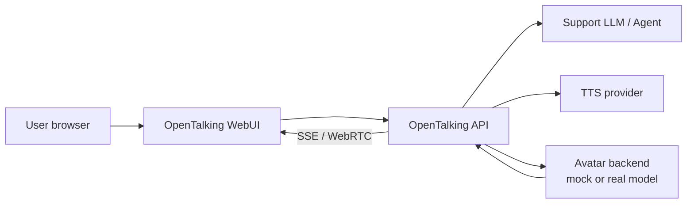

# AI Customer Support

This case shows how to build an AI customer-support digital human with OpenTalking.
The first version uses the `mock` synthesis backend, so it does not require a GPU or
talking-head weights. After validation, replace `mock` with Wav2Lip, QuickTalk,
FlashTalk, or another backend.

## Suitable Scenarios

- Voice support on a website, product console, or showroom screen.
- A visual interface for internal knowledge-base Q&A.
- Sales assistance, feature explanation, and onboarding.
- Teams that want to validate LLM, TTS, captions, and WebRTC before handling model weights.

## Expected Result

The user talks to a digital support agent in the browser. OpenTalking handles sessions,
speech recognition, LLM responses, TTS, caption events, and WebRTC playback. The business
layer can control the answer through a system prompt, retrieval, or an upstream agent.



## Prerequisites

- Finish [Quickstart](../tutorials/quickstart.md) or [Mock E2E](../tutorials/cases/mock-e2e.md).
- Configure `OPENTALKING_LLM_API_KEY` in `.env`; if microphone input is enabled, also configure `OPENTALKING_STT_API_KEY`.
- Use a Chromium-based browser for the smoothest WebRTC path.

## 1. Configure the Support Persona

```env title=".env"
OPENTALKING_LLM_SYSTEM_PROMPT=You are an OpenTalking product support agent. Keep answers concise, polite, and conversational. For pricing, contracts, legal commitments, or unsupported claims, ask the user to contact a human sales representative. Do not invent features.
OPENTALKING_TTS_PROVIDER=edge
OPENTALKING_TTS_VOICE=zh-CN-XiaoxiaoNeural
```

If you already have a support agent, expose it through an OpenAI-compatible endpoint:

```env title=".env"
OPENTALKING_LLM_BASE_URL=http://your-agent-gateway/v1
OPENTALKING_LLM_MODEL=customer-support-agent
OPENTALKING_LLM_API_KEY=<token>
```

## 2. Start the Mock Support Pipeline

```bash title="terminal"
source .venv/bin/activate
bash scripts/quickstart/start_mock.sh
```

Open <http://localhost:5173>, select the built-in avatar and the `mock` model, then start
speaking. The image is a placeholder, but STT, LLM, TTS, captions, and WebRTC are real.

## 3. Embed Through the API

The WebUI is useful for validation. A business system usually calls the API directly:

1. `GET /models` to inspect available models.
2. `GET /avatars` to inspect available avatars.
3. `POST /sessions` to create a session.
4. Establish WebRTC signaling or let the WebUI host playback.
5. Subscribe to `GET /sessions/{session_id}/events` for captions, status, and errors.

See [Sessions API](../docs/api/sessions.md) and [Events and Streaming](../docs/api/events.md).

## 4. Replace Mock with a Real Avatar

| Goal | Recommended path |
|------|------------------|
| Quick lip-sync on a consumer GPU | [QuickTalk](../model-deployment/quicktalk.md) or [Wav2Lip](../model-deployment/wav2lip.md) |
| Higher quality through a remote model service | [FlashTalk](../model-deployment/flashtalk.md) + [OmniRT](../model-deployment/deployment.md) |
| API or frontend development | Keep `mock` until the business flow is stable |

The frontend and API flow remain the same. Select the new `model` and a matching avatar
when creating the session.

## Validation

- `GET /health` returns `{"status":"ok"}`.
- `GET /models` reports the target model as `connected: true`.
- The browser receives caption events and audio playback.
- Support questions follow the configured persona.
- After interruption or a new question, the session can continue.

## Troubleshooting

| Symptom | Action |
|---------|--------|
| Answers are too long | Tighten `OPENTALKING_LLM_SYSTEM_PROMPT`; ask for 2 to 4 sentences per answer. |
| Business facts are inaccurate | Use retrieval or an upstream support agent instead of prompt-only grounding. |
| Mock works but the real model has no video | Check `/models`, then verify that the avatar `model_type` matches the selected model. |
| No browser audio | Check autoplay restrictions; require a user click before starting the session. |

