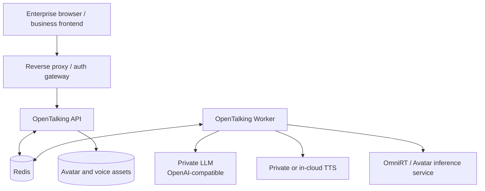

# Private Deployment

This case shows how to place OpenTalking inside an enterprise network with private LLMs,
TTS, avatar backends, and a reverse proxy. It is not a full operations manual; it is a
production evaluation path that makes boundaries explicit before replacing providers.

## Suitable Scenarios

- Internal digital-human support or training systems.
- Environments where business data cannot be sent to public model services.
- Teams that already have private LLM, TTS, or inference clusters.
- Deployments requiring API/Worker split, external Redis, gateway authentication, and audit logs.

## Recommended Architecture



## Prerequisites

- Finish [Quickstart](../tutorials/quickstart.md).
- Read [Configuration](../tutorials/configuration.md) and [Deployment](../deployment/index.md).
- Prefer a private LLM with an OpenAI-compatible `/v1/chat/completions` endpoint.
- Use OmniRT, `direct_ws`, or a local adapter for avatar inference.

## 1. Configure Private LLM and TTS

```env title=".env"
OPENTALKING_LLM_BASE_URL=https://llm.internal.example.com/v1
OPENTALKING_LLM_MODEL=company-chat-model
OPENTALKING_LLM_API_KEY=<gateway-token>

OPENTALKING_TTS_DEFAULT_PROVIDER=dashscope
OPENTALKING_TTS_DASHSCOPE_VOICE=<voice-id>
OPENTALKING_STT_DASHSCOPE_API_KEY=<dashscope-or-internal-token>
```

If TTS is fully private, extend the provider layer. Use [Developing](../docs/developing.md)
and the existing TTS providers as references.

## 2. Configure the Avatar Backend

For production evaluation, keep large models in a separate inference service:

```env title=".env"
OMNIRT_ENDPOINT=http://omnirt.internal.example.com:9000
```

```yaml title="configs/default.yaml"
models:
  flashtalk:
    backend: omnirt
  wav2lip:
    backend: omnirt
  mock:
    backend: mock
```

Keep `mock` enabled for diagnosis. When the real model fails, `mock` can confirm whether
OpenTalking, LLM, TTS, and WebRTC are still healthy.

## 3. Split API and Worker

Unified mode is fine for single-host validation. Production evaluation should use
external Redis and split API from Worker:

```env title=".env"
OPENTALKING_REDIS_URL=redis://redis.internal.example.com:6379/0
```

| Component | Recommendation |
|-----------|----------------|
| API | Place near the gateway; owns HTTP, SSE, WebRTC signaling, and session APIs. |
| Worker | Place near LLM, TTS, and avatar services; owns pipeline execution. |
| Redis | Use an internal address and restrict access sources. |
| Avatar assets | Use a shared mount or synchronized object storage, not temporary directories. |

## 4. Gateway and Security Boundary

OpenTalking does not provide a complete built-in user-auth system. For public or
multi-tenant enterprise deployments, handle these at the gateway:

- TLS termination.
- User authentication and access control.
- CORS allowlist.
- Request body size limits.
- SSE and WebSocket proxy configuration.
- Audit logs and sensitive-field redaction.

SSE requires proxy buffering to be disabled; see [Events and Streaming](../docs/api/events.md).

## Validation

- `/health` is reachable through the gateway and orchestrator.
- `/models` reports the target backend and distinguishes `connected`, `not_configured`, and unreachable services.
- Redis failures produce clear logs and are not confused with model failures.
- LLM/TTS keys do not appear in frontend code, logs, or pull requests.
- Both the mock path and the real-model path are tested at least once.

## Troubleshooting

| Symptom | Action |
|---------|--------|
| SSE stops behind the gateway | Disable proxy buffering and check connection timeout defaults. |
| WebRTC works internally but not externally | Check NAT, TURN/STUN, CORS, and secure browser context. |
| Model service has intermittent timeouts | Add queueing, warmup, and health checks in the avatar backend; record queue state in OpenTalking. |
| Security requires authentication | Authenticate at the gateway and forward only trusted requests to OpenTalking. |

