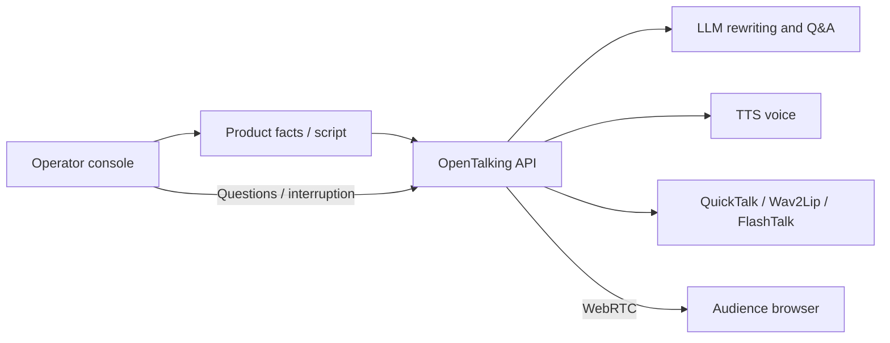

# Product Demo and Live Sales

This case is for e-commerce guides, showroom explainers, course narration, and live
interactive demos. Unlike customer support, the content is usually more controlled by
scripts, product facts, and operator timing. It benefits from stable speaking style,
long-form narration, and manual interruption.

## Suitable Scenarios

- A digital guide on a product page or live commerce room.
- Product explainers on showroom screens.
- Course, news, or event narration.
- Operator-prepared scripts spoken by a digital human.

## Recommended Pipeline



## Prerequisites

- Finish [AI Customer Support](customer-support.md) or at least validate `mock`.
- Prepare a display-friendly avatar. See [Custom Avatar](../tutorials/cases/custom-avatar.md).
- For real lip-sync video, deploy at least one talking-head backend in [Model Deployment](../model-deployment/index.md).

## 1. Prepare Product Facts

Keep product facts short and structured:

```text title="product-brief.txt"
Product: Smart Conference Camera Pro
Audience: remote meetings, online courses, small live rooms
Key benefits:
- Automatic speaker framing
- Dual-microphone noise reduction
- USB plug-and-play
Limits:
- No waterproof guarantee
- Not a replacement for professional cinema cameras
Promotion:
- Use the live business system as the source of truth
```

## 2. Configure the Persona

```env title=".env"
OPENTALKING_LLM_SYSTEM_PROMPT=You are a live product-demo digital human. Speak naturally and rhythmically. Keep each answer under 80 Chinese characters when speaking Chinese. Explain user benefits before features. For price, inventory, and after-sales policies, rely on the business system and do not invent facts.
OPENTALKING_TTS_PROVIDER=edge
OPENTALKING_TTS_VOICE=zh-CN-XiaoxiaoNeural
```

If you already have a product retrieval service, let the business layer assemble the
relevant facts before sending text to OpenTalking.

## 3. Start and Select a Model

Validate script pacing with mock first:

```bash title="terminal"
bash scripts/quickstart/start_mock.sh
```

For a lightweight local path:

```bash title="terminal"
bash scripts/start_unified.sh --backend local --model quicktalk
```

For a remote high-quality path:

```bash title="terminal"
bash scripts/start_unified.sh --backend omnirt --model flashtalk --omnirt http://127.0.0.1:9000
```

## 4. Design Interaction Modes

| Input type | Handling |
|------------|----------|
| Prepared narration | Send fixed scripts or segmented copy from the operator console. |
| User questions | Answer through the LLM/Agent, with product retrieval when needed. |
| Manual interruption | Stop the current narration and switch to the new segment or answer. |
| Risky questions | Return fixed fallback copy for pricing, contracts, medical, or financial claims. |

## Validation

- Long text is split into natural segments.
- The TTS voice fits the brand or character.
- Avatar and model type match; `/models` reports the real model as connected.
- Old product narration does not continue after interruption.
- Dynamic price, inventory, and promotion facts come from the business system.

## Troubleshooting

| Symptom | Action |
|---------|--------|
| Speech sounds mechanical | Shorten each text segment and make the prompt more conversational. |
| The LLM drifts away from the product | Pass structured product facts from the business layer and require grounded answers. |
| First frame is slow | Warm up the real model or create the session before the live segment starts. |
| The live room needs concurrency | Use API/Worker split and external Redis; see [Deployment](../model-deployment/deployment.md). |

