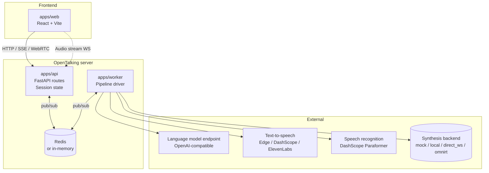
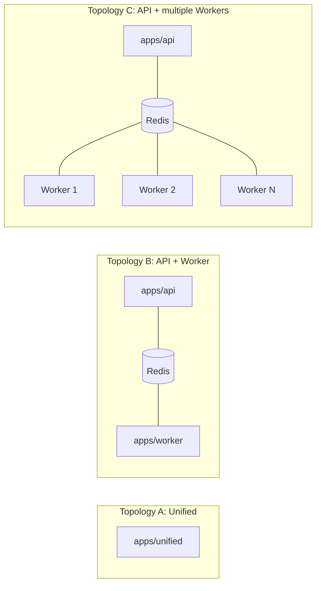
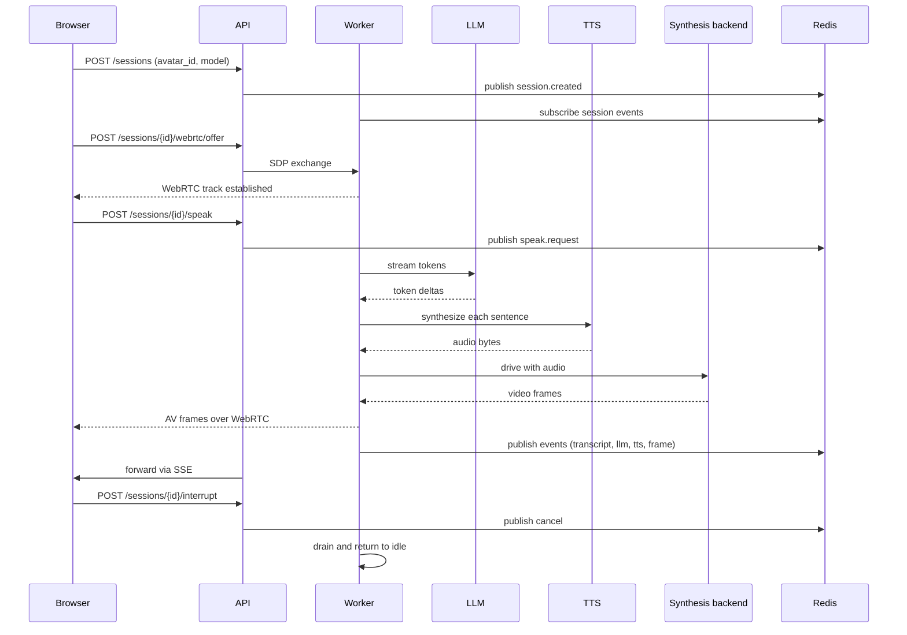

# Architecture

OpenTalking is an orchestration framework for real-time digital humans. It coordinates
speech recognition, language models, text-to-speech synthesis, talking-head rendering,
and WebRTC delivery within a unified session model. A small HTTP and WebSocket surface
is exposed on top.

This page describes the system-level architecture: components, deployment topologies,
session lifecycle, the event bus, and the pluggable synthesis backend boundary.

## Architecture Overview


## Components



| Component | Responsibility | Source |
|-----------|---------------|--------|
| `apps/api` | HTTP and WebSocket entry, session CRUD, WebRTC signaling, SSE event stream. | `apps/api/routes/` |
| `apps/worker` | Drives one or more sessions through the render pipeline. | `apps/worker/`, `opentalking/worker/` |
| `apps/unified` | Combines API, Worker, and an in-memory bus in one process. Intended for development. | `apps/unified/` |
| `opentalking/` library | Providers, adapters, interfaces, types, configuration, bus, and pipeline code. | `opentalking/` (flat layout) |
| Synthesis backend | Per-model runtime selected by the backend resolver: `mock`, `local`, `direct_ws`, or `omnirt`. | `opentalking/providers/synthesis/` |
| OmniRT (external) | Heavyweight, multi-card, GPU/NPU, and remote inference when a model uses `backend: omnirt`. | [datascale-ai/omnirt](https://github.com/datascale-ai/omnirt) |
| Redis (external) | Pub/sub bus between the API and one or more Workers. | Optional in unified mode. |

## Deployment topologies



Command-line specifics are documented in [Deployment](../user-guide/deployment.md).

## Session lifecycle



## Event bus

The bus carries one logical channel per session and a global control channel. Events
are JSON-encoded; schemas are defined in `opentalking/core/types/events.py` and
`opentalking/events/schemas.py`.

| Event | Producer | Consumer |
|-------|----------|----------|
| `session.created` / `session.terminated` | API | Worker |
| `speak.request` | API | Worker |
| `cancel` | API | Worker |
| `transcript` | Worker | API → SSE |
| `llm` (token deltas) | Worker | API → SSE |
| `tts` (lifecycle markers) | Worker | API → SSE |
| `frame` (video frame timing) | Worker | API → SSE |
| `error` | Worker | API → SSE |

In unified mode the bus is in-memory; in split mode the bus uses Redis pub/sub.

## Boundaries

The following concerns are out of scope for OpenTalking:

| Concern | Location |
|---------|----------|
| Model execution and weight loading | Selected synthesis backend (`local`, `direct_ws`, or `omnirt`) |
| GPU and NPU scheduling, batching, multi-card orchestration | OmniRT when `backend: omnirt`; otherwise the selected backend's runtime |
| Language model hosting | User-selected endpoint (DashScope, OpenAI, vLLM, Ollama, etc.) |
| Text-to-speech hosting | User-selected provider (or local Edge TTS) |
| User authentication and account management | Out of scope; integrate via an upstream gateway. |
| WebRTC TURN | Out of scope; deploy `coturn` or an equivalent. |

The `apps/` entry points depend on the backend resolver rather than hard-coded model
sets. Lightweight models can remain in-process through `backend: local`, single-model
services can use `backend: direct_ws`, and production-grade heavy models can use
OmniRT without changing the session API.

## Library layout (`opentalking/`)

```text
opentalking/
├── core/
│   ├── interfaces/        # Protocols (ModelAdapter, TTSAdapter, ...)
│   ├── types/             # AudioChunk, VideoFrameData, SessionState
│   ├── config.py          # Settings model (environment to typed configuration)
│   ├── model_config.py    # Per-model runtime config and backend selection
│   └── bus.py             # Pub/sub abstraction (Redis or in-memory)
├── providers/
│   ├── llm/               # OpenAI-compatible streaming clients
│   ├── stt/               # DashScope Paraformer realtime adapter
│   ├── tts/               # Edge, DashScope, CosyVoice, ElevenLabs
│   ├── rtc/               # aiortc WebRTC adapter
│   └── synthesis/         # Backend resolver, availability, OmniRT/direct WS clients
├── models/
│   ├── registry.py        # @register_model and local adapter lookup
│   └── quicktalk/         # Local talking-head adapter (reference implementation)
├── pipeline/
│   ├── session/           # Session runner
│   ├── speak/             # LLM -> TTS -> synthesis pipeline
│   └── recording/         # Recording and offline export
├── runtime/               # Worker process glue, bus, timing
├── avatar/                # Avatar bundle loader and validator
├── voice/                 # Voice cloning catalog
├── media/                 # Frame/avatar media utilities
└── events/                # Event emitter and API event schemas
```

## Further reading

- [Render pipeline](../user-guide/render-pipeline.md) — stage-by-stage description of the audio-to-video chain.
- [Model adapter](model-adapter.md) — integration interface for new synthesis backends.
- [Developing](developing.md) — repository layout, test workflow, and debugging techniques.
