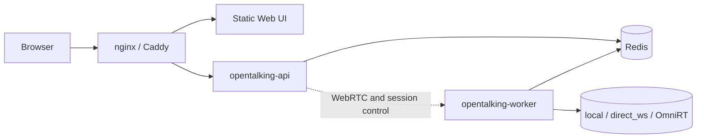
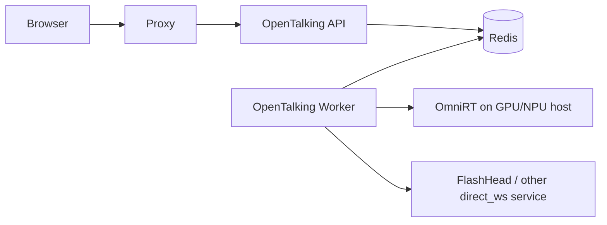

# Deployment

This page is the runbook for deploying the OpenTalking orchestration layer. Model
weights and model-server startup remain in [Models](../model-deployment/index.md);
use this page to decide how the API, Worker, Web UI, Redis, reverse proxy, and
external inference services should be wired together.

## Choose a Topology

| Topology | Command shape | Best for | Notes |
|----------|---------------|----------|-------|
| Single-process `unified` | `opentalking-unified` | Local demos, small internal trials, fast debugging | One process owns API, Worker, sessions, and an in-memory event bus. Do not run multiple `unified` workers behind a load balancer. |
| Split API + Worker | `opentalking-api` + `opentalking-worker` + Redis | Standard single-host or small production deployment | Recommended production baseline. Worker can be restarted or scaled separately from API. |
| Docker Compose | `docker compose up` | Reproducible deployment, CI, container-first teams | Convenient, but heavier than native source installs for CPU and single-GPU evaluation. |
| Remote model backend | OpenTalking + `OMNIRT_ENDPOINT` or `direct_ws` | Heavy models, multi-GPU, remote GPU/NPU hosts | Keep OpenTalking near users; run model servers where accelerators live. |
| Ascend 910B | Source install + CANN + OmniRT/model service | NPU evaluation | Prefer host-native source deployment; Docker is optional and environment-specific. |

## Prerequisites

Prepare these before choosing a topology:

- Python 3.10 or later (3.11 recommended), Node.js 18 or later, Redis 7, and FFmpeg.
- A completed `.env` copied from `.env.example`.
- LLM/STT/TTS credentials configured as described in [Configuration](../tutorials/configuration.md).
- Avatar assets and model backend configuration selected from [Models](../model-deployment/index.md).
- For public access, a domain name, TLS certificate, and a TURN server if browsers are often behind symmetric NAT.

## Native Single-Host Runbook

Use this path for a machine that runs OpenTalking from source. It is the clearest
deployment for debugging and for CPU or single-GPU evaluation because there is no
container layer between the process and the host.

### 1. Install

```bash title="terminal"
git clone https://github.com/datascale-ai/opentalking.git
cd opentalking
uv sync --extra dev --python 3.11
source .venv/bin/activate

cd apps/web
npm ci
cd ../..
cp .env.example .env
```

If you need the compatibility fallback instead:

```bash title="terminal"
python3 -m venv .venv
source .venv/bin/activate
pip install --index-url https://pypi.tuna.tsinghua.edu.cn/simple -e ".[dev]"
```

Set the minimum runtime configuration:

```env title=".env"
OPENTALKING_LLM_BASE_URL=https://dashscope.aliyuncs.com/compatible-mode/v1
OPENTALKING_LLM_API_KEY=<your-key>
OPENTALKING_STT_PROVIDER=dashscope
OPENTALKING_STT_API_KEY=<your-key>
OPENTALKING_TTS_PROVIDER=edge
OPENTALKING_AVATARS_DIR=./examples/avatars
OPENTALKING_VOICES_DIR=./var/voices
OPENTALKING_SQLITE_PATH=./data/opentalking.sqlite3
OPENTALKING_CORS_ORIGINS=http://localhost:5173,http://127.0.0.1:5173
```

### 2. Run `unified`

For development, a private demo, or a single machine without horizontal scaling:

```bash title="terminal"
source .venv/bin/activate
OPENTALKING_REDIS_MODE=memory opentalking-unified --host 0.0.0.0 --port 8000
```

In another terminal:

```bash title="terminal"
cd apps/web
VITE_BACKEND_PORT=8000 npm run dev -- --host 0.0.0.0 --port 5173
```

Open <http://127.0.0.1:5173>, select a built-in avatar, then start with `mock`.

### 3. Run Split API + Worker {#api-and-worker-split}

Use this as the production baseline.

```bash title="terminal: redis"
redis-server --port 6379 --appendonly yes
```

```bash title="terminal: api"
source .venv/bin/activate
export OPENTALKING_REDIS_URL=redis://127.0.0.1:6379/0
export OPENTALKING_WORKER_URL=http://127.0.0.1:9001
opentalking-api
```

```bash title="terminal: worker"
source .venv/bin/activate
export OPENTALKING_REDIS_URL=redis://127.0.0.1:6379/0
opentalking-worker
```

```bash title="terminal: web"
cd apps/web
VITE_API_BASE=/api npm run build
# Serve apps/web/dist with nginx, Caddy, or another static server.
```

The split topology looks like this:



### 4. Connect a Model Backend

For `mock`, no model service is required. For real models, configure only the selected
backend:

```env title=".env"
# OmniRT for wav2lip / musetalk / flashtalk when those models use backend: omnirt.
OMNIRT_ENDPOINT=http://<model-host>:9000

# FlashHead remains a direct WebSocket backend.
OPENTALKING_FLASHHEAD_WS_URL=ws://<flashhead-host>:8766/v1/avatar/realtime
OPENTALKING_FLASHHEAD_BASE_URL=http://<flashhead-host>:8766
```

Verify backend visibility:

```bash title="terminal"
curl -fsS http://127.0.0.1:8000/models | jq '.statuses[] | {id, backend, connected, reason}'
```

## Docker Compose

Docker Compose is useful when reproducibility matters more than startup weight. For
light CPU or single-GPU evaluation, native source deployment is usually easier to
inspect.

### CPU / Mock Stack

```bash title="terminal"
cp .env.example .env
docker compose up -d --build
docker compose ps
curl -fsS http://127.0.0.1:8000/health
curl -fsS http://127.0.0.1:8000/models
```

Open <http://127.0.0.1:5173>. This stack starts `redis`, `api`, `worker`, and `web`.
It is suitable for UI validation and pipeline testing with `mock`.

### GPU / OmniRT Stack

Install the NVIDIA driver and NVIDIA Container Toolkit first. Then run:

```bash title="terminal"
cp .env.example .env
docker compose --profile gpu \
  -f docker-compose.yml \
  -f docker-compose.gpu.yml \
  up -d --build
docker compose ps
curl -fsS http://127.0.0.1:9000/v1/audio2video/models
curl -fsS http://127.0.0.1:8000/models
```

Use this path only for models configured with `backend: omnirt`. Model weights and
OmniRT-specific startup details are documented under [Models](../model-deployment/index.md).

Useful operations:

```bash title="terminal"
docker compose logs -f api worker web
docker compose restart api worker
docker compose down
```

Persist production data by mounting the avatar, voice, SQLite, Redis, and model
directories instead of relying on container-local files.

## Reverse Proxy

For production, terminate TLS at nginx, Caddy, or an ingress controller. The proxy
must support normal HTTP requests, WebSocket upgrades, and SSE without buffering.

Minimal nginx shape:

```nginx title="/etc/nginx/conf.d/opentalking.conf"
map $http_upgrade $connection_upgrade {
  default upgrade;
  '' close;
}

server {
  listen 443 ssl http2;
  server_name demo.example.com;

  ssl_certificate /etc/letsencrypt/live/demo.example.com/fullchain.pem;
  ssl_certificate_key /etc/letsencrypt/live/demo.example.com/privkey.pem;

  root /srv/opentalking/web/dist;
  index index.html;

  location /api/ {
    proxy_pass http://127.0.0.1:8000/;
    proxy_http_version 1.1;
    proxy_set_header Host $host;
    proxy_set_header X-Forwarded-Proto $scheme;
    proxy_set_header X-Real-IP $remote_addr;
    proxy_set_header X-Forwarded-For $proxy_add_x_forwarded_for;
    proxy_set_header Upgrade $http_upgrade;
    proxy_set_header Connection $connection_upgrade;
    proxy_buffering off;
    proxy_cache off;
    proxy_read_timeout 3600s;
  }

  location / {
    try_files $uri /index.html;
  }
}
```

Production `.env` should include the browser origin:

```env title=".env"
OPENTALKING_CORS_ORIGINS=https://demo.example.com
OPENTALKING_PUBLIC_BASE_URL=https://demo.example.com
```

## Multi-Host and Heavy Models

For heavy talking-head models, keep OpenTalking stateless where possible and run model
services on accelerator hosts:



Recommended rules:

- Use `local` for lightweight adapters that fit on the OpenTalking host.
- Use `direct_ws` when a single model already exposes its own WebSocket protocol.
- Use `omnirt` for heavy, multi-card, remote, or NPU-backed inference.
- Do not set `OMNIRT_ENDPOINT` as a blanket requirement for every model; only models
  configured with `backend: omnirt` need it.

## Ascend 910B

For NPU evaluation, prefer host-native source deployment so the process can inherit
the CANN environment:

```bash title="terminal"
source /usr/local/Ascend/ascend-toolkit/set_env.sh
bash scripts/deploy_ascend_910b.sh
```

Prerequisites:

- CANN 8.0 or later.
- Prefer setting `UV_INDEX_URL` / `PIP_INDEX_URL` to a domestic mirror before installing OpenTalking and OmniRT in China-friendly environments.
- OmniRT checked out alongside OpenTalking when using `backend: omnirt`.
- Model checkpoints under `$DIGITAL_HUMAN_HOME/models/`.

Verify:

```bash title="terminal"
curl -fsS http://127.0.0.1:9000/v1/audio2video/models
curl -fsS http://127.0.0.1:8000/models
```

## Health Checks

Use these checks during rollout and after restarts:

| Check | Command | Expected |
|-------|---------|----------|
| API liveness | `curl -fsS http://127.0.0.1:8000/healthz` | HTTP 200 |
| API readiness | `curl -fsS http://127.0.0.1:8000/health` | JSON service status |
| Queue status | `curl -fsS http://127.0.0.1:8000/queue/status` | Queue and slot state |
| Models | `curl -fsS http://127.0.0.1:8000/models` | Each model has `backend`, `connected`, and `reason` |
| Web UI | Open `http://127.0.0.1:5173` or production URL | UI loads and model selector is populated |

## Production Checklist {#production-checklist}

Recommended production defaults:

- Run API and Worker under systemd, supervisor, Docker Compose, or Kubernetes.
- Keep Redis persistent with `appendonly yes`.
- Mount `OPENTALKING_AVATARS_DIR`, `OPENTALKING_VOICES_DIR`, and
  `OPENTALKING_SQLITE_PATH` on durable storage.
- Forward logs to the platform logger and set `OPENTALKING_LOG_LEVEL=INFO`.
- For multiple Workers, isolate model GPU assignments with environment variables such
  as `CUDA_VISIBLE_DEVICES` or vendor-specific NPU visibility controls.
- Use sticky routing or a shared Redis-backed setup for long-lived browser sessions.

Quickstart helper scripts remain useful for development:

| Script | Purpose |
|--------|---------|
| `scripts/quickstart/start_all.sh` | Starts `unified` and the frontend. |
| `scripts/quickstart/start_omnirt_wav2lip.sh` | Starts OmniRT serving Wav2Lip. |
| `scripts/quickstart/start_omnirt_flashtalk.sh` | Starts OmniRT serving FlashTalk. |
| `scripts/quickstart/status.sh` | Reports helper-managed process and endpoint status. |
| `scripts/quickstart/stop_all.sh` | Stops helper-managed processes. |

## Troubleshooting

| Symptom | Likely cause | Fix |
|---------|--------------|-----|
| Web UI loads but API calls fail | `VITE_API_BASE`, nginx `/api` proxy, or CORS mismatch | Confirm `/api/health` reaches API through the same origin; update `OPENTALKING_CORS_ORIGINS`. |
| Event stream connects then stalls | Reverse proxy buffers SSE | Set `proxy_buffering off` and keep `Cache-Control: no-transform`. |
| WebRTC fails only for remote users | NAT traversal problem | Deploy TURN, then expose the TURN config through the frontend/runtime integration used by your deployment. |
| `/models` shows `connected=false` | Backend is unavailable or misconfigured | Read the `reason` field. `local_adapter_missing`, missing WS URL, and missing OmniRT model list are different fixes. |
| `mock` works but real model fails | Model service, weights, or avatar type mismatch | Check [Models](../model-deployment/index.md), verify `/models`, then match avatar `model_type` to the selected model. |
| Worker starts but sessions stay queued | Redis URL mismatch or Worker cannot reach backend | Compare `OPENTALKING_REDIS_URL` in API and Worker; check Worker logs. |
| Docker web port is reachable but API is not | nginx proxy or Compose service health | Run `docker compose logs -f web api worker` and test `curl http://127.0.0.1:8000/health`. |
