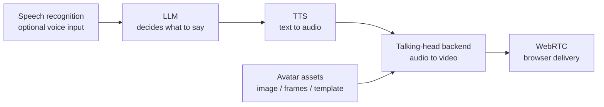

# Models

This module explains how to make the full OpenTalking model chain runnable, not only
the talking-head backend. A usable digital-human session depends on five parts:

## Recommended defaults

| Layer | Default for first run | When to change it |
|-------|-----------------------|-------------------|
| LLM | DashScope OpenAI-compatible endpoint | Use OpenAI, vLLM, Ollama, or DeepSeek when those are already standard in your environment. |
| STT | DashScope Paraformer realtime | Keep it unless you need a different realtime ASR provider. |
| TTS | Edge TTS | Use DashScope, CosyVoice, or ElevenLabs for production voices and voice cloning. |
| Avatar assets | Built-in examples | Prepare model-specific assets before selecting Wav2Lip, QuickTalk, FlashHead, or FlashTalk. |
| Talking-head backend | `mock` first, then Wav2Lip compatibility path | Use QuickTalk / FlashTalk through OmniRT, FlashHead direct WS, or another model service. |

## Setup order

1. Run [Quickstart](../user-guide/quickstart.md) with `mock`.
2. Check the [Support Matrix](support-matrix.md) to choose the right path.
3. Configure [LLM and STT](llm-stt.md).
4. Choose and verify [TTS](tts.md).
5. Prepare [Avatar assets](avatar.md).
6. Start a [talking-head model](talking-head.md).
7. Verify `/models`, create a session, and test through the browser.

Keep model execution decoupled from OpenTalking itself: lightweight models should use
`local` or `direct_ws` where possible, while OmniRT remains the recommended backend
for heavyweight, multi-card, remote, or NPU deployments.
