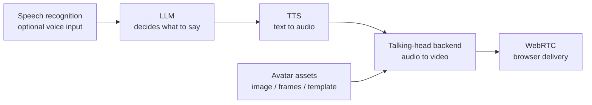

# Models

This module explains how to make the full OpenTalking model chain runnable, not only
the talking-head backend. A usable digital-human session depends on five parts:



## Recommended defaults

| Layer | Default for first run | When to change it |
|-------|-----------------------|-------------------|
| LLM | DashScope OpenAI-compatible endpoint | Use OpenAI, vLLM, Ollama, or DeepSeek when those are already standard in your environment. |
| STT | DashScope Paraformer realtime | Keep it unless you need a different realtime STT provider. |
| TTS | Edge TTS | Use DashScope, CosyVoice, or ElevenLabs for production voices and voice cloning. |
| Avatar assets | Built-in examples | Prepare model-specific assets before selecting Wav2Lip, QuickTalk, FlashHead, or FlashTalk. |
| Talking-head backend | `mock` first, then the Wav2Lip local path | Use QuickTalk local/OmniRT, FlashTalk through OmniRT, FlashHead direct WS, or another model service. |

## Setup order

1. Run [Quickstart](../tutorials/quickstart.md) with `mock`.
2. Check the [Support Matrix](support-matrix.md) to choose the right path.
3. Configure [LLM and STT](llm-stt.md).
4. Choose and verify [TTS](tts.md).
5. Prepare [Avatar assets](avatar.md).
6. Start a [talking-head model](talking-head/index.md).
7. Verify `/models`, create a session, and test through the browser.

## Model Shortcuts

| Goal | Entry |
|------|-------|
| End-to-end self-test with no weights | [Mock](mock.md) |
| First real lip-sync model | [Wav2Lip Local](wav2lip/local.md) |
| Local STT/TTS + QuickTalk | [Local STT/TTS + QuickTalk](recipes/local-quicktalk-audio.md) |
| V100 single-host FasterLivePortrait + FlashHead | [V100 + FasterLivePortrait + FlashHead](recipes/v100-fasterliveportrait-flashhead.md) |
| Existing MuseTalk runtime | [MuseTalk with OmniRT](musetalk/omnirt.md) |
| Local realtime adapter | [QuickTalk Local](quicktalk/local.md) |
| Single-GPU realtime portrait with pasteback | [FasterLivePortrait](fasterliveportrait.md) |
| High-quality heavy model | [FlashTalk](flashtalk.md) |
| Standalone FlashHead service | [FlashHead](flashhead.md) |

Keep model execution decoupled from OpenTalking itself: lightweight models should use
`local` or `direct_ws` where possible, while OmniRT remains the recommended backend
for heavyweight, multi-card, remote, or NPU deployments.

## Frontend Entry

After the model or backend service is running, use the OpenTalking WebUI:

```bash title="Terminal"
cd "$OPENTALKING_HOME"
bash scripts/quickstart/start_frontend.sh --api-port 8000 --web-port 5173 --host 0.0.0.0
```

For a remote server, forward your local browser port to the server `5173`, then open `http://127.0.0.1:5173`.
