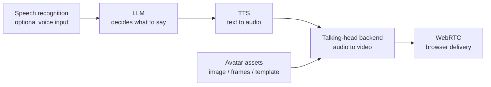

# Models

This module explains how to make the full OpenTalking model chain runnable, not only
the talking-head backend. A usable digital-human session depends on five parts:

## Recommended defaults

| Layer | Default for first run | When to change it |
|-------|-----------------------|-------------------|
| LLM | DashScope OpenAI-compatible endpoint | Use OpenAI, vLLM, Ollama, or DeepSeek when those are already standard in your environment. |
| STT | DashScope Paraformer realtime | Keep it unless you need a different realtime STT provider. |
| TTS | Edge TTS | Use DashScope, CosyVoice, or ElevenLabs for production voices and voice cloning. |
| Avatar assets | Built-in examples | Use shared visual assets; models generate caches, templates, or preprocessing artifacts as needed. |
| Talking-head backend | `mock` first, then the Wav2Lip local path | Use QuickTalk / FlashTalk through OmniRT, FlashHead direct WS, or another model service. |

## Setup order

1. Run [Quickstart](../tutorials/quickstart.md) with `mock`.
2. Check the [Support Matrix](../deployment/support-matrix.md) to choose the right path.
3. Configure [LLM and STT](../speech_models/llm-stt.md).
4. Choose and verify [TTS](../speech_models/tts.md).
5. Prepare [Avatar assets](../avatar_models/avatar.md).
6. Start a [talking-head model](../avatar_models/talking-head.md).
7. Verify `/models`, create a session, and test through the browser.

## Model Shortcuts

| Goal | Entry |
|------|-------|
| End-to-end self-test with no weights | [Mock](../avatar_models/mock.md) |
| First real lip-sync model | [Wav2Lip Local](../avatar_models/deployment/wav2lip-local.md) |
| Local STT/TTS + QuickTalk | [Local STT/TTS + QuickTalk](../recipes/local-quicktalk-audio.md) |
| Existing MuseTalk runtime | [MuseTalk](../avatar_models/musetalk.md) |
| Local realtime adapter | [QuickTalk](../avatar_models/quicktalk.md) |
| Single-GPU realtime portrait with pasteback | [FasterLivePortrait](../avatar_models/fasterliveportrait.md) |
| High-quality heavy model | [FlashTalk](../avatar_models/flashtalk.md) |
| Standalone FlashHead service | [FlashHead](../avatar_models/flashhead.md) |

Keep model execution decoupled from OpenTalking itself: lightweight models should use
`local` or `direct_ws` where possible, while OmniRT remains the recommended backend
for heavyweight, multi-card, remote, or NPU deployments.

## Speech Generation Model Deployment

This section covers TTS model deployment and weight preparation only. For combined
flows, see [Local Audio + QuickTalk](../recipes/local-quicktalk-audio.md).

| Model | Entry | Notes |
| --- | --- | --- |
| Edge TTS | [Speech Generation Models](../speech_models/tts.md) | First-run default, good for pipeline validation. |
| DashScope Qwen TTS | [Speech Generation Models](../speech_models/tts.md) | Chinese realtime TTS and voice cloning. |
| CosyVoice3 | [CosyVoice Deployment](../speech_models/tts/cosyvoice.md) | Local Chinese TTS with built-in and cloned voices. |
| IndexTTS | [IndexTTS Deployment](../speech_models/tts/indextts.md) | Controllable dubbing, emotion control, and voice cloning. |
| ElevenLabs | [Speech Generation Models](../speech_models/tts.md) | Hosted multilingual voices. |
