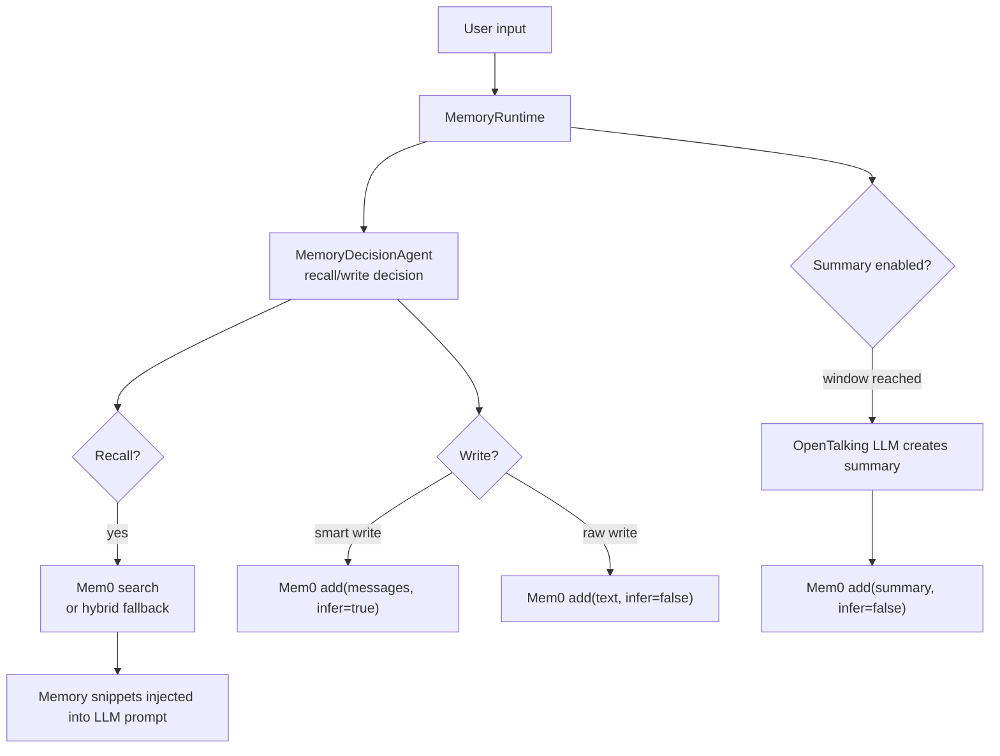

# Mem0 Memory Engine

The Mem0 memory engine powers long-term character memory in OpenTalking. It stores durable user preferences, stable facts, and multi-turn summaries, then recalls relevant memories before the next LLM call. This is separate from the knowledge-base/RAG flow: knowledge bases are for uploaded documents, while memory libraries are for long-lived user-character interaction state.

!!! note "Current implementation"
    OpenTalking currently integrates Mem0 through the open-source `mem0.Memory` SDK and keeps its own `/memory/*` APIs, memory libraries, items, and scope model. Switching the provider to Mem0 does not remove the existing list/import/delete memory API surface.

## Where Mem0 Fits



OpenTalking still owns:

- Scope: `profile_id + character_id + library_id`.
- Memory APIs: create libraries, list items, import turns, delete items.
- Recall decisions: low-value inputs are skipped.
- Multi-turn summary generation: OpenTalking uses the configured main LLM, then writes the summary through the provider.

Mem0 provides:

- Memory storage and semantic search.
- Smart extraction from conversation messages when `smart_write_enabled=true` and the installed SDK supports `infer`.
- Mem0-side semantic recall, deduplication, and disambiguation behavior. OpenTalking does not expose a separate manual disambiguation endpoint.

## Dependencies

The current 146 environment uses the compatible set below:

```bash title="Terminal"
python -m pip install "mem0ai==0.1.60" "qdrant-client==1.12.0" "protobuf==4.25.9"
```

`protobuf` is pinned to 4.x to avoid conflicts between newer `mem0ai` releases and the existing `mediapipe` dependency. Re-run `python -m pip check` and the memory tests before upgrading the Mem0 SDK.

## .env Configuration

OpenTalking defaults to the Mem0 smart memory engine and smart orchestration, but conversation memory still runs only when the session/persona enables `memory_enabled`: if memory is not enabled for that conversation, OpenTalking does not recall or write memories. When memory is enabled and no explicit library is provided, OpenTalking uses its internal default memory library.

Most deployments only need the summary settings and the models Mem0 uses internally:

```env title=".env"
OPENTALKING_MEMORY_SUMMARY_ENABLED=true
OPENTALKING_MEMORY_SUMMARY_TURN_WINDOW=8
OPENTALKING_MEMORY_SUMMARY_MAX_ITEMS=3

OPENTALKING_MEMORY_MEM0_LLM_PROVIDER=openai
OPENTALKING_MEMORY_MEM0_LLM_BASE_URL=https://dashscope.aliyuncs.com/compatible-mode/v1
OPENTALKING_MEMORY_MEM0_LLM_API_KEY=<llm-api-key>
OPENTALKING_MEMORY_MEM0_LLM_MODEL=qwen-flash

OPENTALKING_MEMORY_MEM0_EMBEDDER_PROVIDER=openai
OPENTALKING_MEMORY_MEM0_EMBEDDER_BASE_URL=https://dashscope.aliyuncs.com/compatible-mode/v1
OPENTALKING_MEMORY_MEM0_EMBEDDER_API_KEY=<embedding-api-key>
OPENTALKING_MEMORY_MEM0_EMBEDDER_MODEL=text-embedding-v4
```

Internal defaults already select the Mem0 provider, hybrid recall/write, rules-first plus Mem0/LLM second-stage judgement, and smart writes. `OPENTALKING_MEMORY_MEM0_CONFIG` is still supported as an advanced compatibility override: when it is set, OpenTalking passes that JSON to Mem0 instead of building config from the split variables above.

## LLM, Embedding, And Vector Store

| Config | Purpose |
|--------|---------|
| `llm` | Model Mem0 uses to understand conversations and extract or rewrite durable memories. |
| `embedder` | Model that converts memory text into vectors for semantic retrieval. |
| `vector_store` | Storage backend for vectors, metadata, and indexes, such as Qdrant, Chroma, or pgvector. It is not the OpenTalking memory-library UI; it is Mem0's retrieval database. |

OpenTalking's main LLM is still configured with `OPENTALKING_LLM_*`. The `llm/embedder/vector_store` block only affects Mem0's own memory extraction and retrieval.

## Recall Decision Mode

`OPENTALKING_MEMORY_DECISION_MODE` controls the pre-recall decision:

| Value | Behavior |
|-------|----------|
| `rule` | Default. Uses local rules only, with the lowest latency. |
| `hybrid` | Rules run first. Empty inputs, low-value inputs, and high-risk operations are hard rejects; clear user-memory, fact-entity, and explicit-recall matches recall directly; only ambiguous inputs call the LLM judge. |
| `llm` | Experimental. Hard rejects remain rule-protected; other inputs are judged by the LLM. |

`OPENTALKING_MEMORY_DECISION_TIMEOUT_MS` is the second-stage judge timeout. If the LLM judge times out or fails, OpenTalking falls back to the rule result and continues the conversation.

## Is MEM0_API_KEY Required?

For the current OpenTalking adapter, no. It uses the open-source `mem0.Memory` class, not `MemoryClient`, so `MEM0_API_KEY` is not required. You only need the LLM, embedding, and vector-store configuration used by the open-source Mem0 runtime; those services may have their own API keys or local endpoints.

`MEM0_API_KEY` is required only if the project later switches to Mem0 Platform / `MemoryClient`. Platform pricing depends on Mem0's current plans and is not required for this adapter.

## Impact On Existing Memory APIs

With `OPENTALKING_MEMORY_PROVIDER=mem0`, the OpenTalking memory API remains the same:

```bash title="Terminal"
curl "http://127.0.0.1:8000/memory/libraries?profile_id=default&character_id=<avatar-id>"

curl "http://127.0.0.1:8000/memory/libraries/default/items?profile_id=default&character_id=<avatar-id>"
```

Notes:

- Item listing uses Mem0 `get_all(...)`, then OpenTalking filters by `profile_id`, `character_id`, and `library_id`.
- OpenTalking stores the raw Mem0 id as `_mem0_id` and keeps its own `opentalking_memory_id` for stable API-facing ids.
- Item deletion uses `_mem0_id` when calling Mem0 delete.
- `memory_recall_backend=hybrid` falls back to local BM25 item ranking when Mem0 returns no result; `memory_recall_backend=mem0` uses Mem0 only.

## Verification

Check provider initialization:

```bash title="Terminal"
python - <<'PY'
from opentalking.core.config import get_settings
from opentalking.providers.memory.factory import build_memory_provider

get_settings.cache_clear()
provider = build_memory_provider()
print(type(provider).__name__)
PY
```

Import and list one memory:

```bash title="Terminal"
curl -s -X POST http://127.0.0.1:8000/memory/libraries \
  -H 'content-type: application/json' \
  -d '{"id":"default","name":"Default","character_id":"demo-avatar"}'

curl -s -X POST http://127.0.0.1:8000/memory/libraries/default/import \
  -H 'content-type: application/json' \
  -d '{"profile_id":"default","character_id":"demo-avatar","turns":[{"role":"user","content":"Remember that I prefer concise answers."}]}'

curl -s "http://127.0.0.1:8000/memory/libraries/default/items?profile_id=default&character_id=demo-avatar"
```

After changing SDK versions or dependencies, run:

```bash title="Terminal"
python -m pip check
python -m pytest tests/unit/test_memory_provider.py apps/api/tests/test_memory_api.py apps/api/tests/test_config.py
```

## References

- [Mem0 Open Source Overview](https://docs.mem0.ai/open-source/overview)
- [Mem0 Open Source Configuration](https://docs.mem0.ai/open-source/configuration)
- [Mem0 Platform Quickstart](https://docs.mem0.ai/platform/quickstart)
- [Mem0 Pricing](https://mem0.ai/pricing)
