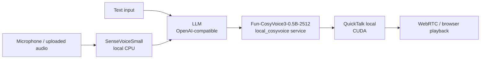

# Local Audio + QuickTalk

This is the local media path for private validation:



The LLM remains a separate module. It can point to DashScope, OpenAI, vLLM, Ollama, or your own local OpenAI-compatible service. STT, TTS, and video can all run on the same machine.

## When to Use It

- You want speech input and speech synthesis to run locally.
- You want QuickTalk driven by OpenTalking's local adapter before introducing OmniRT.
- You need to validate custom avatars, cloned voices, and the realtime digital-human chain.

This is not the first choice for 8GB VRAM machines when local TTS and QuickTalk share the GPU. If VRAM is tight, keep `SenseVoiceSmall CPU + QuickTalk local` and use Edge or DashScope TTS first.

## Provider Configuration

```env title=".env"
OPENTALKING_LLM_PROVIDER=openai_compatible
OPENTALKING_LLM_BASE_URL=https://dashscope.aliyuncs.com/compatible-mode/v1
OPENTALKING_LLM_API_KEY=<llm-key>
OPENTALKING_LLM_MODEL=qwen-flash

OPENTALKING_STT_DEFAULT_PROVIDER=sensevoice
OPENTALKING_STT_ENABLED_PROVIDERS=sensevoice,dashscope
OPENTALKING_STT_SENSEVOICE_MODEL=iic/SenseVoiceSmall
OPENTALKING_STT_SENSEVOICE_MODEL_DIR=./models/local-audio/iic__SenseVoiceSmall
OPENTALKING_STT_SENSEVOICE_DEVICE=cpu

OPENTALKING_TTS_DEFAULT_PROVIDER=local_cosyvoice
OPENTALKING_TTS_ENABLED_PROVIDERS=local_cosyvoice,dashscope,edge
OPENTALKING_TTS_LOCAL_COSYVOICE_MODEL=FunAudioLLM/Fun-CosyVoice3-0.5B-2512
OPENTALKING_TTS_LOCAL_COSYVOICE_MODEL_DIR=./models/local-audio/FunAudioLLM__Fun-CosyVoice3-0.5B-2512
OPENTALKING_TTS_LOCAL_COSYVOICE_RUNTIME_DIR=./models/local-audio/runtime/CosyVoice
OPENTALKING_TTS_LOCAL_COSYVOICE_SERVICE_URL=http://127.0.0.1:19090/synthesize
OPENTALKING_TTS_LOCAL_COSYVOICE_DEVICE=cuda:0

OPENTALKING_QUICKTALK_BACKEND=local
OPENTALKING_QUICKTALK_ASSET_ROOT=./models/quicktalk
OPENTALKING_QUICKTALK_WORKER_CACHE=1
OPENTALKING_TORCH_DEVICE=cuda:0
```

`*_DEFAULT_PROVIDER` only controls the default selection. It is not a fallback chain. If the frontend lets users choose API STT/TTS, configure provider-specific keys explicitly:

```env title=".env"
OPENTALKING_STT_DASHSCOPE_API_KEY=<dashscope-stt-key>
OPENTALKING_TTS_DASHSCOPE_API_KEY=<dashscope-tts-key>
```

## Install and Models

```bash title="terminal"
uv sync --extra dev --extra models --extra local-audio --extra quicktalk-cuda --python 3.11
python scripts/download_local_audio_models.py \
  --root ./models/local-audio \
  --model sensevoice-small \
  --model fun-cosyvoice3-0.5b-2512
```

Use the main `.venv` for OpenTalking, SenseVoice, and QuickTalk. Create a
separate CosyVoice sidecar venv after the runtime checkout.

For CosyVoice3 model sources and the optional fp16 TensorRT ONNX files, see [TTS deployment](../../speech_models/tts/cosyvoice.md).

Prepare QuickTalk weights as described in [QuickTalk Local](../quicktalk/local.md). Put the CosyVoice runtime under the model directory:

```bash title="terminal"
mkdir -p ./models/local-audio/runtime
git clone https://github.com/FunAudioLLM/CosyVoice.git ./models/local-audio/runtime/CosyVoice
cd ./models/local-audio/runtime/CosyVoice
git submodule update --init --recursive
cd "$DIGITAL_HUMAN_HOME/opentalking"
OPENTALKING_COSYVOICE_VENV_DIR=.venv-cosyvoice \
  bash scripts/prepare_cosyvoice_venv.sh
```

## Start

Start the local TTS service first:

```bash title="terminal"
bash scripts/quickstart/start_local_cosyvoice.sh --port 19090
```

Then start OpenTalking:

```bash title="terminal"
bash scripts/start_unified.sh --backend local --model quicktalk
```

## Verify

```bash title="terminal"
curl -fsS http://127.0.0.1:19090/health
curl -fsS http://127.0.0.1:8000/runtime/status
curl -s http://127.0.0.1:8000/models | python3 -m json.tool
```

Expected:

- `stt_provider=sensevoice`
- `tts_provider=local_cosyvoice`
- `quicktalk_backend=local`
- `quicktalk.connected=true`

In the frontend, select local STT, local CosyVoice3, and a QuickTalk avatar. Test text input, microphone input, and TTS preview.

## Mixing API Providers

The local path is not mandatory. Users can choose API STT or API TTS in the frontend, but the backend will not implicitly reuse the LLM key or `DASHSCOPE_API_KEY`. Missing API provider keys are blocked before session startup. API errors during a conversation are shown in the digital-human chat view.

## Frontend Entry

After the model or backend service is running, use the OpenTalking WebUI:

```bash title="Terminal"
cd "$OPENTALKING_HOME"
bash scripts/quickstart/start_frontend.sh --api-port 8000 --web-port 5173 --host 0.0.0.0
```

For a remote server, forward your local browser port to the server `5173`, then open `http://127.0.0.1:5173`.
