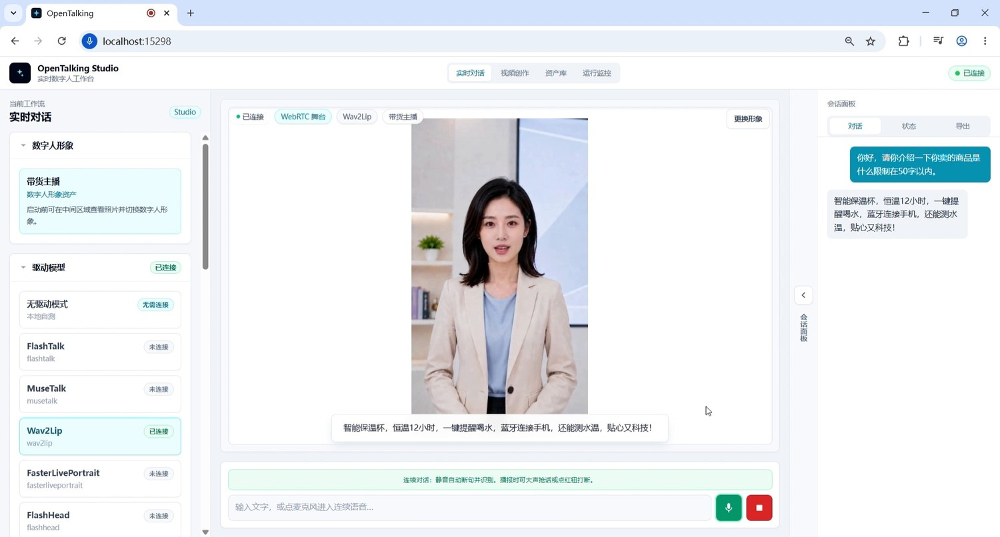
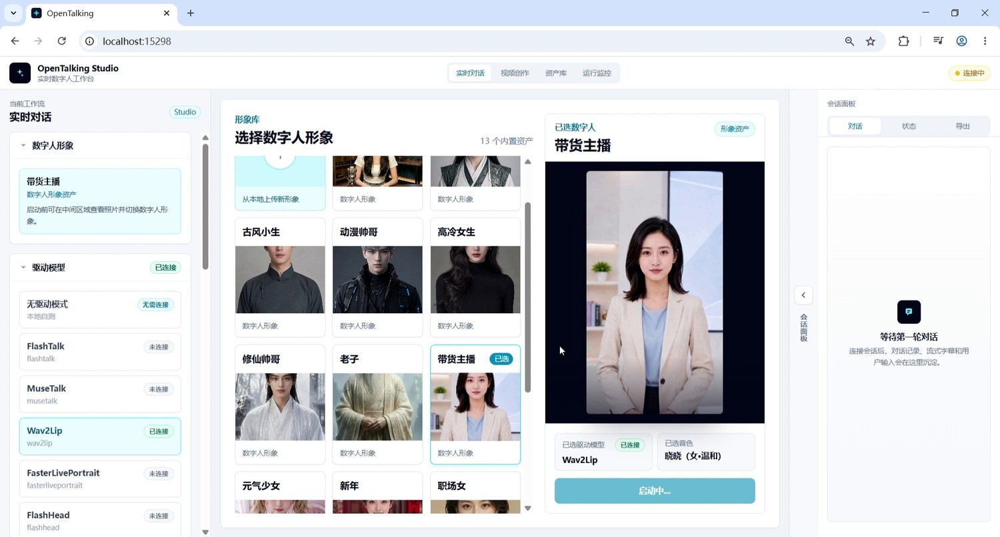

# Quick Start

This page helps you quickly run OpenTalking. Choose one of two paths first: use the published **Compshare image** for the fastest hosted trial, or use **self deployment** when you want to run and customize the repo on your own machine or server.

- Compshare image: no local dependency installation or model download; use the published instance image and open port `5173`.
- Self deployment: clone the repo, configure providers, start Mock mode first, then move to local QuickTalk or remote OmniRT when needed.
- WebUI validation: select avatar, model, and voice in the page, then start a real-time conversation.

## 1. Compshare Image

If you want to skip local dependency installation and model downloads, deploy our published Compshare community image:

- Image URL: <https://www.compshare.cn/images/TdDwmKZUZebI>
- Exposed port: `5173`
- Guide: [Compshare image quick experience](compshare-image.md)

The image already includes OpenTalking, OmniRT, the QuickTalk runtime environment, and model files. Use it to try the real digital-human path first; continue with the source-based steps below when you need local installation or development.

## 2. Self Deployment

Use this path when you want to run OpenTalking from source, change configuration, or continue into local/remote model deployment.

### 2.1 Mock Mode

Mock mode is the recommended first path for OpenTalking. It does not require GPU, model weights, or an external inference service, but still validates the API, LLM, TTS, subtitle events, WebRTC, and browser playback path.

Use it for:

- First installation and environment validation.
- Checking whether LLM / TTS configuration works.
- Previewing WebUI and session flow on a machine without GPU.

#### Mock Mode Environment

| Dependency | Recommended Version | Notes |
| --- | --- | --- |
| Python | `>= 3.10`, `3.11` recommended | Backend service and runtime. |
| Node.js | `>= 18` | WebUI frontend. |
| FFmpeg | Available as a system command | Audio/video processing dependency. |
| GPU | Not required | Uses the built-in Mock static frame. |

#### 1. Clone Repository

```bash
export DIGITAL_HUMAN_HOME=/opt/digital_human
mkdir -p "$DIGITAL_HUMAN_HOME"

cd "$DIGITAL_HUMAN_HOME"
git clone https://github.com/datascale-ai/opentalking.git
cd opentalking
```

#### 2. Install Basic Dependencies

Using `uv` is recommended:

```bash
# Optional: use a China mainland PyPI mirror.
export UV_DEFAULT_INDEX=https://pypi.tuna.tsinghua.edu.cn/simple

uv sync --extra dev --python 3.11
source .venv/bin/activate
cp .env.example .env
```

If `uv` is not convenient in your environment, use the compatibility installation:

```bash
python3 -m venv .venv
source .venv/bin/activate
pip install --index-url https://pypi.tuna.tsinghua.edu.cn/simple -e ".[dev]"
cp .env.example .env
```

#### 3. Configure Minimal Environment Variables

Edit `.env` and configure at least LLM and TTS. The example below uses an OpenAI-compatible endpoint and `edge` TTS:

```env
OPENTALKING_LLM_BASE_URL=https://dashscope.aliyuncs.com/compatible-mode/v1
OPENTALKING_LLM_API_KEY=sk-your-key
OPENTALKING_LLM_MODEL=qwen-flash

OPENTALKING_TTS_DEFAULT_PROVIDER=edge
OPENTALKING_TTS_EDGE_VOICE=zh-CN-XiaoxiaoNeural
```

`edge` TTS does not require an API key. If you use DashScope STT or DashScope TTS, configure `OPENTALKING_STT_DASHSCOPE_API_KEY` or `OPENTALKING_TTS_DASHSCOPE_API_KEY` for that module.

#### 4. Start Mock Mode

```bash
cd "$DIGITAL_HUMAN_HOME/opentalking"
bash scripts/start_unified.sh --mock
```

Default ports:

- API / unified backend: `8000`
- WebUI: `5173`

To specify ports:

```bash
bash scripts/start_unified.sh --mock --api-port 8210 --web-port 5280
```

#### 5. Open WebUI

After startup, the terminal prints the WebUI URL. The default URL is:

```text
http://127.0.0.1:5173
```


*After startup, WebUI shows the avatar library, model selector, voice controls, and conversation area.*

#### 6. Complete Your First Conversation

In WebUI, select Mock / driverless mode, confirm LLM and TTS configuration, enter a short test sentence, and start the session. If the browser plays audio, shows subtitles, and displays the Mock frame, the base pipeline is working.



*For the first validation, check user input, subtitle events, playback state, and video output.*

### 2.2 QuickTalk Mode

QuickTalk mode is a faster path toward real digital-human output. It can load QuickTalk weights locally and is suitable for single-machine validation on consumer CUDA GPUs.

Use it when:

- You have an available NVIDIA GPU and CUDA environment.
- You want to see real lip motion and avatar driving.

#### QuickTalk Mode Environment

| Dependency | Recommended Version | Notes |
| --- | --- | --- |
| Python | `>= 3.10`, `3.11` recommended | Backend service and model dependencies. |
| Node.js | `>= 18` | WebUI frontend. |
| FFmpeg | Available as a system command | Audio/video processing dependency. |
| GPU | NVIDIA CUDA GPU | Start with a 3090 / 4090 class machine if possible. |
| Weights | QuickTalk, HuBERT, InsightFace `buffalo_l` | Download or sync offline according to this page. |

#### 1. Check GPU and System Environment

QuickTalk mode requires a local CUDA GPU. Check:

```bash
nvidia-smi
ffmpeg -version
python --version
node --version
```

#### 2. Install Model Dependencies

```bash
cd "$DIGITAL_HUMAN_HOME/opentalking"
uv sync --extra dev --extra models --python 3.11
source .venv/bin/activate
```

#### 3. Prepare QuickTalk Weights

Place local QuickTalk weights and dependencies under repository-root `models/quicktalk/`.

```bash
cd "$DIGITAL_HUMAN_HOME/opentalking"
mkdir -p models/quicktalk/checkpoints

uv pip install -U "huggingface_hub[cli]"

# Optional: use a Hugging Face mirror when the network is slow.
export HF_ENDPOINT=https://hf-mirror.com

hf download datascale-ai/quicktalk \
  quicktalk.pth \
  repair.npy \
  chinese-hubert-large/config.json \
  chinese-hubert-large/preprocessor_config.json \
  chinese-hubert-large/pytorch_model.bin \
  --local-dir models/quicktalk/checkpoints
```

QuickTalk weights and HuBERT files are included in `datascale-ai/quicktalk`. QuickTalk still needs InsightFace `buffalo_l` prepared separately:

```bash
# Download and unpack InsightFace buffalo_l into the QuickTalk auxiliary directory.
mkdir -p /tmp/opentalking-insightface models/quicktalk/checkpoints/auxiliary/models
curl -L \
  -o /tmp/opentalking-insightface/buffalo_l.zip \
  https://github.com/deepinsight/insightface/releases/download/v0.7/buffalo_l.zip
unzip -q -o /tmp/opentalking-insightface/buffalo_l.zip \
  -d /tmp/opentalking-insightface
rsync -a /tmp/opentalking-insightface/buffalo_l/ \
  models/quicktalk/checkpoints/auxiliary/models/buffalo_l/
```

Recommended SHA256 checks:

```text
quicktalk.pth: fc8a7ea025c99a471ef00738874be5ecb6b5dfaf88ff6a1255a5d45a05d73001
repair.npy: 9ea50edde851bf3b12aa22d67b6f0db4f2930f3d9b7b3febcbd383e14117bfca
chinese-hubert-large/config.json: 8511d73054ac289ef47a527efdfd6738d2cb60f69f2973fdc9277492d9ff854b
chinese-hubert-large/preprocessor_config.json: 6334d6e0c5f2084c9a99b85ddff243cbc79dbaa4aa790bcddf8c41c496fab6fb
chinese-hubert-large/pytorch_model.bin: 9cf43abec3f0410ad6854afa4d376c69ccb364b48ddddfd25c4c5aa16398eab0
```

Check key files:

```bash
stat models/quicktalk/checkpoints/quicktalk.pth
stat models/quicktalk/checkpoints/repair.npy
stat models/quicktalk/checkpoints/chinese-hubert-large/pytorch_model.bin
stat models/quicktalk/checkpoints/auxiliary/models/buffalo_l/det_10g.onnx
```

The directory layout should look like:

```text
models/
  quicktalk/
    checkpoints/
      quicktalk.pth
      repair.npy
      chinese-hubert-large/
        config.json
        preprocessor_config.json
        pytorch_model.bin
      auxiliary/models/buffalo_l/
        det_10g.onnx
        ...
```

#### 4. Prepare a Custom Avatar

You can start with the built-in QuickTalk example avatar. Later, if you want to upload your own identity, use a clear frontal or half-body image and create a custom avatar in WebUI through “upload from local”.



*The WebUI avatar library supports built-in avatars and custom images through the upload entry.*

#### 5. Start QuickTalk Mode

```bash
export OPENTALKING_TORCH_DEVICE=cuda:0
export OPENTALKING_QUICKTALK_ASSET_ROOT="$DIGITAL_HUMAN_HOME/opentalking/models/quicktalk"
export OPENTALKING_QUICKTALK_WORKER_CACHE=1

cd "$DIGITAL_HUMAN_HOME/opentalking"
bash scripts/start_unified.sh --backend local --model quicktalk
```

To specify ports:

```bash
bash scripts/start_unified.sh \
  --backend local \
  --model quicktalk \
  --api-port 8210 \
  --web-port 5280
```

The first startup may build face cache and worker state, so it can take longer than Mock mode.

#### 6. Select QuickTalk in WebUI

After opening WebUI, select a `QuickTalk` avatar and the `quicktalk` model, then start a session. If the video frame is generated along with audio, the local QuickTalk rendering path is available.


*After selecting a QuickTalk avatar and model, check the generation state, connection status, and playback output.*
