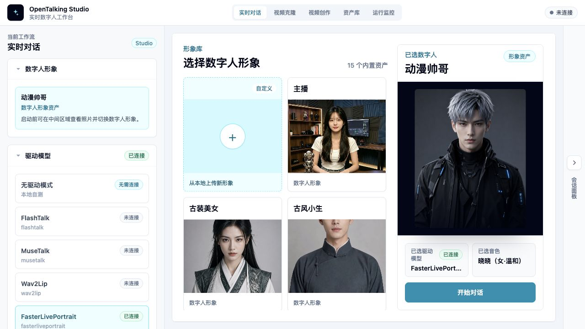
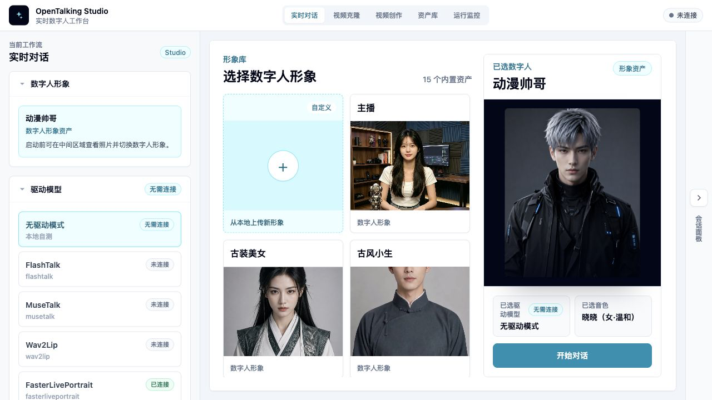

# WebUI Basic Usage

WebUI is OpenTalking's interactive workspace for avatar selection, model selection, voice configuration, and conversation validation. It is useful for quick checks and for letting non-engineering teammates preview the digital human experience.

## What WebUI Is For

Use WebUI to:

- Select built-in or custom avatars.
- Choose the model for the current session.
- Select TTS provider and voice.
- Converse through text or voice.
- Inspect connection status, session state, and errors.

WebUI is not a production admin system or a full asset management platform. It is a visual validation and debugging entry point.

## Open WebUI

Start services with:

```bash
bash scripts/start_unified.sh --mock
```

The script prints the WebUI URL. The default is:

```text
http://127.0.0.1:5173
```

If you changed ports, use the URL printed by the terminal.



## Page Layout

### Top Workflows

The top navigation switches between workflows. The most common entries are Realtime Conversation and Video Clone:

- Realtime Conversation is for digital-human sessions involving LLM / TTS / STT.
- Video Clone is for FasterLivePortrait video driving, where camera frames or uploaded video are only the driving input.

For details, see [Video Clone](./video-clone.md).

### Avatar Selection

The avatar area lists available digital humans. Each item usually has a preview image, name, and type label. Custom avatars are marked as custom and can be deleted.

If an expected avatar is missing, confirm that it is under `OPENTALKING_AVATARS_DIR` and contains a valid `manifest.json` and preview image.

### Model Selection

Model selection controls which digital human driver model is used for the session. In Mock mode, choose a driverless/mock option. In local or OmniRT mode, make sure model weights, backend services, and startup arguments are ready.

Model capabilities and backend choices are covered in [Model Support](../../model-support/index.md).

### Voice Selection

Voice selection controls the TTS provider and voice used for generated speech. Different providers have different voice identifiers, credentials, and latency profiles.

For first validation, use the default voice. For a business-specific voice, see [Voice and TTS](./voice-and-tts.md).

### Conversation Panel

The conversation panel is used for text input, replies, and digital human playback. When voice input is enabled, the browser asks for microphone permission.

Start with short text to verify first frame, audio, and captions before testing long prompts or continuous voice.

### Status and Errors

WebUI displays connection, session, model, and TTS errors. When something fails, read the page message first, then inspect API and WebUI logs.

## First-use Flow

### 1. Select Avatar

Select an avatar from the library. For the first run, use a built-in avatar to avoid custom asset issues.

### 2. Select Model

Choose a model that matches the startup mode:

- Mock mode: choose the mock / driverless option.
- Local QuickTalk: choose `quicktalk`.
- OmniRT backend: choose the model specified in startup arguments.

### 3. Select Voice

Use the default voice first. If multiple providers are configured, preview voices before selecting one.

### 4. Create Session

Create a session after avatar, model, and voice are selected. When creation succeeds, the page enters the conversation state.

### 5. Allow Microphone Permission

If you use voice input, allow microphone access in the browser. Text-only usage does not require it.

### 6. Start Conversation

Try a short message:

```text
Hello, please briefly introduce OpenTalking.
```

After reply, audio, and video are working, test more complex input.



## Common Operations

### Switch Avatar

After switching avatars, recreate the session. Different avatars may have different assets and model compatibility.

### Switch Model

Before switching models, make sure the backend supports the selected model. Otherwise session creation may fail.

### Switch Voice

Voice changes affect future replies. Already generated audio is not re-synthesized.

### View Captions and Events

The page shows conversation text, generated replies, and some status events. For detailed backend events, inspect API logs or later reference materials.

### Stop or Recreate Session

If inference stalls, audio breaks, or configuration changes behave unexpectedly, stop the current session and create a new one. If needed, restart services:

```bash
bash scripts/quickstart/stop_all.sh
```

## Common Issues

### Blank Page or Failed Assets

Check that the WebUI dev server is still running and that the frontend has no compilation errors.

### Session Creation Fails

Check API status:

```bash
bash scripts/quickstart/status.sh
```

Then confirm the selected model matches the backend that was started.

### No Audio

Check browser mute state, TTS provider configuration, voice availability, credentials, and network access.

### Microphone Unavailable

Check browser permissions, system microphone permissions, and whether the page is opened from `localhost` or `127.0.0.1`.
