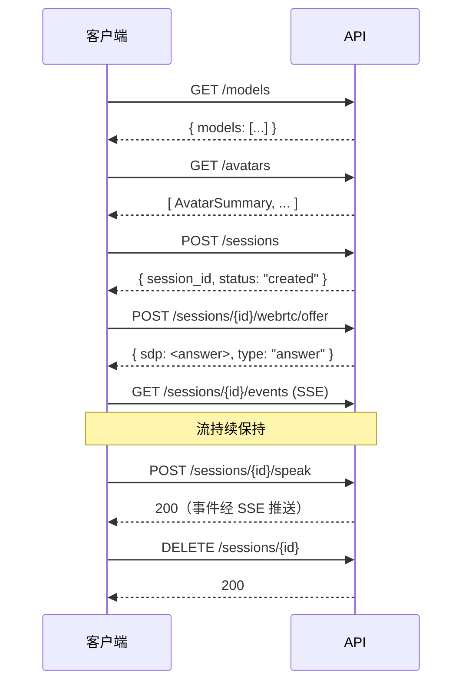

# API 参考

OpenTalking 暴露由 `apps/api/routes/` 定义的 REST、Server-Sent Events 与 WebSocket
接口，分组如下：

| 分组 | 用途 | 文档 |
|------|------|------|
| 健康检查与模型 | 存活探针、队列检视、能力发现。 | [健康检查与模型](health.md) |
| 数字人形象 | Avatar bundle 目录与自定义形象上传。 | [数字人形象](avatars.md) |
| 会话 | 会话生命周期、对话交互、WebRTC 信令。 | [会话](sessions.md) |
| TTS 与音色 | 一次性 TTS 预览与复刻音色管理。 | [TTS 与音色](tts-and-voices.md) |
| 事件与流式接口 | Server-Sent Events 流与音频 WebSocket 协议。 | [事件与流式接口](events.md) |

## Base URL 与鉴权

默认 Base URL 为 `http://localhost:8000`。生产部署通常在上游反向代理终结 TLS 与
鉴权。OpenTalking 自身不对路由强制鉴权；将 API 公开暴露的部署应在网关层实现鉴权。

`OPENTALKING_CORS_ORIGINS` 环境变量控制允许的跨域 origin，详见
[配置 §3](../user-guide/configuration.md#3)。

## 请求与响应约定

除特别说明外，请求与响应体格式为 `application/json`。Avatar 与音色复刻端点使用
multipart 上传（`multipart/form-data`）。

- 成功响应返回 HTTP `200` 与 JSON 体。
- 校验失败返回 HTTP `400`，payload 为 `{"detail": "..."}`。
- 资源缺失返回 HTTP `404`。
- 上游服务（DashScope、OmniRT）的鉴权与授权错误转换为 HTTP `502`，原始错误文本置于 `detail` 字段。
- 服务端错误返回 HTTP `500`，message 为通用提示；具体异常已记录到日志。

标识符格式：

- `session_id` —— 会话创建时分配的 UUID4 字符串。
- `avatar_id` —— slug 格式字符串（字母、数字、连字符、下划线、中文字符），由 avatar 的 `manifest.json` 定义。
- 音色 `entry_id` —— SQLite 音色目录中的整型主键。
- `job_id` —— FlashTalk 离线 bundle 任务分配的 UUID4 字符串。

## 端点汇总

| 方法 | 路径 | 分组 |
|------|------|------|
| `GET` | `/health` | 健康检查与模型 |
| `GET` | `/healthz` | 健康检查与模型 |
| `GET` | `/queue/status` | 健康检查与模型 |
| `GET` | `/models` | 健康检查与模型 |
| `GET` | `/avatars` | 数字人形象 |
| `GET` | `/avatars/{avatar_id}` | 数字人形象 |
| `GET` | `/avatars/{avatar_id}/preview` | 数字人形象 |
| `POST` | `/avatars/custom` | 数字人形象 |
| `DELETE` | `/avatars/{avatar_id}` | 数字人形象 |
| `POST` | `/sessions` | 会话 |
| `POST` | `/sessions/customize` | 会话 |
| `POST` | `/sessions/customize/prompt` | 会话 |
| `POST` | `/sessions/customize/reference` | 会话 |
| `GET` | `/sessions/{session_id}` | 会话 |
| `POST` | `/sessions/{session_id}/start` | 会话 |
| `POST` | `/sessions/{session_id}/speak` | 会话 |
| `POST` | `/sessions/{session_id}/transcribe` | 会话 |
| `POST` | `/sessions/{session_id}/speak_audio` | 会话 |
| `POST` | `/sessions/{session_id}/speak_flashtalk_audio` | 会话 |
| `POST` | `/sessions/{session_id}/interrupt` | 会话 |
| `POST` | `/sessions/{session_id}/webrtc/offer` | 会话 |
| `POST` | `/sessions/{session_id}/flashtalk-recording/start` | 会话 |
| `POST` | `/sessions/{session_id}/flashtalk-recording/stop` | 会话 |
| `GET` | `/sessions/{session_id}/flashtalk-recording` | 会话 |
| `POST` | `/sessions/{session_id}/flashtalk-offline-bundle` | 会话 |
| `GET` | `/sessions/{session_id}/flashtalk-offline-bundle/{job_id}` | 会话 |
| `GET` | `/sessions/{session_id}/flashtalk-offline-bundle/{job_id}/download` | 会话 |
| `DELETE` | `/sessions/{session_id}` | 会话 |
| `WS` | `/sessions/{session_id}/speak_audio_stream` | 事件与流式接口 |
| `GET` | `/sessions/{session_id}/events` | 事件与流式接口 |
| `POST` | `/tts/preview` | TTS 与音色 |
| `GET` | `/voices` | TTS 与音色 |
| `POST` | `/voices/clone` | TTS 与音色 |
| `DELETE` | `/voices/{entry_id}` | TTS 与音色 |
| `GET` | `/voice-uploads/{token}` | TTS 与音色 |

## 典型请求顺序

完整的客户端交互通常遵循下述序列。

## OpenAPI 规范

FastAPI 自动生成完整的 OpenAPI 3.x 规范，可通过以下端点访问：

- 交互式文档（Swagger UI）：`<base>/docs`
- 替代交互式文档（ReDoc）：`<base>/redoc`
- 原始规范（JSON）：`<base>/openapi.json`

字段级精确类型与校验规则以 OpenAPI 规范为准。生成客户端 SDK 与编写集成测试时应以
规范为权威来源，本文档仅作为参考说明。

## 源文件

| 文件 | 路由 |
|------|------|
| `apps/api/routes/health.py` | `/health`、`/healthz`、`/queue/status` |
| `apps/api/routes/models.py` | `/models` |
| `apps/api/routes/avatars.py` | `/avatars/*` |
| `apps/api/routes/sessions.py` | `/sessions/*` |
| `apps/api/routes/tts_preview.py` | `/tts/preview` |
| `apps/api/routes/voices.py` | `/voices/*`、`/voice-uploads/{token}` |
| `apps/api/routes/events.py` | `/sessions/{id}/events`（SSE） |
| `apps/api/schemas/session.py` | 会话的请求与响应模型。 |
| `apps/api/schemas/avatar.py` | `AvatarSummary` 响应模型。 |
