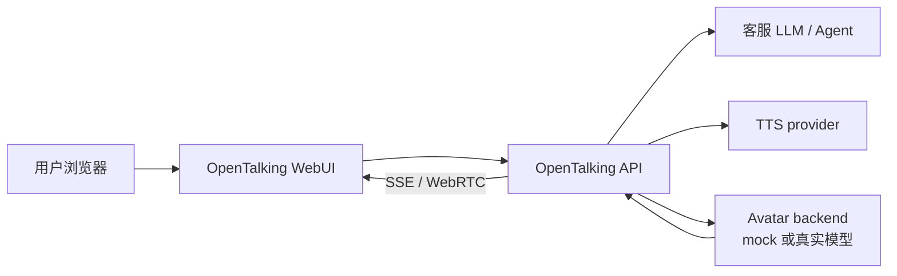

# AI 客服数字人

本案例演示如何用 OpenTalking 搭一个可对话的 AI 客服数字人。第一版使用 `mock` 合成后端，
不需要 GPU，也不需要 talking-head 权重；验证完成后，可以把 `mock` 替换为 Wav2Lip、
QuickTalk、FlashTalk 或其它 backend。

## 适合场景

- 官网、产品后台或展厅大屏上的语音客服。
- 内部知识库问答的可视化入口。
- 售前咨询、功能介绍、 onboarding 讲解。
- 需要先验证 LLM、TTS、字幕和 WebRTC 链路，但暂时不想处理模型权重的团队。

## 最终效果

用户在浏览器中和一个数字人客服对话。OpenTalking 负责会话、语音识别、LLM 回复、TTS、
字幕事件和 WebRTC 播放；业务侧可以通过 LLM system prompt、知识库检索或上游 Agent 决定回答内容。



## 前置条件

- 已完成 [快速上手](../tutorials/quickstart.md) 或 [Mock 端到端案例](../tutorials/cases/mock-e2e.md)。
- `.env` 中已配置 `OPENTALKING_LLM_API_KEY`；如启用语音输入，另配 `OPENTALKING_STT_API_KEY`。
- 浏览器建议使用 Chromium 内核。

## 1. 配置客服人设

在 `.env` 中先用 system prompt 固定客服语气和边界：

```env title=".env"
OPENTALKING_LLM_SYSTEM_PROMPT=你是 OpenTalking 产品客服。回答要简洁、礼貌、口语化。遇到价格、合同、法律承诺等问题时，提示用户联系人工销售。不要编造不存在的功能。
OPENTALKING_TTS_PROVIDER=edge
OPENTALKING_TTS_VOICE=zh-CN-XiaoxiaoNeural
```

如果业务侧已经有客服 Agent，可以让 Agent 提供 OpenAI-compatible endpoint，再配置：

```env title=".env"
OPENTALKING_LLM_BASE_URL=http://your-agent-gateway/v1
OPENTALKING_LLM_MODEL=customer-support-agent
OPENTALKING_LLM_API_KEY=<token>
```

## 2. 启动 mock 客服链路

```bash title="终端"
source .venv/bin/activate
bash scripts/quickstart/start_mock.sh
```

打开 <http://localhost:5173>，选择内置 avatar 与 `mock` 模型，开始语音对话。此时画面是占位数字人，
但 STT、LLM、TTS、字幕事件和 WebRTC 链路都已真实运行。

## 3. 用 API 嵌入业务系统

WebUI 适合验证体验；业务系统通常会直接调用 API。最小顺序是：

1. `GET /models` 查看当前可用模型。
2. `GET /avatars` 查看可用 avatar。
3. `POST /sessions` 创建会话。
4. 建立 WebRTC 信令或使用 WebUI 承载播放。
5. 订阅 `GET /sessions/{session_id}/events` 获取字幕、状态和错误事件。

接口细节见 [Sessions API](../docs/api/sessions.md) 和 [事件与流式接口](../docs/api/events.md)。

## 4. 替换成真实数字人

mock 验证通过后，按硬件和质量选择 backend：

| 目标 | 推荐路线 |
|------|----------|
| 消费级 GPU 快速看到口型效果 | [QuickTalk](../model-deployment/quicktalk.md) 或 [Wav2Lip](../model-deployment/wav2lip.md) |
| 更高质量、远端模型服务 | [FlashTalk](../model-deployment/flashtalk.md) + [OmniRT](../model-deployment/deployment.md) |
| 仍在开发 API 或前端 | 继续使用 `mock`，先稳定业务流程 |

切换后，前端与 API 调用方式保持一致，只需要在会话中选择新的 `model` 与匹配的 avatar。

## 验证清单

- `GET /health` 返回 `{"status":"ok"}`。
- `GET /models` 中目标模型为 `connected: true`。
- 浏览器能收到字幕事件，且音频能播放。
- 业务问题能被 LLM 按客服人设回答。
- 人工打断或重新提问后，会话能回到可继续对话状态。

## 常见问题

| 现象 | 处理方式 |
|------|----------|
| 客服回答太长 | 收紧 `OPENTALKING_LLM_SYSTEM_PROMPT`，要求每次回答 2 到 4 句。 |
| 业务知识不准确 | 不要只靠 prompt，建议接入检索或上游客服 Agent。 |
| mock 正常但真实模型无画面 | 先看 `/models` 的 backend 状态，再检查 avatar 的 `model_type` 是否匹配。 |
| Web 端无声音 | 检查浏览器自动播放限制，先由用户点击页面后再开始会话。 |

