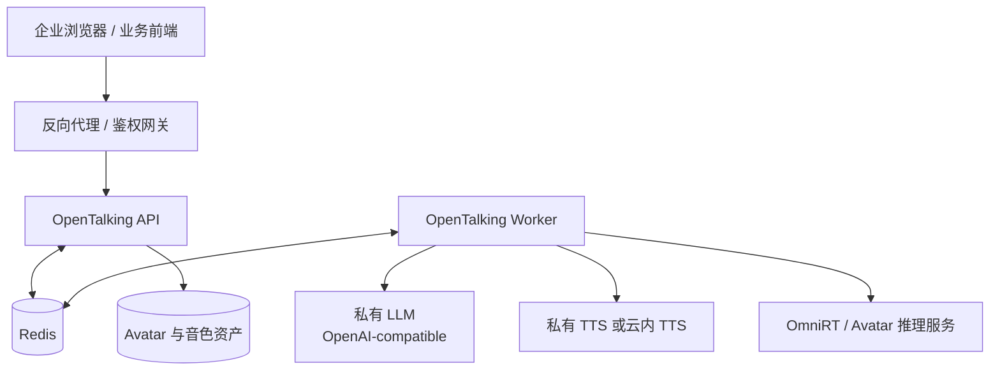

# 企业私有化部署

本案例说明如何把 OpenTalking 放进企业网络中，连接私有 LLM、TTS、Avatar backend 和反向代理。
它不是完整运维手册，而是一条生产评估路径：先明确边界，再逐步替换外部 provider。

## 适合场景

- 企业内部数字人客服或培训系统。
- 不能把业务数据发送到公网模型服务的环境。
- 已有私有大模型、TTS 或推理集群，希望 OpenTalking 只承担实时编排。
- 需要 API/Worker 分离、外部 Redis、网关鉴权和日志审计。

## 推荐架构



## 前置条件

- 已完成 [快速上手](../tutorials/quickstart.md)。
- 已阅读 [配置](../tutorials/configuration.md) 和 [部署](../model-deployment/deployment.md)。
- 私有 LLM 最好提供 OpenAI-compatible `/v1/chat/completions` 接口。
- Avatar 推理服务可选择 OmniRT、`direct_ws` 或本地 adapter。

## 1. 配置私有 LLM 与 TTS

```env title=".env"
OPENTALKING_LLM_BASE_URL=https://llm.internal.example.com/v1
OPENTALKING_LLM_MODEL=company-chat-model
OPENTALKING_LLM_API_KEY=<gateway-token>

OPENTALKING_TTS_PROVIDER=dashscope
OPENTALKING_TTS_VOICE=<voice-id>
OPENTALKING_STT_API_KEY=<dashscope-or-internal-token>
```

如果 TTS 也完全私有化，可以在 provider 层扩展适配器；扩展方式参考 [开发流程](../docs/developing.md)
和现有 TTS provider 实现。

## 2. 配置 Avatar backend

生产评估通常建议把重模型放在独立推理服务中：

```env title=".env"
OMNIRT_ENDPOINT=http://omnirt.internal.example.com:9000
```

```yaml title="configs/default.yaml"
models:
  flashtalk:
    backend: omnirt
  wav2lip:
    backend: omnirt
  mock:
    backend: mock
```

保留 `mock` 有助于排查：当真实模型异常时，可以快速确认 OpenTalking、LLM、TTS、WebRTC 是否健康。

## 3. API/Worker 分离

单机验证可以用 unified 模式；生产评估建议使用外部 Redis，把 API 和 Worker 分离：

```env title=".env"
OPENTALKING_REDIS_URL=redis://redis.internal.example.com:6379/0
```

部署原则：

| 组件 | 建议 |
|------|------|
| API | 靠近网关，负责 HTTP、SSE、WebRTC 信令和会话接口。 |
| Worker | 靠近 LLM/TTS/Avatar 服务，负责流水线执行。 |
| Redis | 使用内网地址，限制访问来源。 |
| Avatar 资产 | 使用统一挂载目录或对象存储同步，不要散落在临时目录。 |

## 4. 网关与安全边界

OpenTalking 默认不内置完整用户鉴权。对公网或企业多租户环境，建议在网关层处理：

- TLS 终止。
- 用户认证与访问控制。
- CORS 白名单。
- 请求体大小限制。
- SSE 与 WebSocket 代理配置。
- 审计日志与敏感字段脱敏。

SSE 代理需要关闭缓冲，配置示例见 [事件与流式接口](../docs/api/events.md)。

## 验证清单

- `/health` 可被网关和编排系统访问。
- `/models` 能显示目标 backend，并区分 `connected`、`not_configured` 或服务不可达。
- Redis 断开时有明确日志，不会误判为模型问题。
- LLM/TTS key 没有进入前端、日志或 PR。
- mock 路径和真实模型路径都至少验证一次。

## 常见问题

| 现象 | 处理方式 |
|------|----------|
| 网关后 SSE 没有持续事件 | 关闭代理缓冲，并确认连接没有被默认超时切断。 |
| WebRTC 在内网可用、公网不可用 | 检查 NAT、TURN/STUN、CORS 和浏览器安全上下文。 |
| 模型服务偶发超时 | 在 Avatar backend 侧增加队列、预热和健康检查；OpenTalking 侧记录队列状态。 |
| 安全团队要求鉴权 | 在网关层统一鉴权，OpenTalking 只接收可信网关转发的请求。 |

