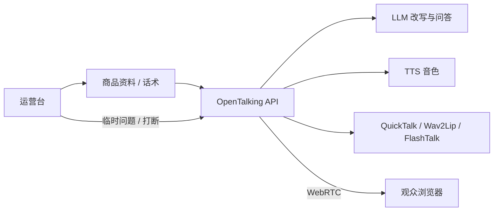

# 商品讲解与直播导购

本案例面向电商导购、展厅讲解、课程口播和直播互动。它和客服案例的区别是：回答内容更受脚本、
商品资料和运营节奏控制，通常需要更稳定的口播风格、更长文本播报，以及人工随时打断。

## 适合场景

- 商品详情页或直播间中的数字人导购。
- 展厅屏幕上的产品讲解员。
- 课程、新闻、活动介绍等半实时口播。
- 运营人员希望先准备话术，再让数字人进行可控播报。

## 推荐链路



## 前置条件

- 已完成 [AI 客服数字人](customer-support.md) 或至少跑通 `mock`。
- 已准备一个适合展示的 avatar。自定义流程见 [自定义 Avatar 案例](../tutorials/cases/custom-avatar.md)。
- 如果需要真实口型效果，先完成 [模型部署](../model-deployment/index.md) 中至少一个 talking-head backend。

## 1. 准备商品资料

把商品资料整理成短块，不要一次塞入很长的 prompt。推荐结构：

```text title="product-brief.txt"
产品名称：智能会议摄像头 Pro
目标用户：远程会议、在线课程、小型直播间
核心卖点：
- 自动人像居中
- 双麦降噪
- USB 即插即用
限制：
- 不承诺户外防水
- 不承诺替代专业电影摄影机
优惠信息：
- 以业务系统实时返回为准
```

## 2. 配置导购人设

```env title=".env"
OPENTALKING_LLM_SYSTEM_PROMPT=你是一个直播导购数字人。回答要自然、有节奏，每次不超过 80 个中文字。介绍商品时先讲用户收益，再讲功能。遇到价格、库存、售后政策时，以业务系统返回为准，不要编造。
OPENTALKING_TTS_PROVIDER=edge
OPENTALKING_TTS_VOICE=zh-CN-XiaoxiaoNeural
```

如果你已经有商品检索服务，建议由业务层先把商品资料拼入 LLM 请求，再交给 OpenTalking 负责语音、
字幕和数字人播放。

## 3. 启动并选择模型

先用 mock 验证话术节奏：

```bash title="终端"
bash scripts/quickstart/start_mock.sh
```

需要真实画面时，选择一个已部署的 backend。例如本地轻量路线：

```bash title="终端"
bash scripts/start_unified.sh --backend local --model quicktalk
```

或远端高质量路线：

```bash title="终端"
bash scripts/start_unified.sh --backend omnirt --model flashtalk --omnirt http://127.0.0.1:9000
```

## 4. 设计互动方式

导购场景建议把输入分成两类：

| 输入类型 | 处理方式 |
|----------|----------|
| 预设讲解 | 由运营台发送固定脚本或分段讲稿，保证表达稳定。 |
| 用户提问 | 通过 LLM/Agent 回答，必要时检索商品资料。 |
| 人工打断 | 停止当前播报，切换到新的讲解段落或回答。 |
| 风险问题 | 返回固定兜底话术，例如价格、合同、医疗、金融承诺。 |

## 验证清单

- 长文本被拆成自然段落，不是一口气播完。
- TTS 音色符合品牌或角色定位。
- Avatar 与模型类型匹配，真实模型下 `/models` 显示 connected。
- 打断后不会继续播放旧商品话术。
- 价格、库存、优惠等动态信息来自业务系统，不由 LLM 编造。

## 常见问题

| 现象 | 处理方式 |
|------|----------|
| 口播太机械 | 缩短单次文本，给 prompt 增加停顿和口语化要求。 |
| LLM 容易离题 | 由业务层传入结构化商品资料，并要求只基于资料回答。 |
| 首帧等待较长 | 对真实模型做预热，或在直播前提前创建会话。 |
| 直播间需要多路并发 | 使用 API/Worker 分离和外部 Redis，见 [部署](../model-deployment/deployment.md)。 |

