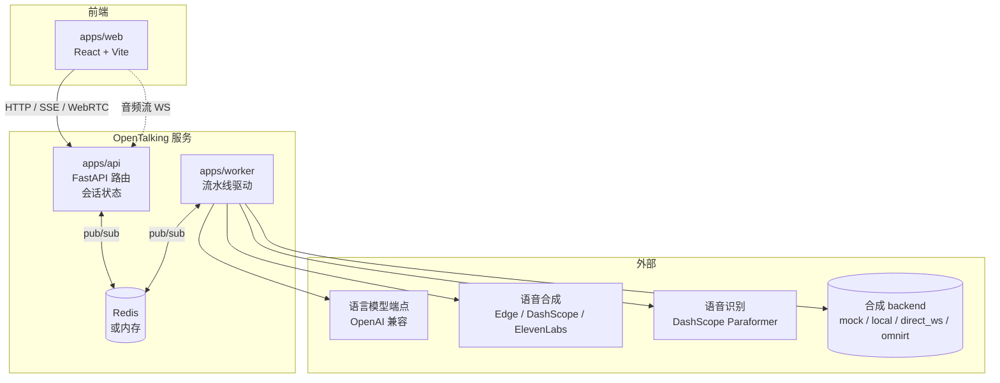
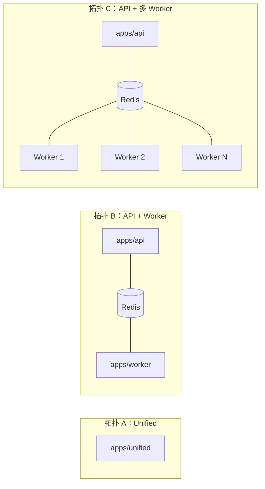
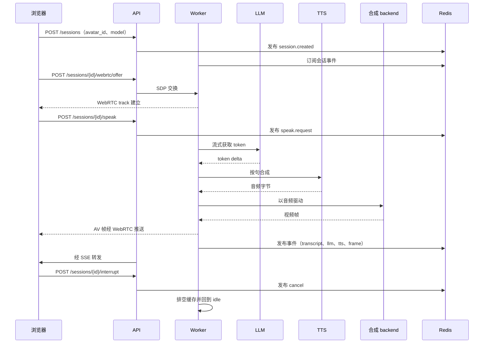

# 架构

OpenTalking 是面向实时数字人的编排框架，负责协调语音识别、语言模型、语音合成、
talking-head 渲染与 WebRTC 推送，整合为统一的会话模型。框架对外提供一套简洁的
HTTP 与 WebSocket 接口。

本页说明系统级架构：组件、部署拓扑、会话生命周期、事件总线，以及可插拔合成
backend 边界。

## 架构总览


## 组件



| 组件 | 职责 | 源码 |
|------|------|------|
| `apps/api` | HTTP 与 WebSocket 入口、会话 CRUD、WebRTC 信令、SSE 事件流。 | `apps/api/routes/` |
| `apps/worker` | 驱动一个或多个会话执行渲染管线。 | `apps/worker/`、`opentalking/worker/` |
| `apps/unified` | 单进程组合 API、Worker 与内存总线，面向开发场景。 | `apps/unified/` |
| `opentalking/` 库 | Provider、适配器、接口、类型、配置、总线与流水线代码。 | `opentalking/`（flat layout） |
| 合成 backend | 由 backend resolver 按模型选择：`mock`、`local`、`direct_ws`、`omnirt`。 | `opentalking/providers/synthesis/` |
| OmniRT（外部） | 当模型使用 `backend: omnirt` 时承载重模型、多卡、GPU/NPU 与远端推理。 | [datascale-ai/omnirt](https://github.com/datascale-ai/omnirt) |
| Redis（外部） | API 与 Worker 之间的 pub/sub 总线。 | unified 模式可省略。 |

## 部署拓扑



命令行细节详见 [部署](../user-guide/deployment.md)。

## 会话生命周期



## 事件总线

每个会话对应一条逻辑频道，全局控制频道单独维护。事件以 JSON 编码，schema 定义于
`opentalking/core/types/events.py` 与 `opentalking/events/schemas.py`。

| 事件 | 生产者 | 消费者 |
|------|--------|--------|
| `session.created` / `session.terminated` | API | Worker |
| `speak.request` | API | Worker |
| `cancel` | API | Worker |
| `transcript` | Worker | API → SSE |
| `llm`（token delta） | Worker | API → SSE |
| `tts`（生命周期标记） | Worker | API → SSE |
| `frame`（视频帧时序） | Worker | API → SSE |
| `error` | Worker | API → SSE |

unified 模式总线为内存实现；分布式模式使用 Redis pub/sub。

## 边界

下列事项不在 OpenTalking 范围内：

| 事项 | 由谁承载 |
|------|---------|
| 模型执行与权重加载 | 所选合成 backend（`local`、`direct_ws` 或 `omnirt`） |
| GPU/NPU 调度、批处理、多卡编排 | `backend: omnirt` 时由 OmniRT 承载；否则由所选 backend 的运行时承载 |
| 语言模型托管 | 用户自选 endpoint（DashScope、OpenAI、vLLM、Ollama 等） |
| 语音合成托管 | 用户自选 provider（或本地 Edge TTS） |
| 用户认证与账号管理 | 不在范围；由上游网关接入。 |
| WebRTC TURN | 不在范围；部署 `coturn` 或等价服务。 |

`apps/` 入口依赖 backend resolver，而不是硬编码模型集合。轻量模型可通过
`backend: local` 留在进程内，单模型服务可通过 `backend: direct_ws` 直连，生产级
重模型可通过 OmniRT 承载，且会话 API 不需要改变。

## 库结构（`opentalking/`）

```text
opentalking/
├── core/
│   ├── interfaces/        # Protocol（ModelAdapter、TTSAdapter 等）
│   ├── types/             # AudioChunk、VideoFrameData、SessionState
│   ├── config.py          # Settings 模型（环境变量到类型化配置）
│   ├── model_config.py    # 模型运行时配置与 backend 选择
│   └── bus.py             # Pub/sub 抽象（Redis 或内存）
├── providers/
│   ├── llm/               # OpenAI 兼容流式客户端
│   ├── stt/               # DashScope Paraformer realtime 适配器
│   ├── tts/               # Edge、DashScope、CosyVoice、ElevenLabs
│   ├── rtc/               # aiortc WebRTC 适配器
│   └── synthesis/         # Backend resolver、可用性探测、OmniRT/direct WS client
├── models/
│   ├── registry.py        # @register_model 与本地 adapter 查找
│   └── quicktalk/         # 本地 talking-head 适配器（参考实现）
├── pipeline/
│   ├── session/           # Session runner
│   ├── speak/             # LLM -> TTS -> 合成流水线
│   └── recording/         # 录制与离线导出
├── runtime/               # Worker 进程 glue、总线、时序
├── avatar/                # Avatar bundle 加载与校验
├── voice/                 # 声音复刻目录
├── media/                 # 帧与 avatar 媒体工具
└── events/                # Event emitter 与 API event schema
```

## 延伸阅读

- [渲染管线](../user-guide/render-pipeline.md) —— 音频到视频链路的逐阶段说明。
- [模型适配器](model-adapter.md) —— 新合成后端的集成接口。
- [开发流程](developing.md) —— 仓库结构、测试流程与调试方法。
