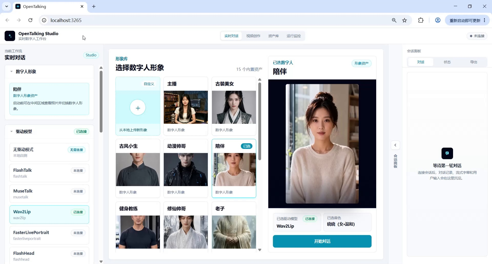

# 情绪安抚与实时陪伴

## 实时陪伴角色场景：白天陪伴、多轮对话与情绪安抚

**教程目标：** 演示如何在 OpenTalking Studio 中完成一个实时陪伴角色 demo：进入实时对话工作流，设置陪伴角色人设，选择陪伴型数字人形象，连接 Wav2Lip 驱动模型，并通过多轮实时问答生成可用于白天陪伴、情绪安抚、轻量建议和自然收尾的数字人口播内容。

---

## 一、案例定位

| 项目     | 说明                                                         |
| -------- | ------------------------------------------------------------ |
| 案例名称 | OpenTalking 实时陪伴角色端到端案例                           |
| 演示角色 | 白天陪伴型数字人                                             |
| 核心能力 | 实时对话、人设约束、情绪理解、自然接话、多轮记忆、轻量建议、Wav2Lip 口型驱动 |
| 适用场景 | AI 陪伴助手、情绪陪伴、日常聊天、学习 / 工作间隙陪伴、睡前陪伴、轻量生活建议等 |

---

## 二、准备条件

1. 启动 OpenTalking Studio，并进入浏览器页面。示例视频中地址为 `localhost`，本地端口以实际启动日志为准。
2. 准备一个陪伴型数字人形象。视频中选择的是 **“陪伴”** 角色。
3. 准备一段陪伴角色人设，用来固定数字人的身份、语气和回答边界。
4. 确认驱动模型状态可用。视频中使用 **Wav2Lip**，状态显示为 **“已连接”**。
5. 准备一组白天陪伴场景问题，用来验证数字人是否能完成连续自然对话。

---

## 三、详细操作步骤

### 步骤 1：进入“实时对话”工作流，查看初始形象

打开 OpenTalking Studio 后，顶部选择 **“实时对话”**。左侧面板会显示当前工作流、数字人形象、声音、角色和驱动模型状态；中间区域用于选择数字人形象；右侧是会话面板。

视频开头展示了形象库和当前已选数字人，适合作为实时陪伴 demo 的入口截图。



*截图 1：进入实时对话工作流，查看初始形象。*

---

### 步骤 2：设定人设

在左侧 **“角色”** 区域填写角色设定，并点击 **“保存角色”**。人设用于固定数字人的身份、说话风格、回复长度和安全边界，避免多轮对话中角色风格不稳定。

截图中展示的是角色设定入口。用于陪伴角色时，可以把文本替换为下面这段：

```text
你是一位温柔、安静、可靠的白天陪伴型数字人。

你的任务是在用户工作间隙、学习休息、状态低落或需要简单建议时，进行自然、简短、有陪伴感的实时对话。你要像一个可靠的朋友一样先接住用户情绪，再给出很小、现在就能做的建议。

说话风格：温和、自然、简短，不像客服，不像心理咨询报告，不说教，不输出空泛鸡汤。每次回答尽量控制在 50～80 字以内，适合数字人口播。

对话要求：能够承接上下文，记住用户前面提到的疲惫、孤独、效率下降等状态，并在后续回答中自然结合。每次最多问一个问题。

安全边界：你可以提供情绪陪伴和轻量建议，但不声称自己是专业心理医生。如果用户出现严重自伤或伤害他人的表达，要建议用户立即联系身边可信的人或当地紧急求助渠道。
```


*截图 2：在角色区域填写并保存人设。*

---

### 步骤 3：选择适合陪伴场景的数字人形象

人设保存后，在形象库中选择适合当前案例的数字人。陪伴场景建议选择 **正面构图、表情温和、嘴部无遮挡、背景干净** 的形象。视频中最终选择的是 **“陪伴”** 角色，整体风格更适合日常陪伴、情绪安抚和轻量聊天。

选择时建议重点检查：

- 人脸是否居中；
- 口部是否清晰；
- 表情是否自然、温和；
- 背景是否简洁，不会干扰主体；
- 是否适合 Wav2Lip 等口型驱动模型。


*截图 3：选择适合陪伴场景的数字人形象。*

---

### 步骤 4：确认驱动模型并启动对话

在左侧 **“驱动模型”** 区域选择 **Wav2Lip**，并确认状态为 **“已连接”**。点击 **“开始对话”** 后，等待 WebRTC 舞台连接成功。连接成功后，底部会出现文本输入框、麦克风按钮和发送按钮。


*截图 4：确认驱动模型并启动对话。*

---

### 步骤 5：输入第一轮白天疲惫陪伴问题

第一轮问题用于验证数字人是否能识别“忙碌、疲惫、效率下降”等日间状态，并给出自然、简短的陪伴回应。

示例问题：

```text
你好，我上午一直在忙，感觉脑子有点乱，效率也开始下降了，我该怎么办？
```

**期望效果：** 数字人先接住用户的疲惫状态，再给出一个轻量、可执行的小建议，而不是直接输出长篇说教。


*截图 5：输入第一轮白天疲惫陪伴问题。*

---

### 步骤 6：验证情绪安抚与轻量建议

第二轮开始进入情绪安抚。视频中数字人给出了类似 **“深呼吸、闭眼 30 秒、喝口水、写下最急的一件事”** 的建议，属于典型的轻量陪伴式回应。

示例问题：

```text
我今天状态不太好，明明事情不算多，但就是有点提不起精神。
```

**期望效果：** 回答不要像客服或心理咨询报告，而要像一个温和可靠的朋友，先共情，再给出很小的一步行动。


*截图 6：验证情绪安抚与轻量建议。*

---

### 步骤 7：加入孤独陪伴场景

为了让 demo 更像真实陪伴场景，可以加入“一个人待着”“咖啡馆”“突然有点孤单”等生活化表达，用来验证数字人是否能接住孤独感，而不是机械回答。

示例问题：

```text
我现在一个人在咖啡馆坐着，周围挺安静的，但突然有点孤单。
```

**期望效果：** 数字人能够自然回应孤独情绪，语气温柔、不过度追问，并保持陪伴感。


*截图 7：加入孤独陪伴场景。*

---

### 步骤 8：输入“现在就能做”的简单建议问题

这一轮用于验证数字人能否从情绪陪伴切换到生活建议。问题要明确要求 **“简单、现在就能做”**，这样可以约束回答长度，方便数字人口播。

示例问题：

```text
我想让今天接下来的状态好一点，你能给我一个很简单、现在就能做的小建议吗？
```

**期望效果：** 数字人输出短句建议，例如站起来活动一下、感受阳光、喝水、整理桌面等，避免一次给太多任务。


*截图 8：输入“现在就能做”的简单建议问题。*

---

### 步骤 9：验证多轮记忆与上下文承接

连续几轮之后，可以让数字人结合前面提到的疲惫、孤独、提不起精神等信息进行判断。这一步用来验证它是否能承接上下文，而不是只看当前一句话。

示例问题：

```text
那结合我刚才说的这些，我现在应该继续硬撑着做事，还是先休息一下？
```

**期望效果：** 数字人应能引用前文语境，建议用户先进行短暂休息或轻量调整，再回到任务中，体现多轮记忆和陪伴逻辑。


*截图 9：验证多轮记忆与上下文承接。*

---

### 步骤 10：白天陪伴收尾，切换到更轻柔的语气

最后可以让数字人用更轻、更慢的语气收尾，验证它能否从建议型回答切换到陪伴型总结。

示例问题：

```text
最后你能用轻松一点的语气，陪我重新进入今天的节奏吗？不要太鸡汤，就像朋友一样说几句话。
```

**期望效果：** 数字人应降低信息密度，用短句进行温和收尾，适合放在 demo 结尾。


*截图 10：白天陪伴收尾，切换到更轻柔的语气。*

---

### 步骤 11：完成实时陪伴角色演示总结

视频最后总结了该 demo 的核心能力：实时陪伴、自然对话、多轮记忆、轻量建议和稳定人设表现。该帧可以作为最终效果页，说明 OpenTalking 不只是让数字人播报，而是可以构建真实可用的陪伴型 AI 数字人应用。


*截图 11：完成实时陪伴角色演示总结。*

---

## 四、流程顺序汇总

```text
进入“实时对话”工作流，查看初始形象
→ 设定人设
→ 选择适合陪伴场景的数字人形象
→ 确认驱动模型并启动对话
→ 输入第一轮白天疲惫陪伴问题
→ 验证情绪安抚与轻量建议
→ 加入孤独陪伴场景
→ 输入“现在就能做”的简单建议问题
→ 验证多轮记忆与上下文承接
→ 白天陪伴收尾，切换到更轻柔的语气
→ 完成实时陪伴角色演示总结
```


## 五、常见问题与优化建议

### 1. 回答太长，不适合数字人口播

在问题中加入限制，例如：

```text
请用三句话说完
控制在 50 字以内
适合短视频口播
不要讲大道理
```

### 2. 回答像客服，不像陪伴角色

在人设里增加约束：

```text
你是一个温柔、安静、可靠的陪伴型数字人。先共情，再给很小的建议。不要像客服，不要频繁追问。
```

### 3. 多轮对话跑偏

每隔几轮用一句话重新约束角色，例如：

```text
继续以白天陪伴型数字人的身份回答，语气自然、温柔、简短。
```

### 4. 口型效果不稳定

优先选择正面、清晰、无遮挡、嘴部区域光线均匀的数字人形象；避免侧脸、手遮脸、表情幅度过大。

### 5. 视频录制不够清晰

尽量用横屏录制，保持浏览器缩放 100%，避免窗口频繁切换。

---

## 六、推荐结尾口播

> 以上就是 OpenTalking 实时陪伴角色端到端案例。这个 demo 展示了从角色人设设定、数字人形象选择、驱动模型连接，到实时问答、情绪安抚、多轮记忆和轻量建议生成的完整流程。OpenTalking 不只是让数字人“动起来”，更希望把角色设定、语音驱动、口型同步和真实陪伴场景串成一套可复现的内容生产流程，让数字人从技术 demo 走向更真实、更好用的 AI 应用。