# 课程与新闻口播

## 新闻主播 / 多语言播报场景：人设切换、形象切换、音色切换与实时播报

**教程目标：** 按照视频中的实际演示顺序，展示 OpenTalking Studio 如何完成新闻主播多语言播报：先进入实时对话工作流并查看初始形象，再设置财经新闻主播人设，随后切换为新闻主播形象，连接 WebRTC 界面，并依次完成中文、英文、日文和粤语新闻播报。

---

## 一、案例定位

| 项目     | 说明                                                         |
| -------- | ------------------------------------------------------------ |
| 案例名称 | OpenTalking 新闻主播 / 多语言播报端到端案例                  |
| 演示角色 | 新闻主播数字人                                               |
| 核心能力 | 实时对话、人设切换、数字人形象切换、多语言播报、音色切换、Wav2Lip 口型驱动 |
| 适用场景 | 多语言播报、人设切换、音色切换和新闻类内容生产能力等         |

---

## 二、准备条件

1. 启动 OpenTalking Studio，并进入浏览器页面。示例中地址为 `localhost`。
2. 准备新闻主播、动漫帅哥等多个数字人形象。
3. 确认驱动模型可用。本案例使用 **Wav2Lip**。
4. 准备四类人设：财经新闻主播、国际体育新闻主播、日语文化旅游新闻主播、粤语本地生活新闻主播。
5. 准备对应的播报问题：中文财经新闻、英文体育新闻、日语旅游新闻、粤语本地生活新闻。

---

## 三、详细操作步骤

### 步骤 1：进入实时对话工作流，查看初始形象

打开 OpenTalking Studio 后，进入 **实时对话** 工作流。此时页面展示当前初始数字人形象，视频中初始选中的是 **“动漫帅哥”**，音色为 **Cherry**，驱动模型为 **Wav2Lip**。

这一步用于说明：演示从当前默认状态开始，后续会先设置人设，再切换到新闻主播形象。

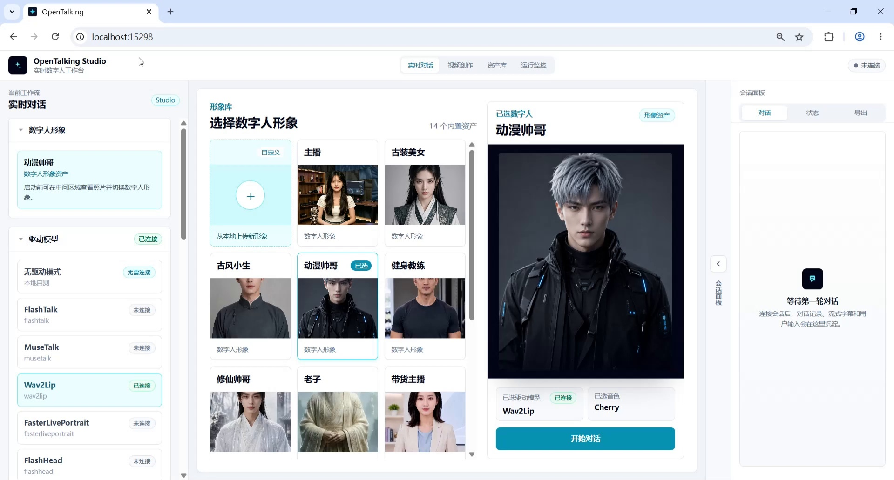

*截图 1：进入实时对话工作流，查看初始形象。*

---

### 步骤 2：设定财经新闻主播人设

在左侧 **角色设定** 中填写财经新闻主播人设，并点击 **保存角色**。这是中文财经新闻播报前的角色约束步骤。

可使用的人设内容：

```text
你是一位中文普通话财经民生新闻主播，擅长用清晰、稳重、易懂的方式播报消费、物价、就业、城市生活和民生服务类新闻。
```

该人设用于后续中文财经 / 民生新闻播报，例如消费券、物价、就业、城市生活服务等主题。

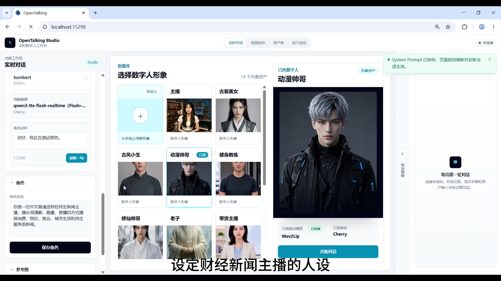

*截图 2：设定财经新闻主播人设。*

---

### 步骤 3：切换数字人形象为“新闻主播”

财经新闻主播人设保存后，在形象库中选择 **“新闻主播”** 数字人。新闻主播形象更适合多语言播报场景，画面中人物正面面对镜头，服装和背景也更接近新闻演播室风格。

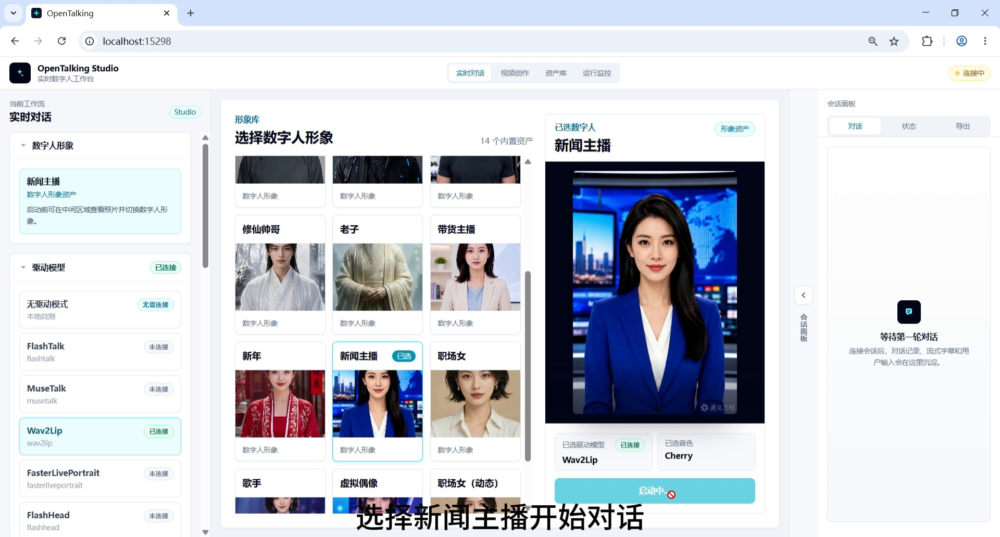

*截图 3：切换数字人形象为“新闻主播”。*

---

### 步骤 4：确认 WebRTC 界面连接成功

切换到新闻主播形象后，点击开始对话，等待 **WebRTC 界面** 连接成功。连接成功后，页面底部会出现输入框、麦克风按钮和发送按钮，说明可以开始进行实时播报。

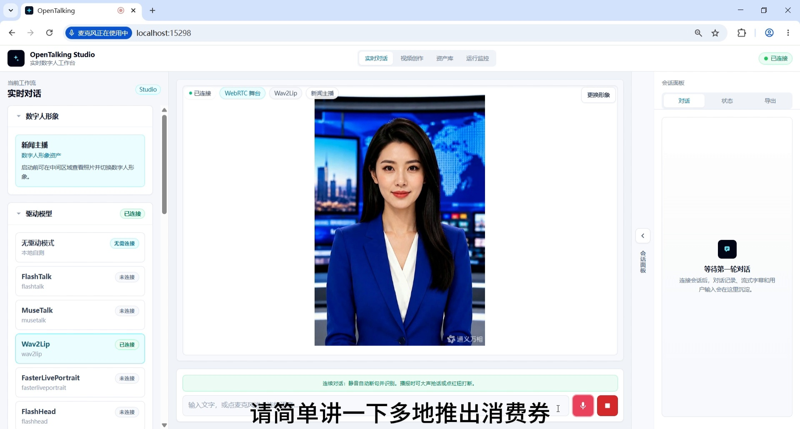

*截图 4：确认 WebRTC 界面连接成功。*

---

### 步骤 5：输入中文新闻播报问题

输入中文财经 / 民生新闻问题，用来验证财经新闻主播人设下的中文播报效果。

示例问题：

```text
请简单讲一下多地推出消费券是如何带动假期消费增长的，限制在50字以内。
```

期望效果：数字人以财经民生新闻主播的风格回答，内容清楚、简短，适合新闻快讯口播。

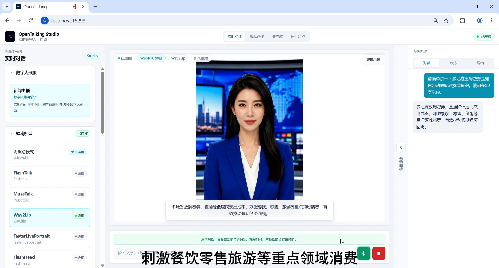

*截图 5：输入中文新闻播报问题并生成回答。*

---

### 步骤 6：切换为“国际体育新闻主播”人设

中文财经新闻播报完成后，在左侧 **角色设定** 中切换为国际体育新闻主播人设，并保存。

可使用的人设内容：

```text
你是一位国际体育新闻主播，擅长用英语播报足球、篮球、奥运赛事和国际体育动态。
```

该人设用于后续英文体育新闻播报，例如世界杯、奥运会、篮球赛事等。

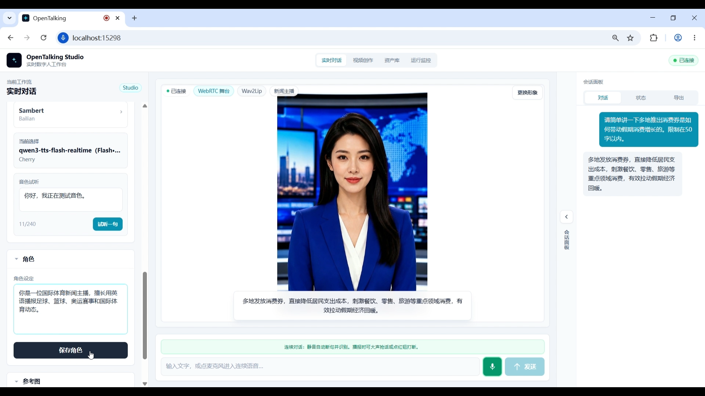

*截图 6：切换为国际体育新闻主播人设。*

---

### 步骤 7：切换到英文体育新闻播报

保存国际体育新闻主播人设后，新闻主播形象保持不变，但播报身份和内容风格切换为英文体育新闻。此时可以准备输入英文体育新闻问题。

这一环节验证的是：同一个数字人形象，可以通过角色人设切换进入不同内容领域。

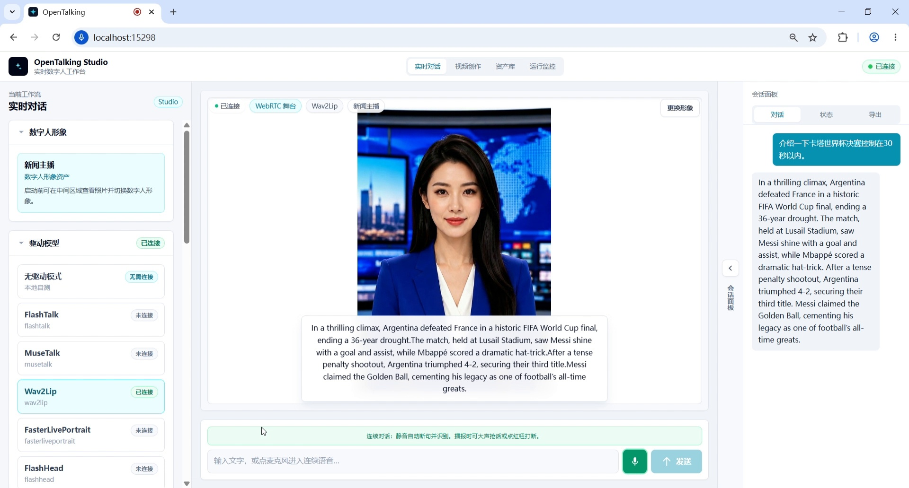

*截图 7：切换到英文体育新闻播报场景。*

---

### 步骤 8：输入英文新闻播报问题

输入英文体育新闻问题，用来验证国际体育新闻主播人设下的英文播报能力。

示例问题：

```text
介绍一下卡塔尔世界杯决赛，控制在30秒以内。
```

期望效果：数字人用英文完成体育新闻播报，内容围绕 World Cup final、Argentina、France、Messi 等信息展开。

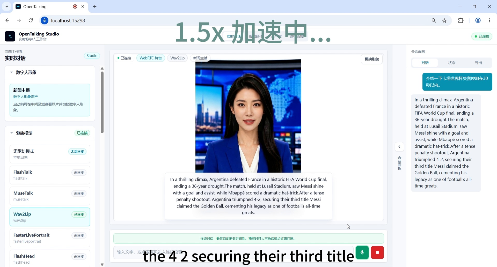

*截图 8：输入英文新闻播报问题并生成回答。*

---

### 步骤 9：切换为“日语文化旅游新闻主播”人设

英文体育新闻播报完成后，在左侧 **角色设定** 中切换为日语文化旅游新闻主播人设，并保存。

可使用的人设内容：

```text
你是一位日语文化旅游新闻主播，擅长用日语介绍城市旅游、传统文化、展览活动和节日出行资讯。
```

该人设用于后续日语旅游新闻、樱花季、城市文化活动等场景。

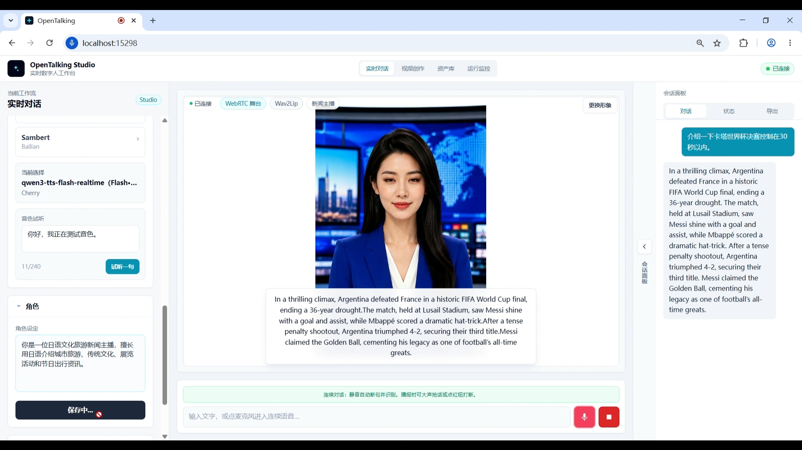

*截图 9：切换为日语文化旅游新闻主播人设。*

---

### 步骤 10：输入日语新闻播报问题

输入日语文化旅游类新闻问题，用来验证日语新闻播报能力。

示例问题：

```text
如何评价春季樱花季带动城市短途旅行和文化展览热度上升？控制在30秒以内。
```

期望效果：数字人用日语完成文化旅游新闻播报，内容围绕樱花季、短途旅行、文化设施和游客增长展开。

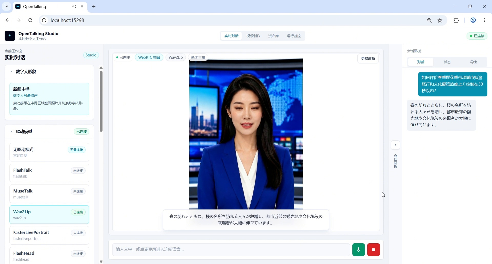

*截图 10：输入日语新闻播报问题并生成回答。*

---

### 步骤 11：切换为“粤语本地生活新闻主播”人设

日语播报完成后，在左侧 **角色设定** 中切换为粤语本地生活新闻主播人设，并保存。

可使用的人设内容：

```text
你是一位面向粤港澳大湾区观众的粤语本地生活新闻主播，擅长用粤语播报交通、天气、社区服务、消费提醒和城市活动。
```

该人设用于后续粤语本地生活新闻播报，例如大湾区夜市、交通、天气、社区活动等。

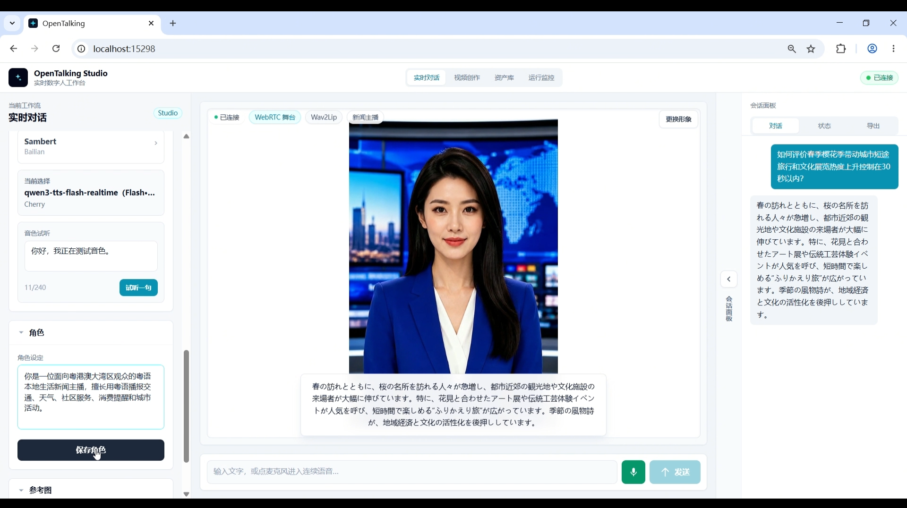

*截图 11：切换为粤语本地生活新闻主播人设。*

---

### 步骤 12：准备切换音色为 Kiki

进入粤语播报前，打开左侧声音区域，准备将音色切换为 **Kiki**。这一步是音色切换，不是人设切换；上一步已经完成粤语本地生活新闻主播人设设定。

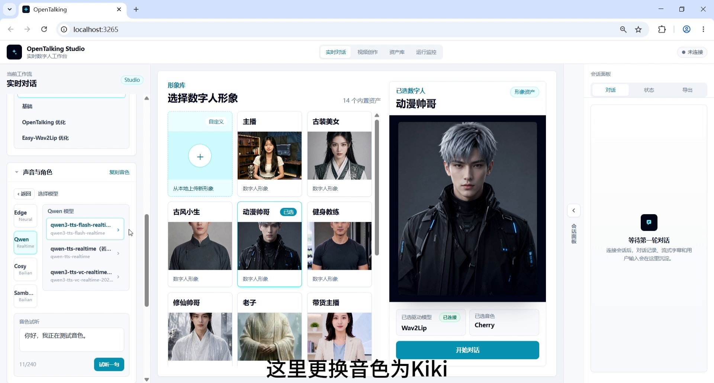

*截图 12：准备切换音色为 Kiki。*

---

### 步骤 13：输入粤语新闻播报问题

切换到 Kiki 音色后，输入粤语本地生活新闻问题。

示例问题：

```text
请你用粤语播报一条本地生活新闻。主题是周末大湾区多个商圈举办夜市和音乐活动，市民出行和消费热度上升，请控制在30秒左右。
```

期望效果：数字人使用粤语风格播报本地生活新闻，内容覆盖夜市、音乐活动、消费热度和城市生活信息。

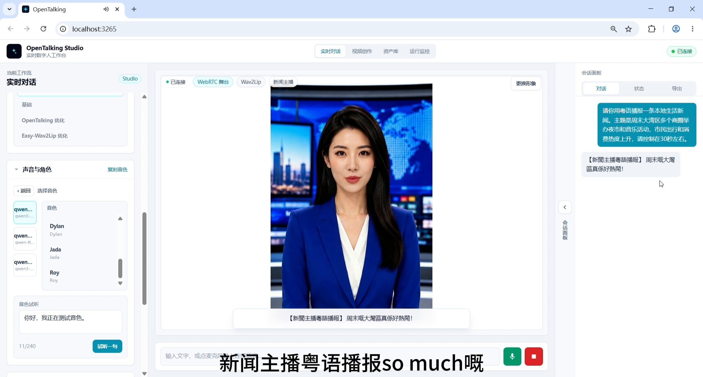

*截图 13：输入粤语新闻播报问题。*

---

### 步骤 14：完成粤语新闻播报输出

最后，新闻主播使用 Kiki 音色完成粤语新闻播报输出。右侧会话面板中可以看到多轮对话记录，中间舞台展示数字人的口型驱动效果。

这一帧用于作为最终效果截图，说明从 **初始形象 → 财经人设 → 新闻主播形象 → WebRTC 连接 → 多人设切换 → 多语言播报 → Kiki 音色切换 → 粤语输出** 的完整链路已经跑通。


*截图 14：完成粤语新闻播报输出。*

---

## 四、流程顺序汇总

```text
进入实时对话工作流，查看初始形象
→ 设定财经新闻主播人设
→ 切换数字人形象为“新闻主播”
→ 确认 WebRTC 界面连接成功
→ 输入中文新闻播报问题
→ 切换为“国际体育新闻主播”人设
→ 切换到英文体育新闻播报
→ 输入英文新闻播报问题
→ 切换为“日语文化旅游新闻主播”人设
→ 输入日语新闻播报问题
→ 切换为“粤语本地生活新闻主播”人设
→ 准备切换音色为 Kiki
→ 输入粤语新闻播报问题
→ 完成粤语新闻播报输出
```

---

## 五、四种人设对应说明

| 人设类型             | 角色设定关键词                               | 对应语言 / 内容     | 对应步骤   |
| -------------------- | -------------------------------------------- | ------------------- | ---------- |
| 财经新闻主播         | 中文普通话、财经民生、消费、物价、就业       | 中文财经 / 民生新闻 | 步骤 2、5  |
| 国际体育新闻主播     | 英语、足球、篮球、奥运赛事、国际体育动态     | 英文体育新闻        | 步骤 6-8   |
| 日语文化旅游新闻主播 | 日语、城市旅游、传统文化、展览活动           | 日语旅游新闻        | 步骤 9-10  |
| 粤语本地生活新闻主播 | 粤语、大湾区、本地生活、交通、天气、消费提醒 | 粤语本地生活新闻    | 步骤 11-14 |


## 六、推荐结尾口播

> 以上就是 OpenTalking 新闻主播 / 多语言播报端到端案例。这个 demo 按顺序展示了进入实时对话工作流、财经新闻主播人设设定、新闻主播形象切换、WebRTC 界面连接、国际体育新闻主播人设、日语文化旅游新闻主播人设、粤语本地生活新闻主播人设、Kiki 音色切换，以及多语言播报输出。OpenTalking 不只是让数字人“说话”，更希望把角色设定、语音驱动、口型同步和真实内容场景串成一套可复现的数字人生产流程。