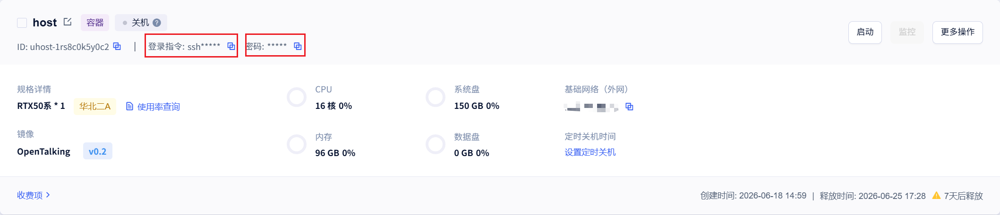
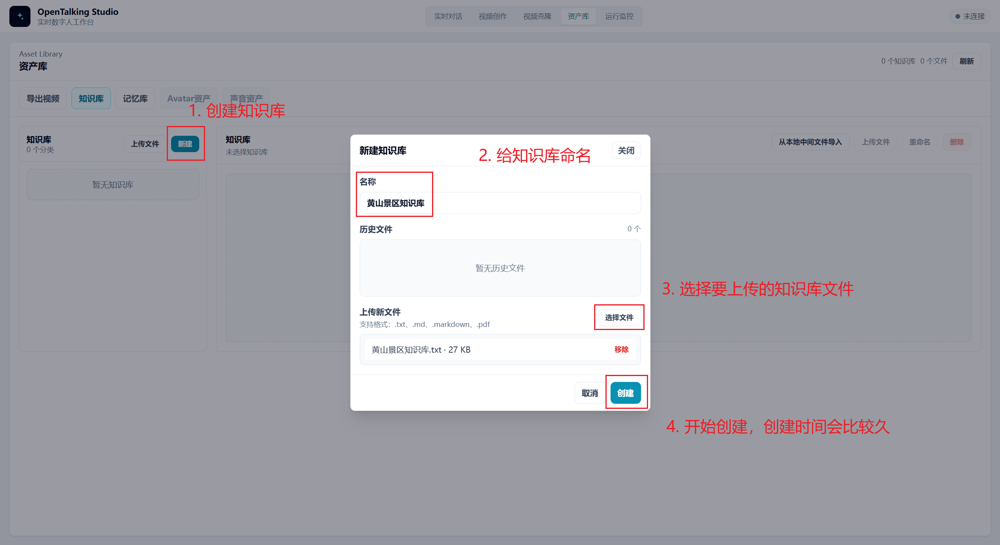
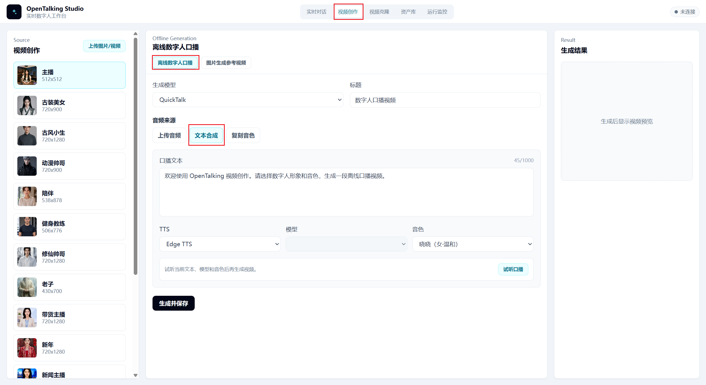
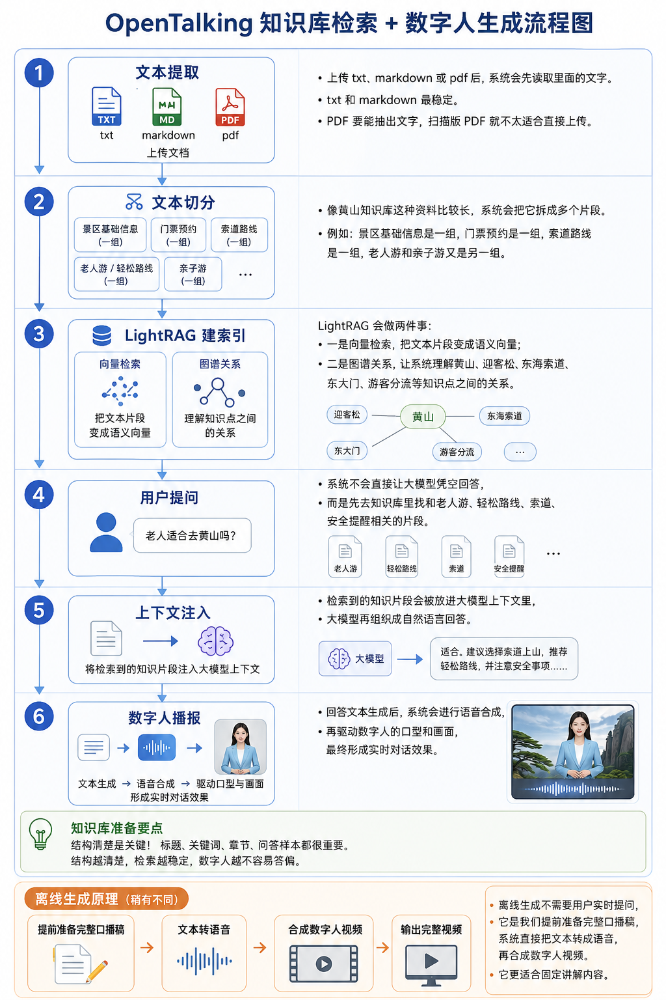

# OpenTalking 黄山景区知识数字人操作文档

本文档用于指导新人使用已部署在镜像中的 OpenTalking 服务，构建一个“黄山景区知识数字人”，完成两类任务：

- 实时对话：游客提出问题，数字人基于黄山景区知识库回答。
- 离线生成：提前准备口播稿，生成黄山景区讲解视频。

## 1. 知识库文本准备

在启动 OpenTalking 之前，建议先准备好知识库文本。知识库不是简单把网页资料复制到一个文件里，而是要把资料整理成“数字人容易检索、容易理解、容易回答”的结构。

OpenTalking 的知识库会将文本切分、索引，并在用户提问时检索相关内容，再交给大模型组织回答。如果知识库结构混乱、同类信息分散、时间信息不清楚，数字人就容易出现答非所问、遗漏重点或把过期信息当成最新信息来回答。

### 1.1 为什么要这样设计知识库

参考 `黄山景区知识库.txt` 的结构，知识库文本建议先写总说明，再写分章节内容，最后补充问答样本。这样设计有几个好处：

- 先写 `文档标题`、`文档类型`、`更新时间`、`适用范围`，可以让数字人知道这份资料是做什么的、适合回答哪些问题，以及信息更新到什么时候。
- 写清楚 `资料来源与时效说明`，可以避免数字人在门票、开放时间、索道运营、优惠政策这类会变化的问题上说得太绝对。
- 设置 `主题分类` 和 `关键词`，可以覆盖游客可能使用的不同叫法，比如“黄山”“黄山风景区”“迎客松”“云谷索道”“南大门”等，提升检索命中率。
- 按游客问题场景拆章节，比按资料来源堆内容更适合问答。游客通常会问“怎么玩”“怎么买票”“从哪个门进”“老人能不能去”，所以章节也要围绕这些问题来组织。
- 最后放 `知识库问答样本`，可以给数字人提供回答风格参考，让回答更像面向游客的讲解，而不是生硬摘录资料。

### 1.2 推荐的知识库文本框架

黄山景区知识库采用的是“元信息 + 场景章节 + 问答样本”的结构。准备其他景区或展馆知识库时，也可以沿用这个框架：

```text
知识库名称

文档标题
这里写清楚这份知识库的正式名称。

文档类型
例如：景区数字人问答资料 / 景区讲解资料 / 游客服务知识库。

更新时间
写资料整理或最后核对的日期。

适用范围
说明这份知识库用于哪些场景，例如实时对话、游客咨询、离线讲解视频等。

主题分类
用几个短语概括知识库所属领域。

关键词
列出景区名称、核心景点、入口、交通方式、特色景观、常见问题词。

内容摘要
用一到两段概括知识库覆盖的主要内容。

资料来源与时效说明
说明资料来源，并标注哪些内容需要以官方实时公告为准。

第一章 景区基础信息
介绍景区概况、地理位置、核心特色、荣誉称号、游客认知。

第二章 开放时间、预约和票务
整理开放时间、预约方式、门票价格、优惠政策和时效提醒。

第三章 景区入口与交通方式
整理外部交通、主要入口、换乘方式、停车和入园方向。

第四章 索道与游览路线
整理索道、登山路线、一日游、两日游、轻松路线等。

第五章 核心景点讲解
整理游客最关心、最适合数字人讲解的景点内容。

第六章 不同人群游览建议
面向老人、儿童、亲子、摄影、徒步、第一次游览等人群给建议。

第七章 季节、天气与最佳游览时间
整理四季特色、日出云海、雨雪天气、安全提醒。

第八章 服务设施与游客须知
整理咨询电话、卫生间、休息点、行李、文明旅游和应急服务。

知识库问答样本
用“问：/答：”形式补充高频问题和推荐回答方式。
```

### 1.3 如何设计自己的知识库文本

第一步，先确定数字人要服务谁。比如黄山景区数字人的服务对象是游客，那么知识库就要围绕游客最常问的问题来写，而不是把景区介绍、新闻稿和攻略原文混在一起。

第二步，列出游客高频问题。可以从“景区是什么”“有哪些亮点”“怎么买票”“怎么进山”“怎么玩省力”“老人小孩适不适合”“天气不好怎么办”“遇到问题联系谁”这些方向展开。

第三步，把资料整理成章节。每个章节只解决一类问题，同类信息放在一起。例如票价、预约、优惠政策都放在“开放时间、预约和票务”里；索道、登山路线、轻松路线都放在“索道与游览路线”里。

第四步，写成适合检索的自然语言段落。每段尽量围绕一个主题，不要一段里同时塞进太多无关信息。标题要清楚，段落要完整，少用只有内部人员才懂的缩写。

第五步，对有时效的信息单独标注。开放时间、门票价格、索道运行、优惠政策、天气管制、临时封闭都可能变化，文本中要写清楚“以官方实时公告或预约页面为准”。

第六步，补充问答样本。问答样本不需要覆盖所有问题，但要覆盖最常见、最容易出错的问题，例如门票价格、老人游览、路线推荐、恶劣天气、安全提醒等。

### 1.4 文本输入建议

知识库文件建议使用 `.txt` 或 `.md` 格式。PDF 也可以上传，但前提是 PDF 能正常抽取文字，扫描版图片 PDF 不建议直接上传。

单文件上传接口硬限制是 `20MB`。实际准备资料时，不建议把一个文件写得过长，单个知识库文本建议控制在 `5万字` 以内。资料很多时，可以按主题拆成多个文件，例如“景区基础信息”“票务交通”“路线讲解”“游客问答”。

文本内容尽量使用清晰标题和完整句子，不要只放表格、链接或零散关键词。数字人最终回答的质量，很大程度取决于知识库文本本身是否清楚、准确、成体系。

## 2. 在服务器启动 OpenTalking 镜像

详情见文档：[OpenTalking 镜像部署文档](../quick-start/compshare-image.md)。

## 3. 使用 SSH Tunnel 映射优云智算实例端口到本机

OpenTalking 镜像运行在优云智算部署实例里。实例内部的 OpenTalking 服务通常监听在实例自己的 `127.0.0.1:5173`，这个地址只对实例内部有效，本机浏览器不能直接打开。我们需要用 SSH Tunnel，把“优云智算实例里的服务端口”映射到“本机端口”，然后在本机浏览器访问。

优云智算实例卡片上需要关注两个位置：



- `登录指令`：点击右侧复制按钮，复制 SSH 登录命令。
- `密码`：点击右侧复制按钮，复制实例登录密码。

### 3.1 复制实例登录指令

在优云智算控制台找到正在运行的 OpenTalking 实例。确认镜像显示为 `OpenTalking v0.2`，实例处于已启动状态。

点击实例卡片上 `登录指令` 后面的复制按钮。复制出来的命令一般类似下面这种形式：

```powershell
ssh -p <SSH端口> root@<实例公网地址> 
```

注意：这里的 `<实例公网地址>` 和 `<SSH端口>` 以你控制台复制出来的实际内容为准。

### 3.2 在登录指令里加入端口映射参数

在本机 PowerShell 打开一个新窗口，把刚才复制到的 SSH 登录命令改成 SSH Tunnel 命令。

如果 OpenTalking 实例内服务端口是 `5173`，本机也使用 `5173` 端口，命令格式是：

```powershell
ssh -p <SSH端口> -N -L 5173:127.0.0.1:5173 root@<实例公网地址> 
```

可以理解为：在原来的登录指令里，给 `ssh` 后面增加 `-N -L 5173:127.0.0.1:5173`。

如果复制出来的登录指令是：

```powershell
ssh root@xxx.xxx.xxx.xxx -p 12345
```

那么改成：

```powershell
ssh -N -L 5173:127.0.0.1:5173 root@xxx.xxx.xxx.xxx -p 12345
```

命令含义：

- 本机访问 `127.0.0.1:5173`。
- SSH 会把请求转发到优云智算实例内部的 `127.0.0.1:5173`。
- 第一个 `5173` 是本机端口。
- 第二个 `5173` 是实例内 OpenTalking 服务端口。
- `-N` 表示只建立隧道，不进入远程 shell。
- 这个 PowerShell 窗口需要保持打开，关闭窗口后隧道会断开。

执行命令后，如果提示输入密码，粘贴优云智算实例卡片中 `密码` 后面复制到的密码，然后按回车。输入密码时终端一般不会显示字符，这是正常现象。

隧道建立后，在本机浏览器打开：

```text
http://127.0.0.1:5173
```

### 3.3 如果本机 5173 端口被占用

如果本机已经有其他程序占用了 `5173`，可以把本机端口换成 `15173`，但实例内服务端口仍然保持 `5173`：

```powershell
ssh -N -L 15173:127.0.0.1:5173 root@<实例公网地址> -p <SSH端口>
```

如果复制出来的登录指令是：

```powershell
ssh root@xxx.xxx.xxx.xxx -p 12345
```

那么改成：

```powershell
ssh -N -L 15173:127.0.0.1:5173 root@xxx.xxx.xxx.xxx -p 12345
```

然后浏览器打开：

```text
http://127.0.0.1:15173
```

注意：这时浏览器访问的是本机 `15173`，但 SSH 转发到实例内部的仍然是 `5173`。

### 3.4 检查 SSH Tunnel 是否可用

本机 PowerShell 中执行：

```powershell
curl http://127.0.0.1:5173
```

如果使用备用本机端口 `15173`：

```powershell
curl http://127.0.0.1:15173
```

能返回页面内容或服务响应，说明端口映射成功。

如果访问失败，依次检查：

- 优云智算实例是否处于运行状态。
- OpenTalking 镜像服务是否已经在实例内启动。
- SSH Tunnel 的 PowerShell 窗口是否还开着。
- `登录指令` 中的实例地址、用户名和 SSH 端口是否复制正确。
- 是否使用了实例卡片里的 `密码`。
- 镜像实际服务端口是否就是 `5173`。
- 本机浏览器访问的端口是否和命令中第一个端口一致，例如 `5173` 或 `15173`。

## 4. 打开 OpenTalking 页面

隧道建立成功后，在本机浏览器打开：

```text
http://127.0.0.1:5173
```

如果使用备用本机端口：

```text
http://127.0.0.1:15173
```


## 5. 上传黄山景区知识库

进入页面后，打开资产库页面下的知识库页面。



新建知识库：

```text
知识库名称：黄山景区知识库
```

上传文件黄山景区知识库.txt

上传完成后，检查文件状态是否正常。

如果页面显示文件状态正常，说明系统已经完成文本读取，并可用于后续检索。

注意：

- OpenTalking 知识库支持 `.txt`、`.md`、`.markdown`、`.pdf`。
- 上传接口硬限制是单文件最大 `20MB`。
- 实际准备资料时，建议单个文件控制在 `5万字` 以内。
- PDF 必须能抽取文字，扫描版 PDF 不建议直接上传。
- 开放时间、票价、索道运营、优惠政策等信息具有时效性，知识库中应提醒以官方实时公告为准。

## 6. 绑定知识库到实时对话

进入实时对话页面。

选择数字人形象或角色。

在会话配置中选择知识库：


注意：只上传知识库还不够，还需要在当前会话或当前数字人角色中绑定知识库。否则数字人可能不会使用这份资料。

## 7. 实时对话测试

这样就就可以实时对话啦，你可以向数字人提问景区相关的问题，数字人会先去知识库中检索再回答。

## 8. 准备离线生成口播稿

离线生成用于制作固定内容的视频，例如景区宣传片、游客中心循环播放视频、展厅讲解视频。

建议先准备 `100-300字` 的短稿进行测试。

示例口播稿：

```text
欢迎来到黄山风景区。黄山位于安徽省黄山市，是中国代表性的山岳型风景名胜区之一。这里以奇松、怪石、云海、温泉和冬雪五绝闻名。第一次来到黄山的游客，可以从南大门进入，乘云谷索道上山，游览始信峰、北海景区、光明顶、天海和迎客松。如果时间充裕，也可以安排两天一晚，欣赏黄山日出、云海和西海大峡谷的壮丽景观。游览过程中，请关注天气变化，按预约方向入园，并根据自身情况合理安排路线。
```

## 9. 离线生成数字人讲解视频

进入离线生成页面。



按顺序操作：

1. 选择数字人形象。
2. 选择声音或音色。
3. 粘贴黄山景区口播稿。
4. 点击生成。
5. 等待生成完成。
6. 预览视频效果。
7. 导出生成结果。

第一次测试建议使用短稿。确认声音、口型、画面和导出结果都正常后，再分段生成更长的讲解视频。

## 10. 原理说明



OpenTalking 的景区知识数字人主要包含三条链路。

第一条是知识库链路：

```text
上传文档 -> 文本提取 -> 文本切分 -> LightRAG 建索引 -> 用户提问 -> 检索相关片段 -> 注入给大模型 -> 生成回答
```

上传 `黄山景区知识库.txt` 后，系统会先读取文本内容。然后把较长的资料切成多个片段，例如景区基础信息、票务预约、入口交通、索道路线、核心景点、人群建议等。

随后，LightRAG 会对这些文本做索引。一方面，它会把文本片段转成语义向量，用于语义检索；另一方面，它会利用实体和关系信息，帮助系统理解“黄山”“迎客松”“东海索道”“东大门”“老人游”等知识点之间的联系。

当游客提问时，系统不会直接让大模型凭空回答，而是先去知识库中检索相关片段。检索结果会作为上下文交给大模型，大模型再生成自然语言回答。

第二条是实时对话链路：

```text
用户输入问题 -> 大模型生成回复 -> TTS 合成语音 -> 数字人驱动画面和口型 -> 实时播放
```

实时对话的关键是问答效果。测试时要重点看数字人是否按照知识库回答。

第三条是离线生成链路：

```text
准备口播稿 -> TTS 合成语音 -> 数字人视频合成 -> 导出视频
```

离线生成不需要用户实时提问，而是提前写好完整讲解稿，适合固定内容生产。

## 11. 常见问题排查

页面打不开：

- 检查 Docker 容器是否运行。
- 检查服务器服务端口是否正确。
- 检查 SSH tunnel 是否还在运行。
- 检查浏览器访问的是本机映射端口，例如 `http://127.0.0.1:5173`。

知识库上传失败：

- 检查文件格式是否为 `.txt`、`.md`、`.markdown` 或 `.pdf`。
- 检查文件是否超过 `20MB`。
- 检查 PDF 是否能抽取文字。
- 检查文件名和内容是否正常编码。

数字人回答很泛：

- 检查当前会话是否绑定了“黄山景区知识库”。
- 检查知识库文件状态是否正常。
- 检查提问是否过于模糊。
- 检查知识库中是否包含对应内容。

门票或开放时间回答不确定：

- 这是正常现象，因为这类信息具有时效性。
- 数字人应提醒游客以黄山旅游官方平台和景区当日公告为准。

离线生成效果不理想：

- 先使用 100-300 字短稿测试。
- 检查口播稿是否句子太长。
- 将长稿拆成多段分别生成。
- 避免一次性输入过长文本。

## 12. 新人检查清单

完成操作后，逐项确认：

- 实例已启动。
- 日志无明显报错。
- SSH tunnel 已建立。
- 本机浏览器能打开 OpenTalking 页面。
- 已上传 `黄山景区知识库.txt`。
- 实时对话会话已绑定“黄山景区知识库”。
- 数字人能回答黄山路线、景点、门票、老人游等问题。
- 离线生成短口播稿成功。
- 视频可以预览和导出。
