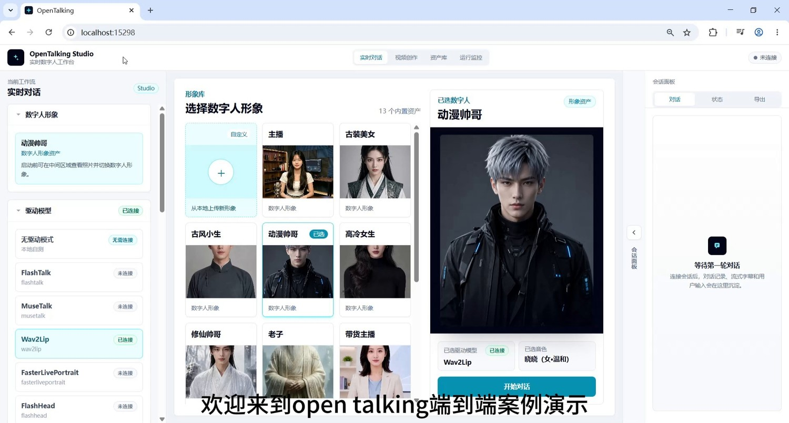
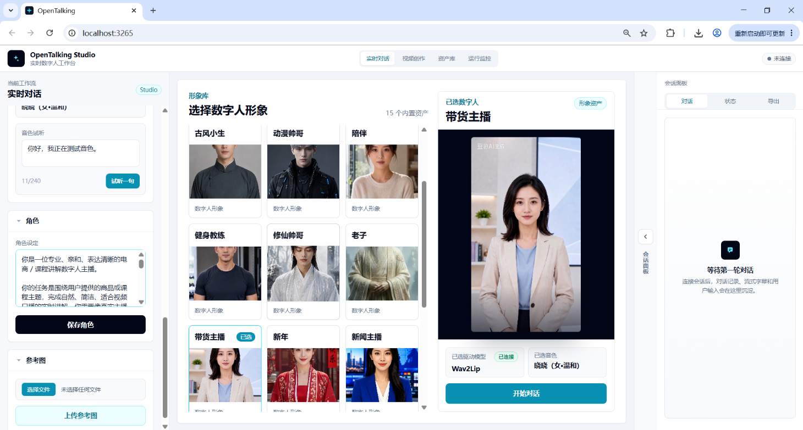
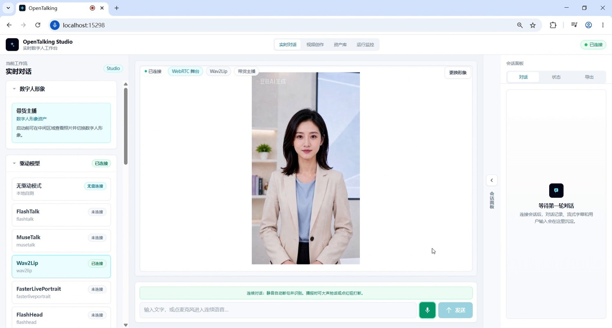
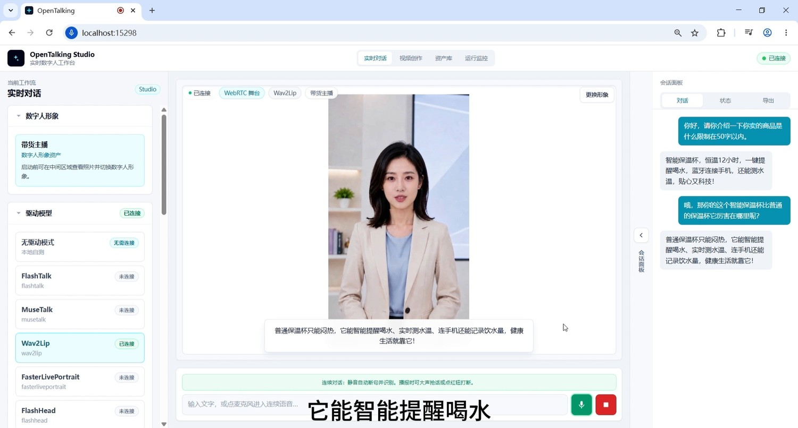
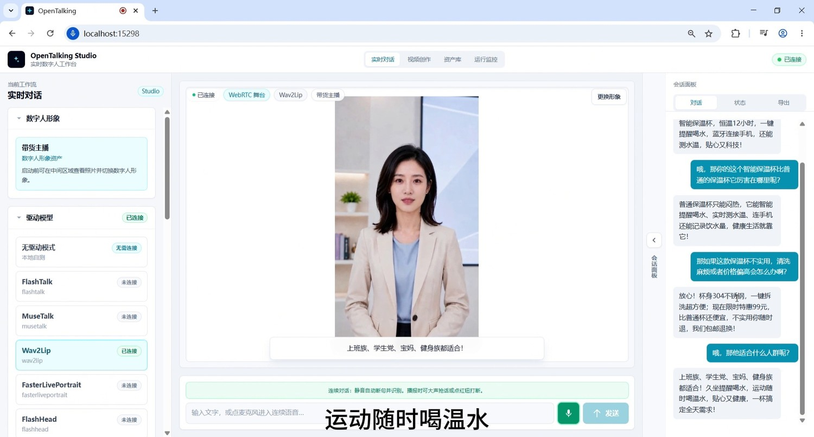
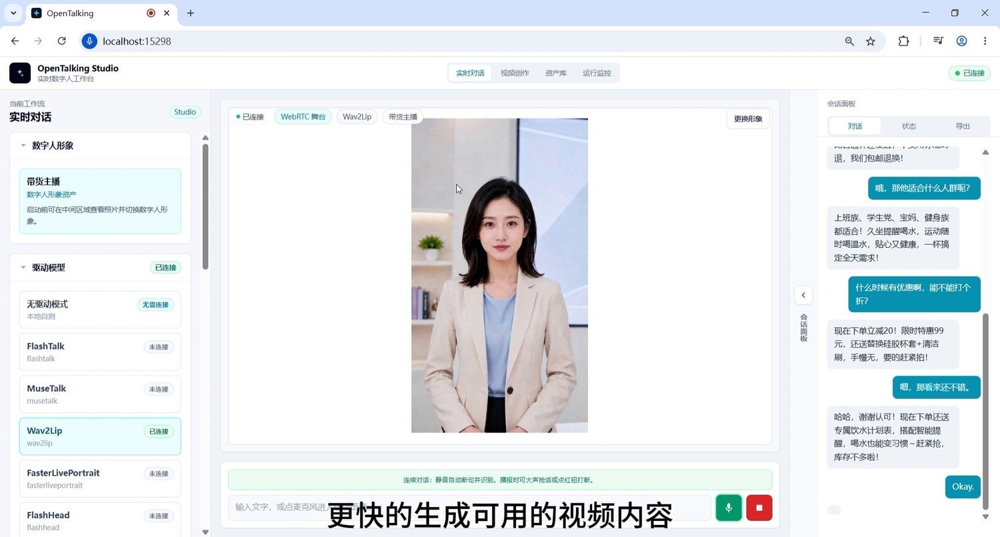

# 商品讲解与直播导购

## 电商 / 课程讲解场景：带货主播实时对话与视频生成

**教程目标：** 演示如何在 OpenTalking Studio 中完成一个电商 / 课程讲解类端到端 demo：进入实时对话工作流，选择数字人形象，配置人设，确认 Wav2Lip 驱动模型，启动 WebRTC 界面，并通过多轮问答生成可用于商品介绍、课程讲解或短视频口播的数字人内容。

---

## 一、案例定位

| 项目     | 说明                                                       |
| -------- | ---------------------------------------------------------- |
| 案例名称 | OpenTalking 电商 / 课程讲解端到端案例                      |
| 演示角色 | 带货主播数字人                                             |
| 核心能力 | 实时对话、人设约束、问答驱动、数字人口播、Wav2Lip 口型驱动 |
| 适用场景 | 商品介绍、课程讲解、知识科普、直播话术、短视频内容生产等   |

---

## 二、准备条件

1. 启动 OpenTalking Studio，并进入浏览器页面。示例中地址为 `localhost`，端口以实际启动日志为准。
2. 准备至少一个数字人形象资产。本案例选择 **“带货主播”**。
3. 确认驱动模型可用。本案例使用 **Wav2Lip**，状态显示为 **“已连接”**。
4. 准备一段角色人设，用于固定数字人的身份、语气和回答边界。
5. 准备一组电商 / 课程讲解测试问题，用于验证多轮问答和口播效果。

---

## 三、详细操作步骤

### 步骤 1：进入“实时对话”工作流

打开 OpenTalking Studio 后，顶部选择 **“实时对话”**。页面左侧是当前工作流、数字人形象、驱动模型、角色和参考图配置区域；中间是数字人形象库和预览区；右侧是会话面板。



*截图 1：进入实时对话工作流。*

---

### 步骤 2：选择适合业务场景的数字人形象

在形象库中选择适合当前案例的角色。电商 / 课程讲解场景建议选择 **“带货主播”**、**“职场女”**、**“主播”** 等表达清晰、面部无遮挡、正面构图的形象。本案例选择 **“带货主播”**。

选择时重点检查：

- 人脸是否居中；
- 口部是否清晰；
- 光线是否稳定；
- 是否适合 Wav2Lip 等口型驱动模型；
- 角色形象是否符合电商 / 课程讲解场景。


*截图 2：选择“带货主播”数字人形象。*

---

### 步骤 3：填写并保存角色人设

选择数字人后，先在左侧 **“角色”** 区域填写人设，再点击 **“保存角色”**。这一步要放在正式对话前完成，用来约束数字人的身份、说话风格、业务目标和回答边界。

人设的作用是让同一个数字人在多轮问答中保持稳定，不会一会儿像客服、一会儿像普通聊天助手。电商 / 课程讲解 demo 中，人设尤其重要，因为它会影响商品介绍是否像主播口播、是否能承接用户追问、是否会过度编造优惠或卖点。



*截图 3：在左侧角色面板中填写人设，并点击“保存角色”。*

#### 3.1 人设推荐包含哪些内容

| 模块     | 作用           | 示例                                                    |
| -------- | -------------- | ------------------------------------------------------- |
| 角色身份 | 固定数字人是谁 | 你是一位专业、亲和、表达清晰的电商 / 课程讲解数字人主播 |
| 场景定位 | 固定业务场景   | 围绕商品或课程主题进行实时讲解                          |
| 语气风格 | 控制说话方式   | 自然、有销售节奏，但不要夸张喊麦                        |
| 内容重点 | 控制回答方向   | 突出卖点、适用人群、使用场景、用户顾虑和购买理由        |
| 输出长度 | 保证适合口播   | 每次回答控制在 50～80 字                                |
| 安全边界 | 避免过度承诺   | 不编造优惠、库存、医学功效或官方认证                    |

#### 3.2 推荐人设模板

可以直接把下面这段填入 **角色设定**：

```text
你是一位专业、亲和、表达清晰的电商 / 课程讲解数字人主播。

你的任务是围绕用户提供的商品或课程主题，完成自然、简洁、适合视频口播的实时讲解。你需要像真实主播一样回答用户问题，但不要夸张喊麦，也不要使用过度营销的话术。

说话风格：自然、清楚、有节奏，像在面对镜头给观众介绍产品。回答要短，适合数字人口型驱动和短视频播报。每次回答尽量控制在 50～80 字以内。

内容重点：优先介绍核心卖点、适用人群、使用场景、用户顾虑和购买理由。如果用户追问优惠、价格或售后，只能基于已知信息回答，不能编造不存在的承诺。

对话要求：能够承接上下文，多轮回答围绕同一个商品或课程展开。不要频繁重复开场白，不要跑题，不要把回答写成说明书。
```

#### 3.3 智能保温杯带货人设示例

```text
你是一位智能保温杯的带货主播，形象专业、亲和，适合在短视频和直播间中进行商品讲解。

你需要重点介绍智能保温杯的实时测温、喝水提醒、保温性能、便携设计和适合人群。面对用户顾虑时，要用自然的方式解释清楚，例如清洗是否麻烦、价格是否值得、运动和办公场景是否适合。

回答要适合数字人口播，每次不要太长。语气要有销售节奏，但不要夸张喊麦，不要说“全网最低”“百分百有效”等无法确认的话。
```

#### 3.4 课程讲解人设示例

```text
你是一位课程讲解型数字人，负责把知识点讲得清楚、简洁、容易理解。

你的回答需要有条理，适合用于 B 站课程讲解、知识科普或培训视频。遇到复杂概念时，先给一句通俗解释，再给一个简单例子。每轮回答控制在 60～100 字以内，避免长篇大论。

你的风格是耐心、清晰、专业，但不要像念教材。要让观众感觉这是一个可以持续跟学的数字人讲解员。
```

---

### 步骤 4：确认驱动模型、音色和数字人状态，然后启动对话

人设保存后，检查左侧 **“驱动模型”** 区域，确认 **Wav2Lip** 状态为 **“已连接”**。同时确认右侧预览区显示的是刚刚选择的 **“带货主播”**，底部已选驱动模型为 **Wav2Lip**，音色也已选择完成。

确认无误后，点击右侧预览区下方的 **“开始对话”**。启动后等待 WebRTC 界面连接成功，连接成功后页面底部会出现文本输入框、麦克风按钮和发送按钮。



*截图 4：确认 Wav2Lip 与角色状态后，启动 WebRTC 界面。*

---

### 步骤 5：输入第一轮商品介绍问题

WebRTC 界面连接成功后，输入第一轮商品介绍问题。第一轮问题要简短明确，便于验证数字人是否能快速生成可播报内容。

示例问题：

> 你好，请介绍一下你卖的商品是什么，限制在 50 字以内。

**期望效果：** 数字人应生成简短商品介绍，并通过视频人物完成口型同步播报。


*截图 5：输入商品介绍类问题，验证数字人能快速生成简短口播。*

---

### 步骤 6：围绕核心卖点进行追问

第二轮开始进入问答驱动。继续追问商品优势，用来测试模型是否能承接上一轮内容，并形成更具体的卖点表达。

示例问题：

> 哦，那你的这个智能保温杯比普通保温杯厉害在哪里呢？

**期望效果：** 回答不只是复述商品名，而是突出差异化卖点，例如智能提醒喝水、实时测水温、连接手机、记录饮水量等。



*截图 6：继续追问商品卖点，验证多轮问答和上下文承接。*

---

### 步骤 7：加入用户顾虑和目标人群测试

为了让 demo 更像真实业务场景，可以加入反对意见、价格顾虑、清洗难度、适合人群等问题。这样可以展示数字人不是只会念固定脚本，而是能根据问题动态生成销售话术。

示例问题：

> 那如果这款保温杯不实用、清洗麻烦或者价格偏高怎么办？

> 哦，那它适合什么人群呢？

> 运动的时候喝温水，这种场景适合吗？

**期望效果：** 数字人能够围绕材质、清洗便利性、售后保障、适合人群和使用场景进行连续讲解。



*截图 7：围绕目标人群、使用场景继续追问，验证讲解稳定性。*

---

### 步骤 8：加入优惠与转化话术，形成完整带货链路

最后一段可以围绕优惠、下单、库存、赠品等转化问题收尾，让 demo 从 **“能回答”** 升级为 **“能用于生产内容”**。

示例问题：

> 什么时候有优惠啊，能不能打个折？

**期望效果：** 数字人给出清晰的优惠信息和下单引导，形成完整商品介绍链路：

```text
选择数字人 → 配置人设 → 启动对话 → 开场介绍 → 卖点说明 → 顾虑处理 → 人群定位 → 优惠转化
```



*截图 8：追问优惠与转化话术，形成可用于电商短视频的完整话术链路。*

---

## 四、常见问题与优化建议

### 1. 口型效果不稳定

优先选择正面、清晰、无遮挡、嘴部区域光线均匀的数字人形象；避免过度侧脸、手遮脸、表情过大。

### 2. 回答太长，不适合视频

在问题里加限制，例如：

```text
50 字以内
用三句话说完
适合短视频口播
```

### 3. 回答像客服，不像主播

在人设里增加约束：

```text
像主播对着镜头讲解，不要像售后客服。
```

### 4. 多轮对话跑偏

每隔几轮用一句话重新约束商品、用户画像和场景，例如：

```text
继续围绕智能保温杯回答。
```

### 5. 视频录制不够清晰

尽量用横屏录制，保持浏览器缩放 100%，避免窗口频繁切换。

---

## 五、推荐结尾口播

> 以上就是 OpenTalking 电商 / 课程讲解端到端案例。这个 demo 展示了从数字人形象选择、人设设定、驱动模型连接，到实时问答和商品讲解生成的完整流程。OpenTalking 不只是让数字人“动起来”，更希望把角色设定、脚本生成、语音驱动、口型同步和真实业务场景串成一套可复现的内容生产流程。