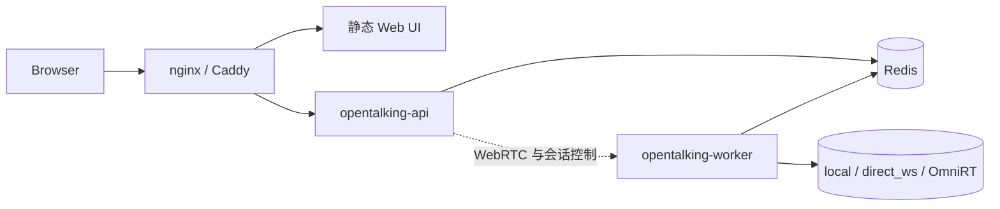
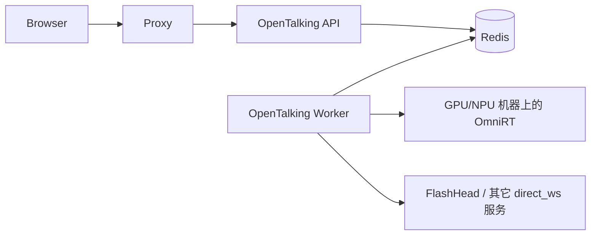

# 部署

本页是 OpenTalking 编排层的部署 runbook。模型权重下载与模型服务启动仍放在
[模型](../model-deployment/index.md)；本页只负责说明 API、Worker、Web UI、Redis、
反向代理和外部推理服务如何组合。

## 选择拓扑

| 拓扑 | 命令形态 | 适用场景 | 说明 |
|------|----------|----------|------|
| 单进程 `unified` | `opentalking-unified` | 本地演示、小型内测、快速排错 | 一个进程承载 API、Worker、会话和内存事件总线。不要把多个 `unified` 进程直接挂在负载均衡后。 |
| API + Worker 分离 | `opentalking-api` + `opentalking-worker` + Redis | 标准单机或小规模生产部署 | 推荐的生产基线。Worker 可独立重启和扩容。 |
| Docker Compose | `docker compose up` | 可复现部署、CI、容器化团队 | 方便但更重；CPU 和单 GPU 评估优先考虑源码/native 路径。 |
| 远端模型 backend | OpenTalking + `OMNIRT_ENDPOINT` 或 `direct_ws` | 重模型、多卡、远端 GPU/NPU | OpenTalking 靠近用户，模型服务跑在加速卡机器上。 |
| 昇腾 910B | 源码安装 + CANN + OmniRT/模型服务 | NPU 评估 | 优先宿主机源码部署；Docker 取决于现场环境。 |

## 前置条件

选择拓扑前先准备：

- Python 3.10 或更高版本（建议 3.11）、Node.js 18 或更高版本、Redis 7、FFmpeg。
- 从 `.env.example` 复制并填写 `.env`。
- 按 [配置](../tutorials/configuration.md) 填好 LLM、STT、TTS。
- 按 [模型](../model-deployment/index.md) 准备 avatar 资产和模型 backend。
- 公开访问时准备域名、TLS 证书；用户常在对称 NAT 后时准备 TURN 服务。

## Native 单机部署流程

这条路径直接在宿主机运行 OpenTalking。CPU 或单 GPU 评估时最容易观察日志、驱动和模型
依赖，因此通常比 Docker 更轻。

### 1. 安装

```bash title="终端"
git clone https://github.com/datascale-ai/opentalking.git
cd opentalking
uv sync --extra dev --python 3.11
source .venv/bin/activate

cd apps/web
npm ci
cd ../..
cp .env.example .env
```

如需兼容 fallback，可改用：

```bash title="终端"
python3 -m venv .venv
source .venv/bin/activate
pip install --index-url https://pypi.tuna.tsinghua.edu.cn/simple -e ".[dev]"
```

最小运行配置：

```env title=".env"
OPENTALKING_LLM_BASE_URL=https://dashscope.aliyuncs.com/compatible-mode/v1
OPENTALKING_LLM_API_KEY=<your-key>
OPENTALKING_STT_PROVIDER=dashscope
OPENTALKING_STT_API_KEY=<your-key>
OPENTALKING_TTS_PROVIDER=edge
OPENTALKING_AVATARS_DIR=./examples/avatars
OPENTALKING_VOICES_DIR=./var/voices
OPENTALKING_SQLITE_PATH=./data/opentalking.sqlite3
OPENTALKING_CORS_ORIGINS=http://localhost:5173,http://127.0.0.1:5173
```

### 2. 单进程 `unified`

开发、私有演示或不需要横向扩展的单机部署可使用：

```bash title="终端"
source .venv/bin/activate
OPENTALKING_REDIS_MODE=memory opentalking-unified --host 0.0.0.0 --port 8000
```

另开一个终端启动前端：

```bash title="终端"
cd apps/web
VITE_BACKEND_PORT=8000 npm run dev -- --host 0.0.0.0 --port 5173
```

打开 <http://127.0.0.1:5173>，选择内置 avatar，先用 `mock` 验证链路。

### 3. API + Worker 分离 {#api-worker}

生产基线建议使用这一拓扑。

```bash title="终端：redis"
redis-server --port 6379 --appendonly yes
```

```bash title="终端：api"
source .venv/bin/activate
export OPENTALKING_REDIS_URL=redis://127.0.0.1:6379/0
export OPENTALKING_WORKER_URL=http://127.0.0.1:9001
opentalking-api
```

```bash title="终端：worker"
source .venv/bin/activate
export OPENTALKING_REDIS_URL=redis://127.0.0.1:6379/0
opentalking-worker
```

```bash title="终端：web"
cd apps/web
VITE_API_BASE=/api npm run build
# 用 nginx、Caddy 或其它静态服务托管 apps/web/dist。
```

分离拓扑如下：



### 4. 连接模型 backend

`mock` 不需要模型服务。真实模型只配置被选中的 backend：

```env title=".env"
# wav2lip / musetalk / flashtalk 在 backend: omnirt 时使用。
OMNIRT_ENDPOINT=http://<model-host>:9000

# FlashHead 仍是独立 direct WebSocket backend。
OPENTALKING_FLASHHEAD_WS_URL=ws://<flashhead-host>:8766/v1/avatar/realtime
OPENTALKING_FLASHHEAD_BASE_URL=http://<flashhead-host>:8766
```

验证模型可用性：

```bash title="终端"
curl -fsS http://127.0.0.1:8000/models | jq '.statuses[] | {id, backend, connected, reason}'
```

## Docker Compose

Docker Compose 适合追求部署可复现的场景。轻量 CPU 或单 GPU 评估通常用源码部署更容易
排错。

### CPU / Mock Stack

```bash title="终端"
cp .env.example .env
docker compose up -d --build
docker compose ps
curl -fsS http://127.0.0.1:8000/health
curl -fsS http://127.0.0.1:8000/models
```

打开 <http://127.0.0.1:5173>。该栈启动 `redis`、`api`、`worker`、`web`，
适合使用 `mock` 做 UI 与流水线验证。

### GPU / OmniRT Stack

宿主机先安装 NVIDIA driver 和 NVIDIA Container Toolkit，然后运行：

```bash title="终端"
cp .env.example .env
docker compose --profile gpu \
  -f docker-compose.yml \
  -f docker-compose.gpu.yml \
  up -d --build
docker compose ps
curl -fsS http://127.0.0.1:9000/v1/audio2video/models
curl -fsS http://127.0.0.1:8000/models
```

这条路径仅用于配置为 `backend: omnirt` 的模型。模型权重、OmniRT 启动细节见
[模型](../model-deployment/index.md)。

常用操作：

```bash title="终端"
docker compose logs -f api worker web
docker compose restart api worker
docker compose down
```

生产环境应把 avatar、voice、SQLite、Redis、模型目录挂载到持久化存储，不依赖容器内文件。

## 反向代理

生产部署建议在 nginx、Caddy 或 Ingress 层终结 TLS。代理必须支持普通 HTTP、
WebSocket upgrade，并关闭 SSE 缓冲。

最小 nginx 形态：

```nginx title="/etc/nginx/conf.d/opentalking.conf"
map $http_upgrade $connection_upgrade {
  default upgrade;
  '' close;
}

server {
  listen 443 ssl http2;
  server_name demo.example.com;

  ssl_certificate /etc/letsencrypt/live/demo.example.com/fullchain.pem;
  ssl_certificate_key /etc/letsencrypt/live/demo.example.com/privkey.pem;

  root /srv/opentalking/web/dist;
  index index.html;

  location /api/ {
    proxy_pass http://127.0.0.1:8000/;
    proxy_http_version 1.1;
    proxy_set_header Host $host;
    proxy_set_header X-Forwarded-Proto $scheme;
    proxy_set_header X-Real-IP $remote_addr;
    proxy_set_header X-Forwarded-For $proxy_add_x_forwarded_for;
    proxy_set_header Upgrade $http_upgrade;
    proxy_set_header Connection $connection_upgrade;
    proxy_buffering off;
    proxy_cache off;
    proxy_read_timeout 3600s;
  }

  location / {
    try_files $uri /index.html;
  }
}
```

生产 `.env` 应包含浏览器访问 origin：

```env title=".env"
OPENTALKING_CORS_ORIGINS=https://demo.example.com
OPENTALKING_PUBLIC_BASE_URL=https://demo.example.com
```

## 多机与重模型

重模型 talking-head 部署时，OpenTalking 尽量保持编排层轻量，模型服务跑在加速卡机器上：



建议规则：

- 轻量 adapter 且能放在 OpenTalking 主机上时，用 `local`。
- 单模型服务已经有独立 WebSocket 协议时，用 `direct_ws`。
- 重模型、多卡、远端或 NPU 推理时，用 `omnirt`。
- 不要把 `OMNIRT_ENDPOINT` 当成所有模型的强依赖；只有配置为 `backend: omnirt` 的模型需要。

## 昇腾 910B

NPU 评估建议用宿主机源码部署，让进程继承 CANN 环境：

```bash title="终端"
source /usr/local/Ascend/ascend-toolkit/set_env.sh
bash scripts/deploy_ascend_910b.sh
```

前置条件：

- CANN 8.0 或更高版本。
- 推荐先设置 `UV_INDEX_URL` / `PIP_INDEX_URL` 指向国内镜像后再安装 OpenTalking 与 OmniRT。
- 使用 `backend: omnirt` 时，OmniRT 仓库与 OpenTalking 仓库处于同级目录。
- 模型检查点位于 `$DIGITAL_HUMAN_HOME/models/`。

验证：

```bash title="终端"
curl -fsS http://127.0.0.1:9000/v1/audio2video/models
curl -fsS http://127.0.0.1:8000/models
```

## 健康检查

发布和重启后建议检查：

| 检查项 | 命令 | 期望 |
|--------|------|------|
| API liveness | `curl -fsS http://127.0.0.1:8000/healthz` | HTTP 200 |
| API readiness | `curl -fsS http://127.0.0.1:8000/health` | JSON 服务状态 |
| 队列状态 | `curl -fsS http://127.0.0.1:8000/queue/status` | 队列与 slot 状态 |
| 模型状态 | `curl -fsS http://127.0.0.1:8000/models` | 每个模型包含 `backend`、`connected`、`reason` |
| Web UI | 打开 `http://127.0.0.1:5173` 或生产域名 | UI 加载，模型选择器有数据 |

## 生产部署清单 {#production-checklist}

生产建议：

- 用 systemd、supervisor、Docker Compose 或 Kubernetes 管理 API 与 Worker。
- Redis 开启 `appendonly yes`。
- `OPENTALKING_AVATARS_DIR`、`OPENTALKING_VOICES_DIR`、`OPENTALKING_SQLITE_PATH`
  挂载到持久化存储。
- 日志交给平台采集，并设置 `OPENTALKING_LOG_LEVEL=INFO`。
- 多 Worker 时用 `CUDA_VISIBLE_DEVICES` 或厂商 NPU 可见性变量隔离卡资源。
- 长连接浏览器会话使用 sticky routing，或确保状态通过 Redis 共享。

Quickstart 脚本仍适合开发：

| 脚本 | 用途 |
|------|------|
| `scripts/quickstart/start_all.sh` | 启动 `unified` 与前端。 |
| `scripts/quickstart/start_omnirt_wav2lip.sh` | 启动 OmniRT Wav2Lip。 |
| `scripts/quickstart/start_omnirt_flashtalk.sh` | 启动 OmniRT FlashTalk。 |
| `scripts/quickstart/status.sh` | 查看辅助脚本管理的进程和 endpoint 状态。 |
| `scripts/quickstart/stop_all.sh` | 停止辅助脚本启动的进程。 |

## 故障排查

| 现象 | 常见原因 | 处理 |
|------|----------|------|
| Web UI 能打开但 API 请求失败 | `VITE_API_BASE`、nginx `/api` 代理或 CORS 不匹配 | 用同源 `/api/health` 验证代理；更新 `OPENTALKING_CORS_ORIGINS`。 |
| 事件流连接后卡住 | 反向代理缓冲 SSE | 设置 `proxy_buffering off`，保留 `Cache-Control: no-transform`。 |
| 远端用户 WebRTC 失败 | NAT 穿透问题 | 部署 TURN，并在你的部署集成里下发 TURN 配置。 |
| `/models` 显示 `connected=false` | backend 不可用或配置错误 | 先看 `reason` 字段。`local_adapter_missing`、缺 WS URL、OmniRT 模型列表缺失是不同问题。 |
| `mock` 正常但真实模型失败 | 模型服务、权重或 avatar 类型不匹配 | 查看 [模型](../model-deployment/index.md)，确认 `/models`，并让 avatar `model_type` 匹配所选模型。 |
| Worker 启动但会话一直排队 | Redis URL 不一致或 Worker 访问不了 backend | 对比 API/Worker 的 `OPENTALKING_REDIS_URL`，检查 Worker 日志。 |
| Docker Web 端口可达但 API 不通 | nginx 代理或 Compose 服务健康异常 | 执行 `docker compose logs -f web api worker`，并测试 `curl http://127.0.0.1:8000/health`。 |
