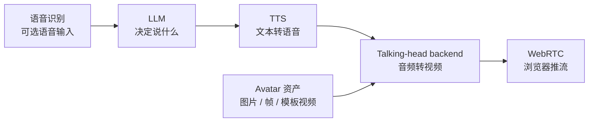

# 模型

本模块说明如何让 OpenTalking 的完整模型链路跑起来，而不仅是 talking-head backend。
一个可用的数字人会话依赖五类能力：

## 推荐默认值

| 层级 | 首次运行默认值 | 何时替换 |
|------|----------------|----------|
| LLM | DashScope OpenAI-compatible endpoint | 已有 OpenAI、vLLM、Ollama、DeepSeek 等标准服务时替换。 |
| STT | DashScope Paraformer realtime | 需要接入其它实时 STT provider 时替换。 |
| TTS | Edge TTS | 生产音色、声音复刻或更高质量语音时切换 DashScope、CosyVoice、ElevenLabs。 |
| Avatar 资产 | 内置 examples | 作为通用形象资产使用，模型按需生成缓存、模板或预处理产物。 |
| Talking-head backend | 先用 `mock`，再跑 Wav2Lip local 路径 | 需要 QuickTalk / FlashTalk OmniRT、FlashHead direct WS 或其它模型服务时替换。 |

## 推荐顺序

1. 用 [快速上手](../tutorials/quickstart.md) 跑通 `mock`。
2. 先看 [支持矩阵](../deployment/support-matrix.md)，选对部署路径。
3. 配置 [LLM 与 STT](../speech_models/llm-stt.md)。
4. 选择并验证 [TTS](../speech_models/tts.md)。
5. 准备 [Avatar 资产](../avatar_models/avatar.md)。
6. 启动 [Talking-head 模型](../avatar_models/talking-head.md)。
7. 验证 `/models`，创建会话，并通过浏览器测试。

## 模型快捷入口

| 目标 | 入口 |
|------|------|
| 无权重端到端自测 | [Mock](../avatar_models/mock.md) |
| 第一个真实唇形模型 | [Wav2Lip Local](../avatar_models/deployment/wav2lip-local.md) |
| 本地 STT/TTS + QuickTalk | [本地 STT/TTS + QuickTalk](../recipes/local-quicktalk-audio.md) |
| 已有 MuseTalk runtime | [MuseTalk](../avatar_models/musetalk.md) |
| 本地实时 adapter | [QuickTalk](../avatar_models/quicktalk.md) |
| 单卡实时头像贴回链路 | [FasterLivePortrait](../avatar_models/fasterliveportrait.md) |
| 高质量重模型 | [FlashTalk](../avatar_models/flashtalk.md) |
| 独立 FlashHead 服务 | [FlashHead](../avatar_models/flashhead.md) |

模型执行应与 OpenTalking 编排层解耦：轻量模型优先使用 `local` 或 `direct_ws`，OmniRT
保留为重模型、多卡、远端或 NPU 部署的推荐 backend。

## 语音生成模型部署

本节只覆盖 TTS 模型本身的部署与权重准备。组合式场景请继续看
[本地语音 + QuickTalk](../recipes/local-quicktalk-audio.md) 等配方页。

| 模型 | 入口 | 说明 |
| --- | --- | --- |
| Edge TTS | [语音生成模型](../speech_models/tts.md) | 首次运行默认值，适合验证链路。 |
| DashScope Qwen TTS | [语音生成模型](../speech_models/tts.md) | 中文实时 TTS 与声音复刻。 |
| CosyVoice3 | [CosyVoice 部署](../speech_models/tts/cosyvoice.md) | 本地中文 TTS、内置音色和复刻音色。 |
| IndexTTS | [IndexTTS 部署](../speech_models/tts/indextts.md) | 可控配音、情绪控制和复刻音色。 |
| ElevenLabs | [语音生成模型](../speech_models/tts.md) | 托管多语言音色。 |
