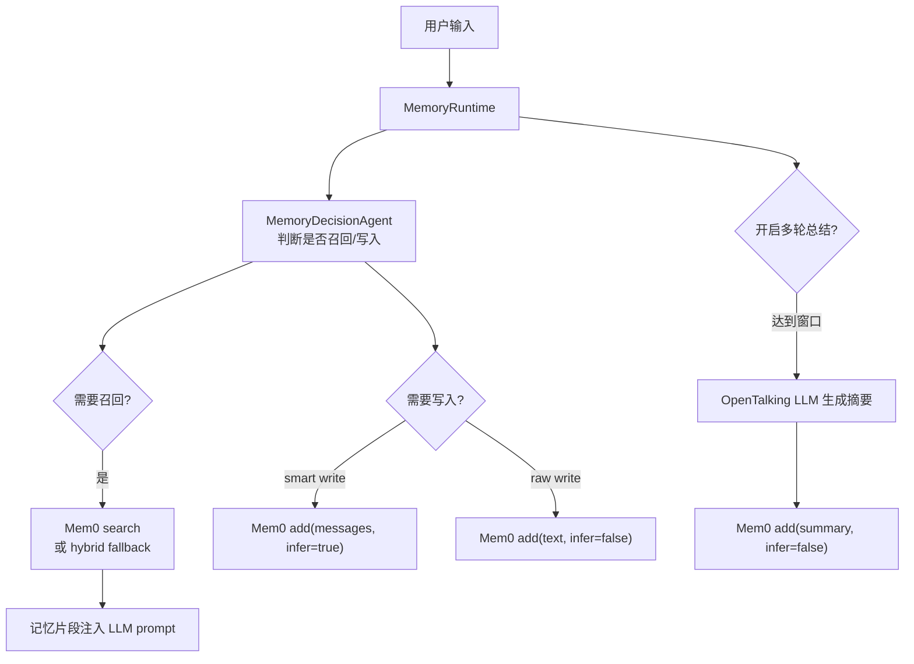

# Mem0 记忆引擎

Mem0 记忆引擎用于 OpenTalking 的长期角色记忆：记录用户偏好、稳定事实、多轮对话摘要，并在后续对话前召回相关记忆注入 LLM 上下文。它不同于“知识库/RAG”：知识库面向上传文档和业务资料，记忆库面向用户和角色之间的长期互动状态。

!!! note "当前实现"
    OpenTalking 当前通过 `mem0.Memory` 开源 SDK 接入 Mem0，并继续使用自己的 `/memory/*` API、记忆库、条目和作用域模型。也就是说，切换到 Mem0 后，前端和 API 的“查看记忆库条目、导入、删除”等能力仍走 OpenTalking 的统一 `MemoryProvider` 接口。

## Mem0 在流程中的位置



OpenTalking 仍负责：

- 记忆作用域：`profile_id + character_id + library_id`。
- 记忆 API：创建记忆库、列出条目、导入对话、删除条目。
- 召回决策：低价值输入不会触发记忆召回。
- 多轮摘要：由 OpenTalking 使用已配置的主 LLM 生成摘要，再写入 provider。

Mem0 负责：

- 存储和检索记忆。
- 在 `smart_write_enabled=true` 且 SDK 支持 `infer` 时，从对话消息里抽取更适合长期保存的记忆。
- 对记忆执行语义召回、去重和歧义处理能力；OpenTalking 侧不会额外暴露一个独立的“手动消歧”接口。

## 安装依赖

```bash title="终端"
python -m pip install "mem0ai==0.1.60" "qdrant-client==1.12.0" "protobuf==4.25.9"
```

这里固定 `protobuf` 4.x 是为了避免新版 `mem0ai` 依赖链和项目中的 `mediapipe` 冲突。后续如果升级 Mem0 SDK，需要先重新跑 `python -m pip check` 和记忆相关测试。

## .env 配置

OpenTalking 默认使用 Mem0 智能记忆引擎和智能编排，但是否在对话中生效仍由会话/角色侧的 `memory_enabled` 控制：未开启记忆能力时，不召回、不写入；开启后如果没有传入具体记忆库，系统使用内部默认记忆库。

普通部署只需要配置多轮总结和 Mem0 自身使用的模型：

```env title=".env"
OPENTALKING_MEMORY_SUMMARY_ENABLED=true
OPENTALKING_MEMORY_SUMMARY_TURN_WINDOW=8
OPENTALKING_MEMORY_SUMMARY_MAX_ITEMS=3

OPENTALKING_MEMORY_MEM0_LLM_PROVIDER=openai
OPENTALKING_MEMORY_MEM0_LLM_BASE_URL=https://dashscope.aliyuncs.com/compatible-mode/v1
OPENTALKING_MEMORY_MEM0_LLM_API_KEY=<llm-api-key>
OPENTALKING_MEMORY_MEM0_LLM_MODEL=qwen-flash

OPENTALKING_MEMORY_MEM0_EMBEDDER_PROVIDER=openai
OPENTALKING_MEMORY_MEM0_EMBEDDER_BASE_URL=https://dashscope.aliyuncs.com/compatible-mode/v1
OPENTALKING_MEMORY_MEM0_EMBEDDER_API_KEY=<embedding-api-key>
OPENTALKING_MEMORY_MEM0_EMBEDDER_MODEL=text-embedding-v4
```

内部默认值已经设置为 Mem0 provider、hybrid 召回/写入、规则闸门 + Mem0/LLM 二级判断、智能写入开启。`OPENTALKING_MEMORY_MEM0_CONFIG` 仍作为高级兼容配置保留：如果设置了它，会优先使用这段 JSON 并覆盖上面的拆分配置。

## LLM、embedding 和 vector store 是什么

| 配置 | 作用 |
|------|------|
| `llm` | Mem0 用来理解对话、抽取或改写长期记忆的模型配置。 |
| `embedder` | 把记忆文本转成向量，用于语义相似度检索。 |
| `vector_store` | 保存向量、元数据和索引的存储后端，例如 Qdrant、Chroma、pgvector 等。它不是 OpenTalking 的“记忆库 UI”，而是 Mem0 底层检索所需的向量数据库。 |

OpenTalking 的主 LLM 配置仍由 `OPENTALKING_LLM_*` 控制；Mem0 的 `llm/embedder/vector_store` 配置只影响 Mem0 自己的记忆抽取和检索。

## 召回决策模式

`OPENTALKING_MEMORY_DECISION_MODE` 控制召回前置判断：

| 值 | 行为 |
|----|------|
| `rule` | 默认值。只使用本地规则判断是否召回，延迟最低。 |
| `hybrid` | 规则先判；空输入、低价值输入、高风险操作等硬拒绝不会调用 LLM；明确命中用户信息、事实实体、显式回忆标记时直接召回；只有模糊输入再调用 LLM 二级判断。 |
| `llm` | 实验模式。硬拒绝仍保留，其余输入交给 LLM judge 判断。 |

`OPENTALKING_MEMORY_DECISION_TIMEOUT_MS` 是二级判断超时时间。LLM judge 超时或失败时，会回退到规则结果，不中断主对话。

## 是否需要 MEM0_API_KEY

当前 OpenTalking 适配层使用 Mem0 开源 SDK 的 `mem0.Memory`，不使用 `MemoryClient`，所以不需要 `MEM0_API_KEY`。你需要配置的是 Mem0 开源版所依赖的 LLM、embedding 和 vector store；这些服务本身可能需要各自的 API key 或本地服务地址。

只有切换到 Mem0 Platform / `MemoryClient` 时，才需要 `MEM0_API_KEY`。平台版是否收费取决于 Mem0 官方当前套餐；本项目不把平台版 API key 作为当前必需项。

## 对现有记忆库功能的影响

切换 `OPENTALKING_MEMORY_PROVIDER=mem0` 后，OpenTalking 的记忆库接口仍保持不变：

```bash title="终端"
curl "http://127.0.0.1:8000/memory/libraries?profile_id=default&character_id=<avatar-id>"

curl "http://127.0.0.1:8000/memory/libraries/default/items?profile_id=default&character_id=<avatar-id>"
```

需要注意：

- 条目列表来自 Mem0 的 `get_all(...)`，OpenTalking 会按 `profile_id`、`character_id`、`library_id` 再过滤。
- OpenTalking 会把 Mem0 原始 id 保存到 `_mem0_id`，并保留自己的 `opentalking_memory_id`，避免前端条目 id 因底层 provider 切换而失效。
- 删除条目时会用 `_mem0_id` 调 Mem0 删除；如果 Mem0 返回格式变化，需要优先检查 id 映射。
- 如果 `memory_recall_backend=hybrid`，Mem0 搜不到结果时会回退到本地 BM25 条目排序；如果设为 `mem0`，则只使用 Mem0 召回。

## 验证

检查配置是否能初始化：

```bash title="终端"
python - <<'PY'
from opentalking.core.config import get_settings
from opentalking.providers.memory.factory import build_memory_provider

get_settings.cache_clear()
provider = build_memory_provider()
print(type(provider).__name__)
PY
```

导入一条记忆并列出：

```bash title="终端"
curl -s -X POST http://127.0.0.1:8000/memory/libraries \
  -H 'content-type: application/json' \
  -d '{"id":"default","name":"Default","character_id":"demo-avatar"}'

curl -s -X POST http://127.0.0.1:8000/memory/libraries/default/import \
  -H 'content-type: application/json' \
  -d '{"profile_id":"default","character_id":"demo-avatar","turns":[{"role":"user","content":"记住，我喜欢简洁回答。"}]}'

curl -s "http://127.0.0.1:8000/memory/libraries/default/items?profile_id=default&character_id=demo-avatar"
```

建议每次调整 SDK 或依赖后运行：

```bash title="终端"
python -m pip check
python -m pytest tests/unit/test_memory_provider.py apps/api/tests/test_memory_api.py apps/api/tests/test_config.py
```

## 参考资料

- [Mem0 Open Source Overview](https://docs.mem0.ai/open-source/overview)
- [Mem0 Open Source Configuration](https://docs.mem0.ai/open-source/configuration)
- [Mem0 Platform Quickstart](https://docs.mem0.ai/platform/quickstart)
- [Mem0 Pricing](https://mem0.ai/pricing)
