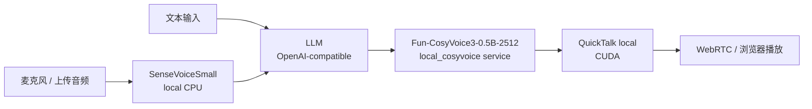

# 本地语音 + QuickTalk

这是一条面向私有化验证的全本地媒体链路：



LLM 仍是独立模块，可以指向百炼、OpenAI、vLLM、Ollama 或你自己的本地 OpenAI-compatible 服务。STT、TTS、Video 都可以在本机部署。

## 适合场景

- 希望语音输入和语音合成都在本地运行。
- 希望 QuickTalk 直接由 OpenTalking 的 local adapter 驱动，不先引入 OmniRT。
- 需要验证自定义头像、复刻音色和实时数字人链路。

不适合 8GB 显存机器直接全开本地 TTS + QuickTalk；显存紧张时优先保留 `SenseVoiceSmall CPU + QuickTalk local`，TTS 改为 Edge 或 DashScope。

## Provider 配置

```env title=".env"
OPENTALKING_LLM_PROVIDER=openai_compatible
OPENTALKING_LLM_BASE_URL=https://dashscope.aliyuncs.com/compatible-mode/v1
OPENTALKING_LLM_API_KEY=<llm-key>
OPENTALKING_LLM_MODEL=qwen-flash

OPENTALKING_STT_DEFAULT_PROVIDER=sensevoice
OPENTALKING_STT_ENABLED_PROVIDERS=sensevoice,dashscope
OPENTALKING_STT_SENSEVOICE_MODEL=iic/SenseVoiceSmall
OPENTALKING_STT_SENSEVOICE_MODEL_DIR=./models/local-audio/iic__SenseVoiceSmall
OPENTALKING_STT_SENSEVOICE_DEVICE=cpu

OPENTALKING_TTS_DEFAULT_PROVIDER=local_cosyvoice
OPENTALKING_TTS_ENABLED_PROVIDERS=local_cosyvoice,dashscope,edge
OPENTALKING_TTS_LOCAL_COSYVOICE_MODEL=FunAudioLLM/Fun-CosyVoice3-0.5B-2512
OPENTALKING_TTS_LOCAL_COSYVOICE_MODEL_DIR=./models/local-audio/FunAudioLLM__Fun-CosyVoice3-0.5B-2512
OPENTALKING_TTS_LOCAL_COSYVOICE_RUNTIME_DIR=./models/local-audio/runtime/CosyVoice
OPENTALKING_TTS_LOCAL_COSYVOICE_SERVICE_URL=http://127.0.0.1:19090/synthesize
OPENTALKING_TTS_LOCAL_COSYVOICE_DEVICE=cuda:0

OPENTALKING_QUICKTALK_BACKEND=local
OPENTALKING_QUICKTALK_ASSET_ROOT=./models/quicktalk
OPENTALKING_QUICKTALK_WORKER_CACHE=1
OPENTALKING_TORCH_DEVICE=cuda:0
```

`*_DEFAULT_PROVIDER` 只决定默认选择，不是 fallback。前端选择 API STT/TTS 时，必须配置对应 provider 的 key，例如：

```env title=".env"
OPENTALKING_STT_DASHSCOPE_API_KEY=<dashscope-stt-key>
OPENTALKING_TTS_DASHSCOPE_API_KEY=<dashscope-tts-key>
```

## 安装与模型

```bash title="终端"
uv sync --extra dev --extra models --extra local-audio --extra quicktalk-cuda --python 3.11
python scripts/download_local_audio_models.py \
  --root ./models/local-audio \
  --model sensevoice-small \
  --model fun-cosyvoice3-0.5b-2512
```

主 `.venv` 只负责 OpenTalking、SenseVoice 和 QuickTalk。CosyVoice runtime
准备好后，创建独立 sidecar venv。

CosyVoice3 主权重来源和可选 fp16 TensorRT ONNX 文件见 [TTS 部署](../../speech_models/tts/cosyvoice.md)。

QuickTalk 权重按 [QuickTalk Local](../quicktalk/local.md) 页面准备。CosyVoice runtime 放在模型目录下即可：

```bash title="终端"
mkdir -p ./models/local-audio/runtime
git clone https://github.com/FunAudioLLM/CosyVoice.git ./models/local-audio/runtime/CosyVoice
cd ./models/local-audio/runtime/CosyVoice
git submodule update --init --recursive
cd "$DIGITAL_HUMAN_HOME/opentalking"
OPENTALKING_COSYVOICE_VENV_DIR=.venv-cosyvoice \
  bash scripts/prepare_cosyvoice_venv.sh
```

## 启动

先启动本地 TTS service：

```bash title="终端"
bash scripts/quickstart/start_local_cosyvoice.sh --port 19090
```

再启动 OpenTalking：

```bash title="终端"
bash scripts/start_unified.sh --backend local --model quicktalk
```

## 验证

```bash title="终端"
curl -fsS http://127.0.0.1:19090/health
curl -fsS http://127.0.0.1:8000/runtime/status
curl -s http://127.0.0.1:8000/models | python3 -m json.tool
```

期望：

- `stt_provider=sensevoice`
- `tts_provider=local_cosyvoice`
- `quicktalk_backend=local`
- `quicktalk.connected=true`

前端选择本地 STT、本地 CosyVoice3 和 QuickTalk avatar 后，分别测试文本输入、麦克风输入和 TTS preview。

## 与 API provider 混用

全本地部署不是强制固定。用户可以在前端选择 API STT 或 API TTS，但后端不会隐式使用 LLM key 或 `DASHSCOPE_API_KEY`。API provider 缺少 key 时，前端启动前会提示错误；会话中 API 返回错误时，数字人对话界面会显示错误消息。

## 前端入口

模型或后端服务启动后，统一用 OpenTalking WebUI 访问：

```bash title="终端"
cd "$OPENTALKING_HOME"
bash scripts/quickstart/start_frontend.sh --api-port 8000 --web-port 5173 --host 0.0.0.0
```

远程服务器部署时，把本地浏览器端口映射到服务器 `5173`，再打开 `http://127.0.0.1:5173`。
