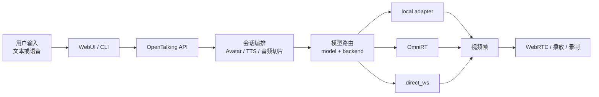

# 模型支持概览

本章说明 OpenTalking 如何接入数字人驱动模型、当前支持哪些模型和推理后端，以及在不同硬件和服务形态下应该如何选择。

OpenTalking 的目标不是把所有模型都塞进同一个进程，而是提供统一的会话、Avatar、TTS、WebRTC 和 WebUI 编排层，让不同模型可以通过一致的接口被使用和替换。

## OpenTalking 与模型的关系

OpenTalking 位于应用层和推理层之间：

- 应用层：WebUI、命令行工具、会话创建、文本/语音输入、TTS、录制和状态展示。
- 编排层：Avatar 加载、音频切片、模型调用、帧输出、WebRTC 推流、错误处理。
- 推理层：Wav2Lip、QuickTalk、MuseTalk、FlashTalk、FlashHead 等具体模型。

因此，一个模型接入 OpenTalking 后，通常不需要重新实现 WebUI、TTS、会话管理和播放链路，只需要适配模型输入输出。

## 什么是 Model

Model 指具体的数字人驱动能力，例如：

- `wav2lip`：经典音频驱动口型模型，适合轻量验证和图片/视频 Avatar。
- `quicktalk`：更偏实时口播的模型，适合快速验证和低延迟链路。
- `musetalk`：适合较高质量的口型同步和视频 Avatar。
- `flashtalk`：面向高质量实时数字人，需要独立推理服务承载。
- `flashhead`：通过 HTTP 生成式接口接入，适合片段式生成和离线/准实时链路。

Model 决定了画面质量、延迟、显存占用、Avatar 要求和可调参数。

## 什么是 Runtime Backend

Runtime Backend 指模型实际运行在哪里、通过什么协议调用。

当前主要有四类：

- `mock`：不做真实推理，只验证 OpenTalking 流程。
- `local`：模型在 OpenTalking 进程内加载。
- `direct_ws`：OpenTalking 直接连接模型 WebSocket 服务。
- `omnirt`：OpenTalking 通过 OmniRT 统一接入多模型推理服务。

后续多模态推理后端会在能力稳定后再单独补充。

## 什么是 Model Backend

Model Backend 是“某个模型使用哪个 Runtime Backend”的配置。例如：

```yaml
models:
  wav2lip:
    backend: local
  quicktalk:
    backend: omnirt
  musetalk:
    backend: local
```

也可以用环境变量覆盖：

```bash
export OPENTALKING_QUICKTALK_BACKEND=local
export OPENTALKING_WAV2LIP_BACKEND=omnirt
export OPENTALKING_MUSETALK_BACKEND=local
```

同一个 OpenTalking 实例可以让不同模型走不同后端。例如 Wav2Lip 和 MuseTalk 用本地进程内推理，FlashTalk 走远端 OmniRT。

## 典型链路



模型页会分别说明每个模型的适用场景、后端建议、资产要求和可调整参数。

## 当前支持状态

| 模型 | 推荐后端 | 当前定位 |
| --- | --- | --- |
| Mock | `mock` | 安装验证、WebUI 流程验证 |
| Wav2Lip | `local` / `omnirt` | 轻量口型同步、Avatar 资产验证 |
| QuickTalk | `local` / `omnirt` | 快速实时口播、低延迟验证 |
| MuseTalk | `local` / `omnirt` / `direct_ws` | 更高质量口型同步；local 模式会在会话初始化前运行官方头像预处理 |
| FlashTalk | `omnirt` | 高质量实时数字人，适合服务化部署 |
| FlashHead | `direct_ws` / HTTP adapter | 片段式生成、离线或准实时链路 |

实际可用性取决于模型权重、硬件、后端服务和部署方式。页面中的参数说明以 OpenTalking 当前代码支持为准。

## 本章不讲什么

本章不展开业务案例、WebUI 操作细节和 TTS Provider 使用。相关内容分别在：

- [案例教程](../tutorials/index.md)
- [使用指南](../usage/index.md)
- [音色与 TTS](../usage/webui/voice-and-tts.md)

## 下一步

- 不确定选哪个模型：先看[模型与后端选择](./selection.md)。
- 想了解模型可调参数：进入具体模型页。
- 准备生产部署：先参考[模型与后端选择](./selection.md)中的服务化建议。
