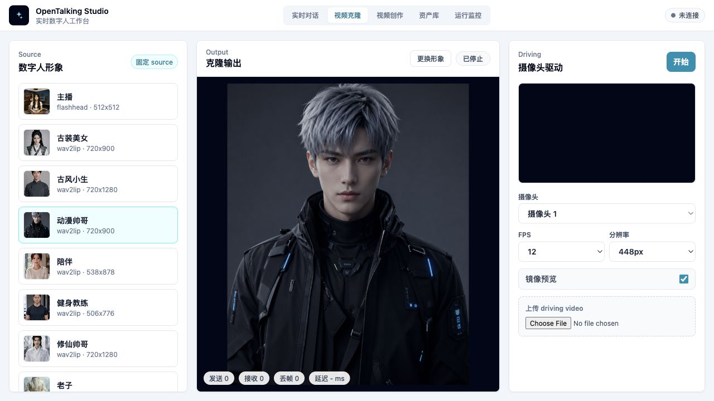

# 视频克隆

“视频克隆”是 WebUI 中和“实时对话”并列的工作流。它固定 OpenTalking 形象库中的数字人作为 source，用摄像头实时帧或上传视频作为 driving video，让数字人模仿用户的表情、嘴型和头动。

## 适用场景

- 验证 FasterLivePortrait 视频驱动效果。
- 用摄像头实时测试数字人的表情和头动跟随。
- 上传一段自拍视频，检查 driving video 的口型、裁剪和贴回效果。

视频克隆不会发起 LLM 对话，也不会调用 TTS 或 STT。它和“实时对话”的音频驱动链路是两条独立工作流。

## 前置条件

1. OmniRT 已启动 FasterLivePortrait runtime。
2. OpenTalking API 能访问 OmniRT。
3. WebUI 的模型状态里 `fasterliveportrait` 为已连接。
4. 浏览器可以访问摄像头。建议通过 `localhost`、`127.0.0.1` 或 HTTPS 打开页面。

如果还没有启动服务，先按 [FasterLivePortrait 模型页](../../../avatar_models/fasterliveportrait.md) 完成“启动 OmniRT”和“启动 OpenTalking WebUI”两步。

## 页面组成

### Source 形象

左侧 source 区展示当前形象库中的数字人资产。点击任意资产后，它会作为最终输出的数字人形象。摄像头或上传视频不会变成 source，只提供动作。

如果输出被放大成头像，先确认 `拼回原图` 已开启。这个开关会把驱动后的人脸贴回 source 原始图，保留半身构图和背景。

### 克隆输出

中间区域显示当前 source 和克隆后的输出画面。状态条会展示发送帧数、接收帧数、丢帧和延迟。

停止后可以点击“更换形象”回到形象选择状态，重新选择 source。

### Driving 输入

右侧区域用于选择摄像头、FPS、分辨率和本地预览。点击“开始”后，浏览器通过 canvas 定时采样摄像头帧并发送到后端。

上传 driving video 是辅助测试路径，适合对比同一段自拍视频在不同参数下的效果。

## 摄像头实时驱动

1. 打开 WebUI，切换到“视频克隆”。
2. 在左侧选择一个数字人 source。
3. 右侧选择摄像头、FPS 和分辨率。
4. 点击“开始”，允许浏览器摄像头权限。
5. 观察中间输出画面和状态条。
6. 点击“停止”或切换页面前，确认摄像头预览关闭。

推荐从 `12fps`、`448px` 开始。输出稳定后再提高 FPS 或分辨率。

## 上传 driving video

上传视频用于验证 driving video 的表情、口型和裁剪效果。建议使用清晰正脸或半身自拍视频，避免脸太小、强遮挡、剧烈转头或画面比例过窄。

如果上传视频效果不如摄像头：

- 关闭 `裁剪 driving 人脸`，避免 driving 脸部被裁得太紧。
- 打开 `拼回原图`，确认输出不是只显示裁剪头部。
- 打开 `唇形重定向`，同时关闭 `相对运动`。
- 将驱动区域从 `嘴部` 改为 `表情` 或 `全表情`，观察嘴角和脸颊是否恢复。

## 参数建议

| 参数 | 作用 | 建议 |
| --- | --- | --- |
| 动作幅度 | 整体 driving 强度 | 从 `1.0` 开始 |
| 表情幅度 | 表情和口型强度 | 从 `1.0` 开始 |
| 头动幅度 | 头部整体运动 | 从 `0.3` 开始 |
| 张嘴开合 | 嘴部开合幅度 | `0.8-1.3` |
| 左右摇头 / 上下点头 / 左右歪头 | 姿态分量 | 头动过大时先降低对应分量 |
| 拼回原图 | 保留 source 原始构图 | 建议开启 |
| Stitching | 稳定脸部边界 | 建议开启 |
| 相对运动 | 保留 source 基础姿态 | 开启唇形重定向后通常关闭 |
| 唇形归一 | 减少初始嘴型偏差 | 建议开启 |
| 唇形重定向 | 增强嘴部跟随 | 嘴型张不开或发鼓时尝试开启 |
| 裁剪 driving 人脸 | 裁剪输入视频人脸 | 上传视频比例异常时关闭 |

## 常见问题

### 无法启动摄像头或视频克隆服务

检查浏览器权限、页面来源是否为 `localhost` / `127.0.0.1` / HTTPS，以及 `/models` 中 FasterLivePortrait 是否已连接。

### 上传视频嘴部发鼓或张不开

通常和 driving 视频裁剪、脸部位置、缩放或唇形参数有关。先关闭 `裁剪 driving 人脸`，再试 `唇形重定向 + 关闭相对运动`。

### 唇形重定向后只剩上下张嘴

唇形重定向会强化嘴部开合。如果同时保留相对运动，可能把嘴角和脸颊运动压弱。关闭 `相对运动`，并把驱动区域切到 `表情` 或 `全表情`。

### 资产点击后比例不对

打开 `拼回原图`，并选择 source 原图构图合适的资产。视频克隆应以 source 原始图为输出构图，driving 视频只提供动作。
